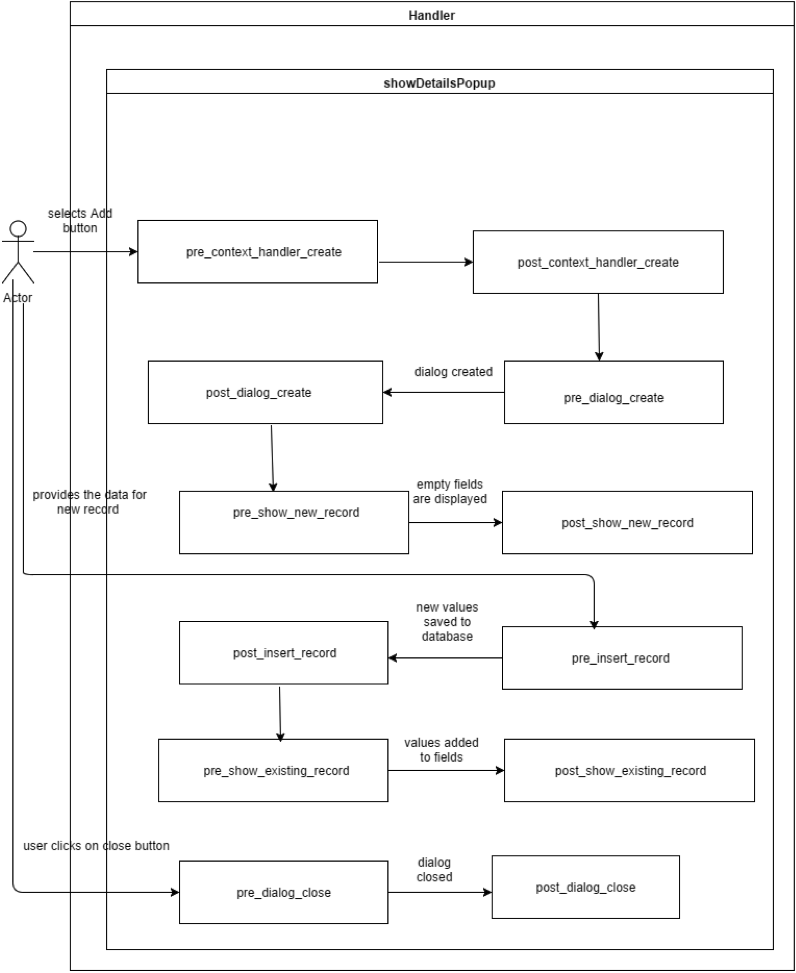
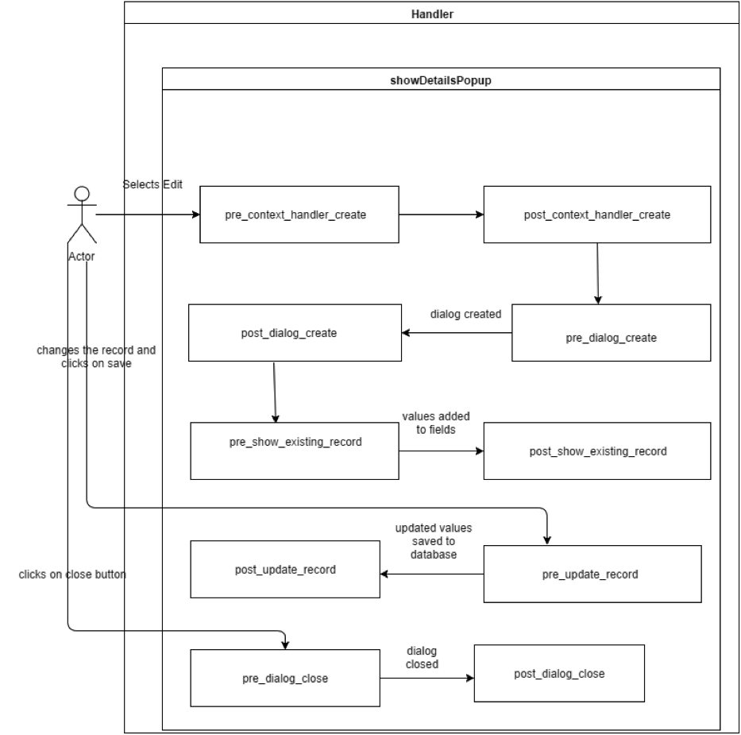
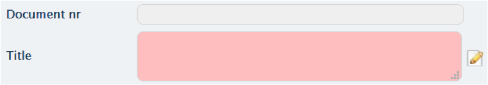
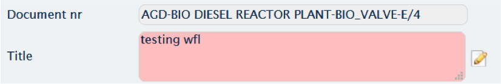
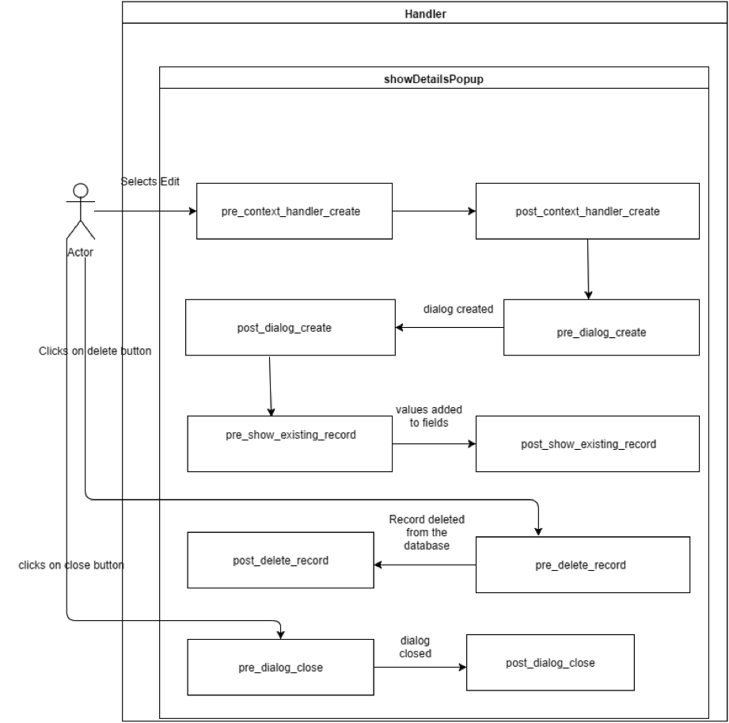

# Handlers details

## Handler_details __add__

## Handler_details __edit__

## Handler_details __edit after create__

## Handler_details __edit after show existing__

## Handler_details __delete__

