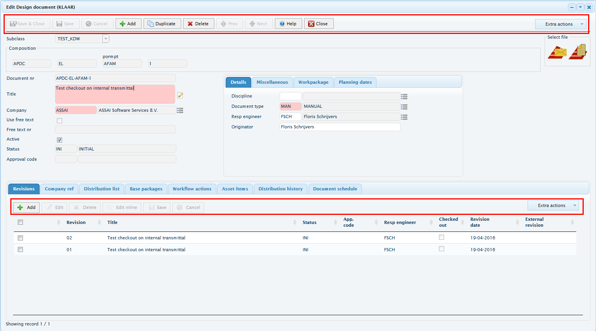
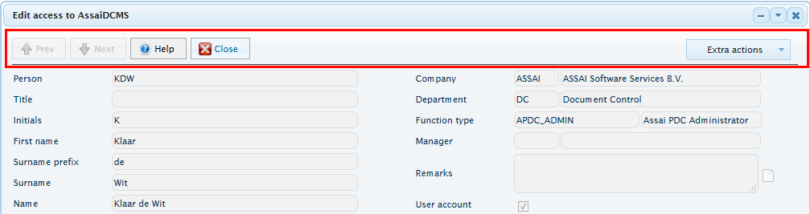
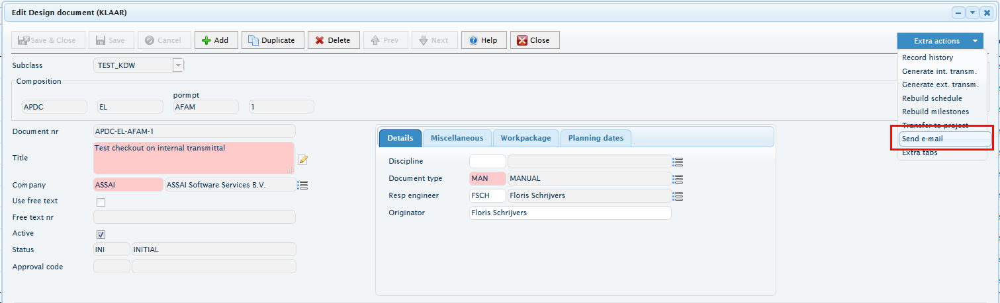
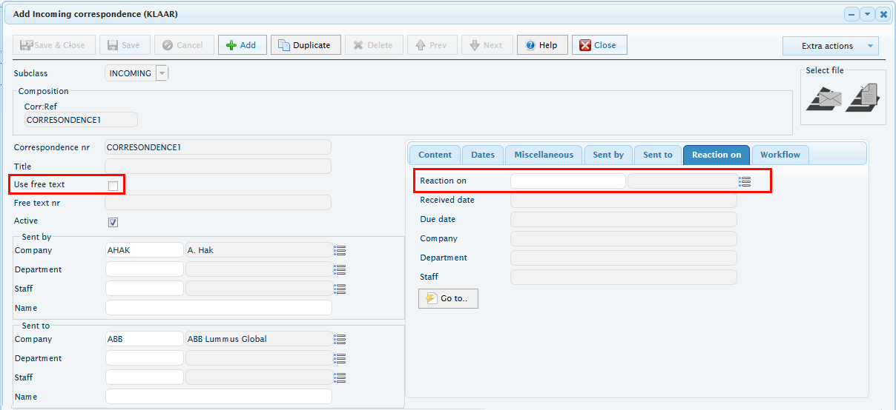
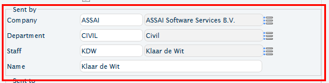
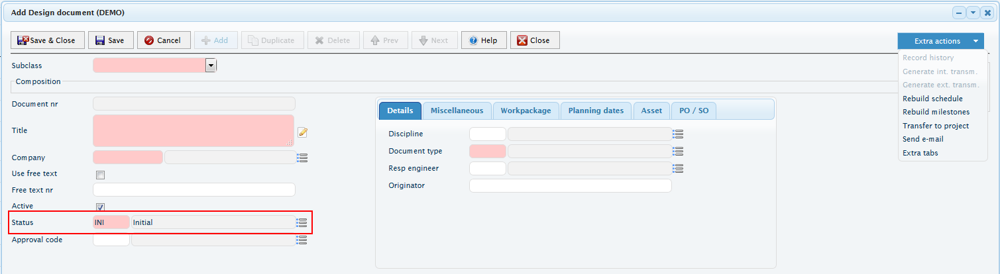
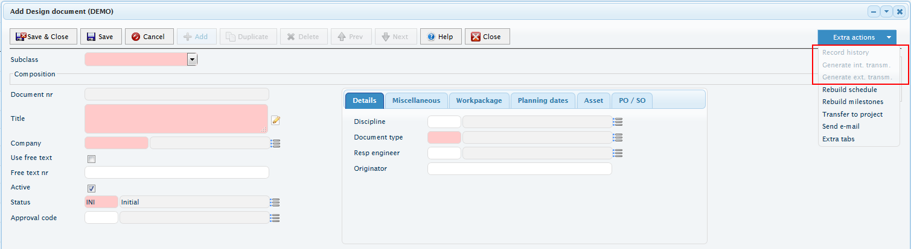
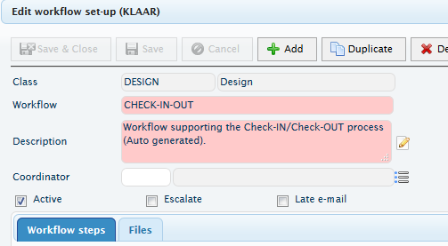
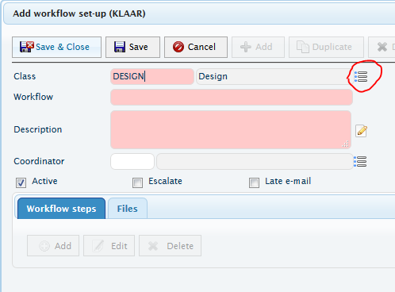

# Handlers details

The Vaizr framework describes the screen phases via it's hooks. For example, the initiation phase of a screen is described by the pre- and post_context create hook.

Below describes the initiation, creation and rendering of a dialog screen. The hooks are sequentially called from top to bottom.
Summary: First the context is created. Then the ACDC objects are setup. The ACDC objects are used as configuration to build the dialog. The dialog is rendered by the browser. Data is retrieved and filled into the screen.
For a more generalized look at handler creation, view [vaizr_flow](vaizr_flow).

## pre_context_handler_create

At this hook the context settings can be manipulated before they are processed. 
The context is the button bar and extra actions menu which are filled with actions that are available in the current dialog. This is new/duplicate/delete/etc.

Example:

 Status: Context = not created. ACDC fields = not created. Dialog = not rendered. Fields = empty. Record = does not exist.
 Usage: Remove context action, 
 Example: if a particular screen should not allow the add, duplicate and delete actions, they can be removed from the context. If done in this hook, all the code run after this hook, will run without the features de-activated. 
 Code example :

	options.pre_context_handler_create = function (ctxOptions, callback) {
		var itemsToRemove = ['add', 'duplicate', 'delete'];
		var newCtx = [];
		$.each(ctxOptions.items, function (id, item) {
		    if (itemsToRemove.indexOf(item.name) === -1) {
		        newCtx.push(item);
		    }
		});
		ctxOptions.items = newCtx;
		callback();
	};

Once rendered:	
      
      
## post_context_handler_create

At this hook, the context had been created with default options or optionally changed values via the pre_context_handler_create hook. The context can be expanded with custom actions that are required for the screen.
 Status: Context = created. ACDC fields = not created. Dialog = not rendered. Fields = empty. Record = does not exist.
 Usage : Add context actions.
 Example, an email feature can be added to the menu.
 Code example :

	options.post_context_handler_create = function (context) {
	    context.addMenuOption('send_email', _send_email);
	}; 

Once rendered:

 
## pre_dialog_create

At this hook, the dialog has not been been rendered by the browser yet. However, all the ACDC objects have been created and are available for manipulation.
 Status: Context = created. ACDC fields = created. Dialog = not rendered. Fields = empty. Record = does not exist.
 Usage : Change screenfields, this includes type, label, onChange function, extra parameters. Also, LOV's are loaded.
 Example: Loading the [LOV's](lov). Adding an onchange listener to a screenfield. Setting a screenfield to readonly and setting a screenfield type to a checkbox.
 Code example :

	options.pre_dialog_create = function (detailsContext, pageItems, callback) {
		Assai.lovCollection.convertForeignKeyFieldsToLov(options.fk_lookups, pageItems, {}, {clas_seq_nr: clas_seq_nr, accessible_project: 'Y', list_subclass_type: 'DES_DOC, SUP_DOC'}, settings.recType);//load the LOV's
		
		var corr_seq_nr_reaction_fld = $.alfa.DlgBlocks.getFieldFromPage(dlgItems, 'corr_seq_nr_reaction');
		if (corr_seq_nr_reaction_fld) {
		    corr_seq_nr_reaction_fld.onchange = _reactionOnChanged;
		    corr_seq_nr_reaction_fld.service.parameters.corr_type = other_corr_type;
		}
		var full_nr_fld = $.alfa.DlgBlocks.getFieldFromPage(dlgItems, 'full_nr');
		if (full_nr_fld) {
		    full_nr_fld.readonly = true;
		}
		var free_text_ind_fld = $.alfa.DlgBlocks.getFieldFromPage(dlgItems, 'free_text_ind');
		if (free_text_ind_fld) {
		    free_text_ind_fld.type = 'checkbox';
		    free_text_ind_fld.labelStyle = 'left';
		}
	};

Once rendered:	

## post_dialog_create   

At this hook, the ACDC objects have been converted into HTML elements that are rendered on the screen. The dialog is now accessible to the user. 
At this hook, JQuery should be used to access the screenfields. From this hook on, if ACDC objects are manipulated, it will not automatically be reflected on the screen.
 Status: Context = created. ACDC fields = created. Dialog = rendered. Fields = empty. Record = does not exist.
 Usage : Add reactions to user interaction, add change events,
 Example: Add change listener to a company screenfield that will delete the content from department and person screenfields and set the company value for the department and person LOV. 
 Code example :

	options.post_dialog_create = function (detailsContext, pageItems) {
		var cmpy_seq_nr = $.alfa.DlgBlocks.getFieldFromPage(dlgItems, 'cmpy_seq_nr');//get the screen fields, this is the ACDC object that contains among others, the id.
		var dept_seq_nr = $.alfa.DlgBlocks.getFieldFromPage(dlgItems, 'dept_seq_nr');
		var staf_seq_nr = $.alfa.DlgBlocks.getFieldFromPage(dlgItems, 'staf_seq_nr');
		        
		// If company changes then change search parameter for departments and staf LOV
		if (cmpy_seq_nr) {
		    $('#' + cmpy_seq_nr.id + '_display_1').off();
		    $('#' + cmpy_seq_nr.id + '_display_1').on('change', function () {//add the listener
		        var newValue = $('#' + cmpy_seq_nr.id).val();
		        dept_seq_nr.service.parameters.cmpy_seq_nr = newValue;//set value for department lov
		        staf_seq_nr.service.parameters.cmpy_seq_nr = newValue;//set value for department lov
		        $('#' + dept_seq_nr.id + '_display').val('').blur();//remove value
		        $('#' + staf_seq_nr.id + '_display').val('').blur();//remove value
		    });
		}
	};

# Branching

Here the flow of hooks can branch. The opening of the dialog can be initiated to create a new record, to view/edit and existing record and the dialog can be closed at any point.  
First, the hooks for a new record are discussed, these are [pre_show_new_record](#pre_show_new_record) and [post_show_new_record](#post_show_new_record). 
Next the hooks for showing an existing record are discussed, these are [pre_show_existing_record](#pre_show_existing_record) and [post_show_existing_record](#post_show_existing_record).

# New record

## pre_show_new_record

At this hook, the database is queried for the data which will is to be shown in the dialog; However, at this point, the data is not yet being rendered, resulting in an empty rendered screen.
This is the point where additional required data can be loaded that needs to be shown on the screen. 
 Status: Context = created. ACDC fields = created. Dialog = rendered. Fields = empty. Record = does not exist.
 Usage : Apply runtime data for LOV's, set default values on screen.
 Example: Apply the proj_seq_nr to all the LOV's that require it and set a default value.  
 Code example :

	options.pre_show_new_record = function (detailsContext, pageItems, values, callback) {
		$.alfa.DlgBlocks.applyToAllFieldItems(pageItems, function (name, fieldDef) {
			if (fieldDef.type === 'lov') {
			    fieldDef.service.parameters.proj_seq_nr = proj_seq_nr;//apply the proj_seq_nr to all LOV fields
			}
			});
		
		DwrGeneral.getDefaultValues(subclass_type, parameters, {async: false, callback: function (defaults) {//retrieve the defaults from the server
			$.each(defaults, function (col_name, col_value) {
			    values[col_name] = col_value;//set the matching columns to the default values 
			});			
		}});
	};
	

   
## post_show_new_record

At this hook, the data if filled into the screen. This data might have been manipulated in the pre_show_new_record hook. At this point, the record does not exist in the database yet. Only after saving via this screen, will the record be created in the database. 
 Status: Context = created. ACDC fields = created. Dialog = rendered. Fields = filled. Record = does not exist.
 Usage : Show composition elements, enable/disable onscreen items that are not available for new items. 
 Example: Disable context menu items that are not available for a not yet existing record.
 Code example :

	options.post_show_new_record = function (detailsContext, pageItems, values) {
		detailsContextHandler.disableItems(['generate_int_txl', 'generate_ext_txl', 'schedule', 'planning']);
	};
	

## pre_insert_record

At this hook, the user has filled in the required data in the screen and pushed the save button. The screen data is about to be sent to the server for processing. It can be manipulated in this hook before it is sent. 
 Status: Context = created. ACDC fields = created. Dialog = rendered. Fields = filled. Record = does not exist.
 Usage : Getting the new sequence number to register the composition elements to , setting a value based on several fields. 
 Example: Getting the new sequence number to register the composition elements to before the document record exists.
 Code example :

	options.pre_insert_record = function (detailsContext, pageItems, values, callback) {
		// For documents and correspondence: first get new primary key and then insert the flex elements before inserting the record
		DwrGeneral.searchRecords('dc_docs_rectype_next_seq_nr', {}, function (result) {
			values.docs_seq_nr = result.rows[0][0];
			var msg = coelWidget.insertElements(values.docs_seq_nr, settings.entity_code, values.free_text_ind, 'Y');
		});
	};

## post_insert_record

At this hook, the data has been sent to the server and the server has returned a message to the client confirming creation of the record. 
 Status: Context = created. ACDC fields = created. Dialog = rendered. Fields = filled. Record = Exists.
 Usage : Enable screen fields after record creation, refresh parts of the screen. 
 Example: Set access_indicators and refresh a tab. 
 Code example :

	options.post_insert_record = function (detailsContext, pageItems, values) {
		// Set data for dialog so tabs can access it too
		access_indicators = null;
		$('#' + detailDialogId).data('access_indicators', access_indicators);
		popupHandler.setAccessIndicators(access_indicators);
		// Refresh the document revisions tab
		activateTabFunctions[0](values);
	};
	

After this step, the [pre_show_existing_record](#pre_show_existing_record) hook will be called to fill the  screen with the new values for the newly created record.

# Existing record

## pre_show_existing_record

At this hook, the database has just been queried for the data which will be shown in the dialog (right after this hook). This is the point where additional required data can be loaded that needs to be shown on the screen and fields can be enabled/disabled when necessary for existing records, or for a specific record value. 
 Status: Context = created. ACDC fields = created. Dialog = rendered. PageItems exist, Field values are empty. Record = exists. 
 Usage : Apply runtime data for LOV's and enable or disable fields based on selectedRecord. 
 Example: For an existing record the class lov is disabled. This lov is there for a new record.
 Code example :

	options.pre_show_existing_record = function (detailsContext, pageItems, values, selectedRecord, callback) {
        selectedRowRecord = selectedRecord;
        var classField = $.alfa.DlgBlocks.getFieldFromPage(pageItems, 'clas_seq_nr');
        $.alfa.DlgLov.disableLov(classField.id);
        _activate_tab(detailDialogId, tabsContainer); 
       callback();
    };
    
Existing record:

New record:

[More details.](pre_show_existing_record)

## post_show_existing_record
Klaar will create this one.
	
## pre_update_record

At this hook, the record exists and was opened. The [pre_show_existing_record](#pre_show_existing_record) and [post_show_existing_record](#post_show_existing_record) hooks both have fired already. The user has edited values in the screen and pressed the save button. 
 Status: Context = created. ACDC fields = created. Dialog = rendered. PageItems exist, Field values are filled. Record = exists. 
 Usage : Update composition elements for the document, save a value of the current record before it is saved for later usage. 
 Example: Keeps the wfit_seq_nr for later usage and updates the composition elements if required.
 Code example : 

	options.pre_update_record = function (detailsContext, pageItems, values, callback) {
		if (wfit_seq_nr_changed) {
			values._wfit_seq_nr_changed = 'Y';
			values._old_wfit_seq_nr = old_wfit_seq_nr;
		}
		
		var coelWidget = _getCoelWidget();
		if (values.free_text_ind === 'Y' || !coelWidget.isUpdated()) {
			callback(true);
		} else {
			var msg = coelWidget.updateElements(values.docs_seq_nr, settings.entity_code, values.free_text_ind, 'Y');
			if (msg) {
				Assai.mainPageHandler.showErrorMsg(msg, false, function () {
					callback(false);
				});
			} else {
				callback(true);
			}
		}
	};

## post_update_record	

At this hook, the record has been updated in the database. Some additional screen manipulation can be done to show the changed data.
 Status: Context = created. ACDC fields = created. Dialog = rendered. PageItems exist, Field values are filled. Record = exists. 
 Usage :  Make specific screen changes based on the updated data
 Example: refresh the workflow tab after changes made.
 Code example : 

	options.post_update_record = function (detailsContext, pageItems, values) {	
		if (wfit_seq_nr_changed) {
			selectedRowRecord.wfit_seq_nr = values.wfit_seq_nr;
			activateTabFunctions[4](selectedRowRecord);
		}
	};

## pre_delete_record

At this hook, some additional cleanup can be performed before the record is deleted from the database.
 Status: Context = created. ACDC fields = created. Dialog = rendered. PageItems exist, Field values are filled. Record = exists. 
 Usage : Show confirmation message, check if delete is possible.
 Example: Show confirmation to user if the files should also be deleted.
 Code example :

	options.pre_delete_records = function (tableId, tabContext, pk_seq_nr_list, extraParams, callback) {
        Assai.StandardDetailPopupHandler.showConfirmDeleteFilesToo(dialogId, extraParams, callback);
    };

## post_delete_record

At this hook, the record was just deleted from the database. Some cleanup to the screen might be required.
 Status: Context = created. ACDC fields = created. Dialog = rendered. PageItems exist, Field values are filled. Record = does not exist. 
 Usage : Cleanup screen, reload search results.
 Example: Remove file icon.
 Code example :

	options.post_delete_record = function () {
	    _showFileIcon(null);
	};

# No changes

## pre_cancel_record

At this hook, changes to the record were initiated but canceled.
 Status: Context = created. ACDC fields = created. Dialog = rendered. PageItems exist, Field values are filled. Record = Exists. 
 Usage : Reset values that were changed when activating edit mode.
 Example: Reset the subclass.
 Code example :

	options.pre_cancel_record = function (detailsContext, pageItems, values, callback) {
		var subclassField = $.alfa.DlgBlocks.getFieldFromPage(pageItems, 'subclass');
		$('#' + subclassField.id).val('').change();
		callback();
	};	

## pre_dialog_close

At this hook, the user pressed the closed button for the screen. Some cleanup operations can be initiated to leave the screen in a clean state.
 Status: Context = created. ACDC fields = created. Dialog = rendered. PageItems exist, Field values are filled. Record = Exists. 
 Usage : Show confirm dialog based on custom screen values.
 Example: Show confirm dialog if changes were made to the persons list.
 Code example :

	options.pre_dialog_close = function (detailsContext, pageItems, callback) {
		var pers_seq_nr_list = $('#' + mainFields.data.employees.id).val();
		if (pers_seq_nr_list) {
			var text = $.alfa.alfaUtils.getLabel('ignore_changes');
			var title = $.alfa.alfaUtils.getLabel('confirm');
			$.alfa.dlgUtils.showConfirmDialog(title, text, callback);
		} else {
			callback();
		}
	};

## post_dialog_close

# Inline edit
note, probably needs some txt on how a result page works

## pre_inline_edit
## post_inline_edit
## post_inline_cancel
