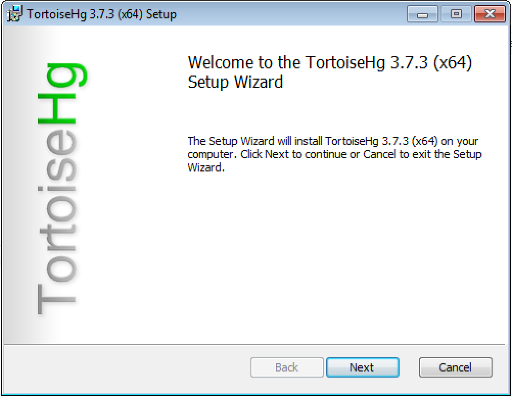
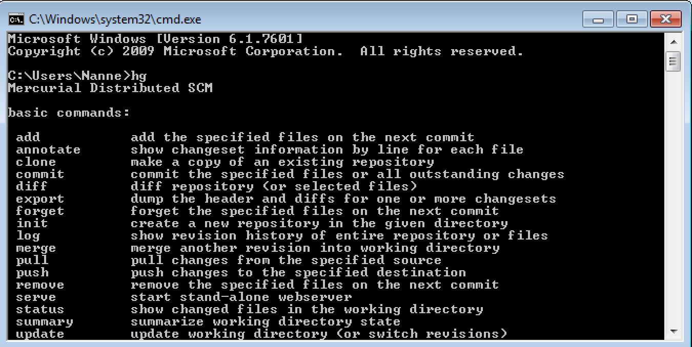
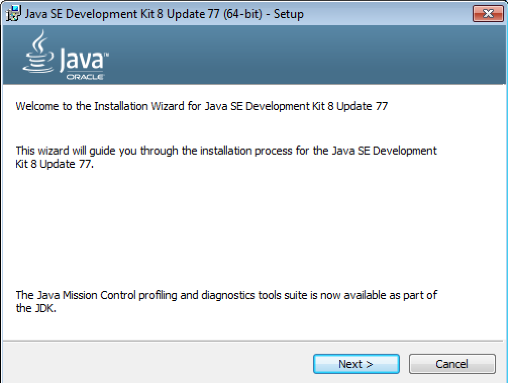
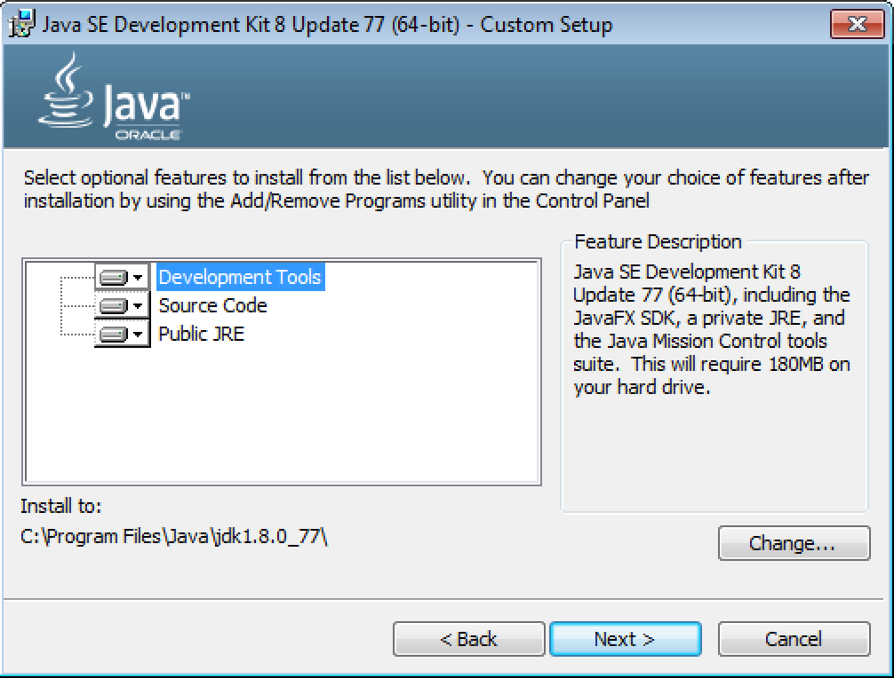
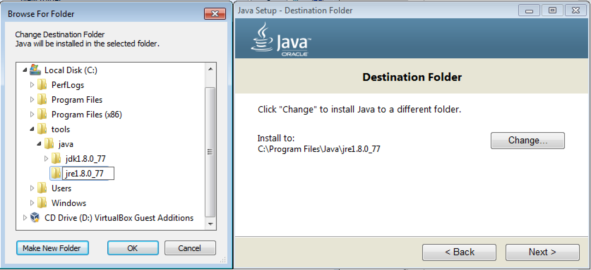
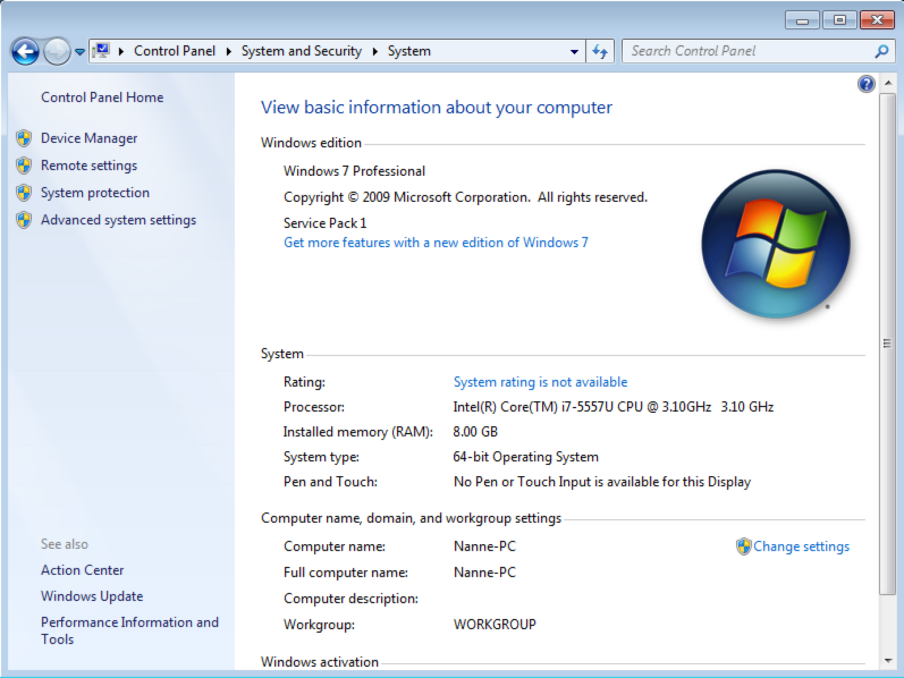
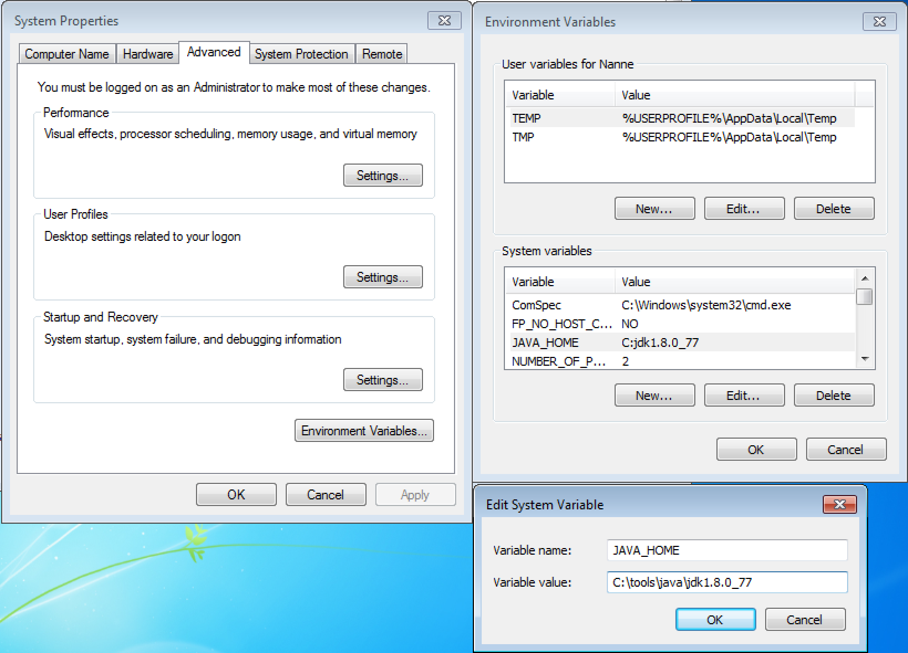
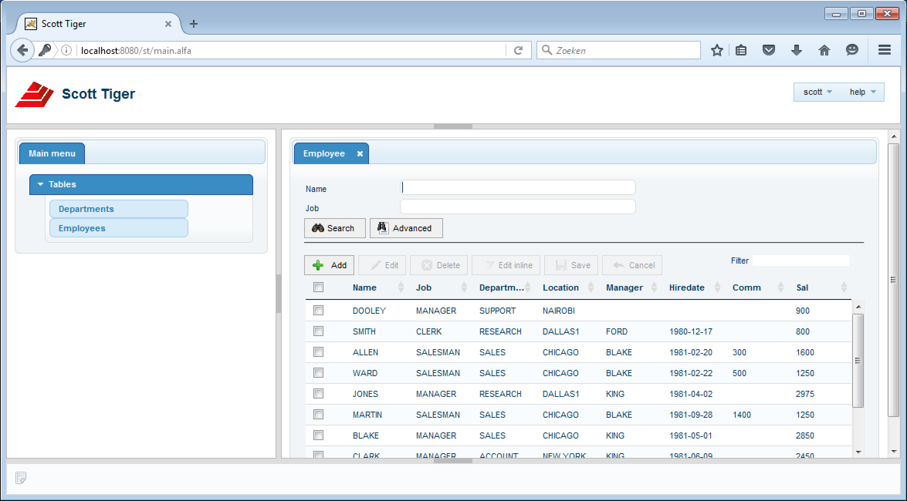
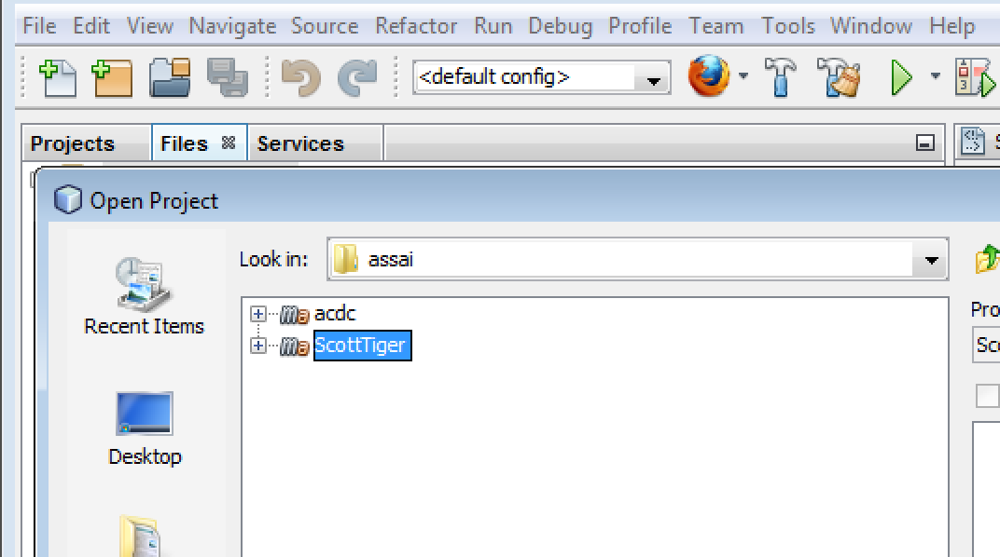
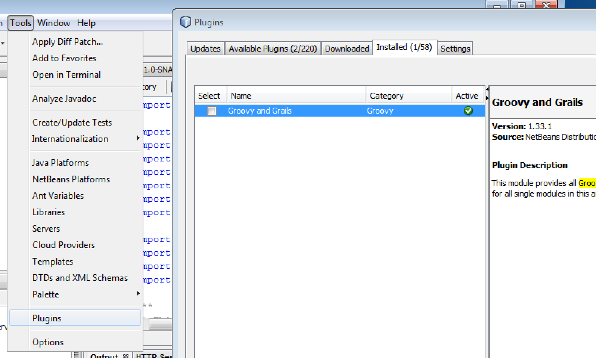

# Tutorial 1 : Install the environment

# Introduction
There are a number of ways to get started with the development of Assai 9. In this tutorial we start with a small demo application.  The main structure of this documentation contains three parts.

1. This Tutorial
2. The Developer Guide, this you can read a as the how-to
3. The Reference Documentation, here you can find all the details

This tutorial gives you an overview of how you can use Vaizr Platform to build single-page web UIs for your an application. What you need to start with it for now is JDK 8 and an IDE, such as NetBeans. While this tutorial is written for NetBeans users, you can use your IDE of choice.

# Installation

In this section, you dive right into the things and get all the software installed on your machine and make sure is is working correctly before moving further into the Vaizr Platform and writing applications.

The necessary software stack consists of the following software components, in this section we do the whole installation for a windows based machine. The example machine is a Windows 7 (64 bit).

* Mercurial
* Java JDK 1.8 
* Maven
* Netbeans
* Tomcat

Optional

* SQLDeveloper
* Firefox
* Chrome

* Python
* MKDocs

* IntelliJ

## Install Mercurial

Mercurial is the distributed version control system. You can find more on Mercurial in the reference guide in this help

Visit the [Mercurial download page](https://www.mercurial-scm.org/downloads) and download the latest version **including TortoiseHg**

**TortoiseHg (including Mercurial) 3.7.3 - x64 Windows**

After you downloaded the MSI, double-click on it. You should see a setup program similar to that shown below. Click Next and follow the instructions

### Verify the installation

To test the installation of the Mercurial software, you can use the Windows command prompt ``cmd.``

To make sure Mercurial was installed properly, type ``hg``

You should see the output as in the figure below

And you can check the version

    C:\Users\Nanne>hg version
    Mercurial Distributed SCM (version 3.7.3)
    (see https://mercurial-scm.org for more information)
    
    Copyright (C) 2005-2016 Matt Mackall and others
    This is free software; see the source for copying conditions. There is NO
    warranty; not even for MERCHANTABILITY or FITNESS FOR A PARTICULAR PURPOSE.

## Install Java JDK 1.8 

Visit the [Java JDK 1.8 download page](http://www.oracle.com/technetwork/java/javase/downloads/jdk8-downloads-2133151.html) and download the Windows x64 version

**Windows x64	187.31 MB  	jdk-8u77-windows-x64.exe **

After you downloaded the exe, double-click on it. You should see a setup program similar to that shown below. Click Next and follow the instructions.

We change the installation path for the **jdk** to ``C:\tools\java\jdk1.8.0_77\ `` It makes it more convenient when java is installed in a directory where the name does not contain spaces, also it is preferred only to use lowercase letter for the folder names

We change the installation path for the **jre** to ``C:\tools\java\jre1.8.0_77\ `` 

Finally we set **JAVA_HOME** in a system environment variable. To do this in windows go to
Control Panel ==> System and Security => System

Here you go in the lefthand menu to the link **Advanced system settings**

Now you can set the environment variable **JAVA_HOME = C:\tools\java\jdk1.8.0_77** in the following manner. Click on environment variables, than you get a new screen environment variables. Click on New under system variables and create the JAVA_HOME variable.

### Verify the installation

    C:\Users\Nanne> java -version
    java version "1.8.0_77"
    Java(TM) SE Runtime Environment (build 1.8.0_77-b03)
    Java HotSpot(TM) 64-Bit Server VM (build 25.77-b03, mixed mode)

### Verify JAVA_HOME

    C:\Users\Nanne>echo %JAVA_HOME%
    C:\tools\java\jdk1.8.0_77

## Install Maven

Maven is the Apache build manager for Java projects. You can find more on Maven in the reference guide in this help

Visit the [Maven download page](https://maven.apache.org/download.cgi) and download the latest version

**Binary zip archive 	apache-maven-3.3.9-bin.zip**

The installation of Apache Maven is a simple process of extracting the archive and adding the bin folder with the mvn command to the PATH.

Detailed steps are:

    Ensure JAVA_HOME environment variable is set and points to your JDK installation

    unzip apache-maven-3.3.9-bin.zip in c:\tools\java
    
    * Create a system environment variable MAVEN_HOME = C:\tools\java\apache-maven-3.3.9
    * Create a system environment variable MAVEN_OPTS = -Xmx612m -Dfile.encoding=UTF-8
    * Extend the Path system environment viarable with ;%MAVEN_HOME%\bin

### Verify Maven

    C:\Users\Nanne>mvn -v
    Apache Maven 3.3.9 (bb52d8502b132ec0a5a3f4c09453c07478323dc5; 2015-11-10T17:41:4
    7+01:00)
    Maven home: C:\tools\java\apache-maven-3.3.9\bin\..
    Java version: 1.8.0_77, vendor: Oracle Corporation
    Java home: C:\tools\java\jdk1.8.0_77\jre
    Default locale: en_US, platform encoding: UTF-8
    OS name: "windows 7", version: "6.1", arch: "amd64", family: "dos"

### Run Maven

Run maven without any argument. This step is necessary to create a **.m2** directory under %HOMEPATH%

    C:\Users\Nanne>mvn

## Get the Assai Software from the central Mercurial repository

It is assumed that it is the first time you download the assai software from Mercurial repository on your local machine. It is also assumed that you have a drive L: which is mapped to store11.assai.nl\Develop

If the above two pre-requisites apply to you, you can execute the following command. Once again, if you want to know more about the usage of mercurial please refer to the Mercurial section in the Reference guide of this help
 
     >mkdir -P C:\workspaces\assai
     > cd C:\workspaces\assai
     C:\workspaces\assai>hg clone L:\Mercurial\AlfaCommonDialogComponents acdc

     C:\workspaces\assai>hg clone L:\Mercurial\ScottTiger

Now we got the latest sources of the AlfaCommonDialogComponents and the start situation of tutorial 1, since we don't vhange any code in the first tutorial is is also the start of tutorial 2. We can start building now

# Build acdc and build ScottTiger

### Provide a settings.mxl file for Maven

This settings.xml file points maven to the [nexus repository manager](http://www.sonatype.com/nexus-repository-oss). In nexus the third party java libraries (jars) are maintained.

   |   |   |
   |---|---|
   |   |Nexus is an example of a repository manager. A repository manager is a dedicated server application designed to manage repositories of binary components. The usage of a repository manager is considered an essential best practice for any significant usage of Maven.|
   |   |   |

    copy C:\workspaces\assai\ScottTiger\misc\settings.xml %HOMEPATH%\.m2\settings.xml

## Start the acdc build
    
    cd C:\workspaces\assai\acdc
    C:\workspaces\assai\acdc>mvn clean install
    
After a while, up to 10 minutes, the following output should finally appear, the first time a lot of programs are downloaded in your local maven repository

    [INFO] Installing C:\workspaces\assai\acdc\pom.xml to C:\Users\Nanne\.m2\reposi
    ory\nl\alfa\acdc\ACDC\1.0-SNAPSHOT\ACDC-1.0-SNAPSHOT.pom
    [INFO] ------------------------------------------------------------------------
    [INFO] BUILD SUCCESS
    [INFO] ------------------------------------------------------------------------
    [INFO] Total time: 10:39 min
    [INFO] Finished at: 2016-04-17T20:41:45+02:00
    [INFO] Final Memory: 46M/289M
    [INFO] ------------------------------------------------------------------------

Running the same mvn command with the filled mvn repository takes normally less than two minutes

    cd C:\workspaces\assai\acdc
    C:\workspaces\assai\acdc>mvn clean install
    
    [INFO] All checks passed.
    [INFO]
    [INFO] --- maven-install-plugin:2.4:install (default-install) @ ACDC ---
    [INFO] Installing C:\workspaces\assai\acdc\target\ACDC-1.0-SNAPSHOT.jar to C:\Us
    ers\Nanne\.m2\repository\nl\alfa\acdc\ACDC\1.0-SNAPSHOT\ACDC-1.0-SNAPSHOT.jar
    [INFO] Installing C:\workspaces\assai\acdc\pom.xml to C:\Users\Nanne\.m2\reposit
    ory\nl\alfa\acdc\ACDC\1.0-SNAPSHOT\ACDC-1.0-SNAPSHOT.pom
    [INFO] ------------------------------------------------------------------------
    [INFO] BUILD SUCCESS
    [INFO] ------------------------------------------------------------------------
    [INFO] Total time: 01:41 min
    [INFO] Finished at: 2016-04-17T20:52:09+02:00
    [INFO] Final Memory: 46M/300M
    [INFO] ------------------------------------------------------------------------

## Start the ScottTiger build

    cd C:\workspaces\assai\ScottTiger
    C:\workspaces\assai\ScottTiger>mvn clean install
    
    [INFO] All checks passed.
    [INFO]
    [INFO] --- maven-install-plugin:2.4:install (default-install) @ ScottTiger ---
    [INFO] Installing C:\workspaces\assai\ScottTiger\target\ScottTiger-1.0-SNAPSHOT.
    war to C:\Users\Nanne\.m2\repository\nl\assai\alfa\ScottTiger\1.0-SNAPSHOT\Scott
    Tiger-1.0-SNAPSHOT.war
    [INFO] Installing C:\workspaces\assai\ScottTiger\pom.xml to C:\Users\Nanne\.m2\r
    epository\nl\assai\alfa\ScottTiger\1.0-SNAPSHOT\ScottTiger-1.0-SNAPSHOT.pom
    [INFO] ------------------------------------------------------------------------
    [INFO] BUILD SUCCESS
    [INFO] ------------------------------------------------------------------------
    [INFO] Total time: 33.013 s
    [INFO] Finished at: 2016-04-17T21:03:18+02:00
    [INFO] Final Memory: 30M/287M
    [INFO] ------------------------------------------------------------------------
    
    C:\workspaces\assai\ScottTiger>

## Install Netbeans & Tomcat Server

Netbeans is the official Java IDE written completely in Java, IDE stands for integrated development environment. Tomcat is packaged with the install of Netbeans EE.

Visit the download pagehttps://netbeans.org/downloads/ and download the Java EE version.

double-click the install and unselect the Glassfish Server Open Source and select the Apache Tomcat server.

Install Apache Tomcat to **C:\tools\java\Apache Tomcat 8.0.27**

## Verify the ScottTiger application

After the installation we can already run the sample application. Follow the steps below and run the ScottTiger Application

    >copy C:\workspaces\assai\ScottTiger\misc\ScottTiger-1.0-SNAPSHOT.xml "C:\tools\java\Apache Tomcat 8.0.27\conf"\st.xml
    >copy C:\workspaces\assai\ScottTiger\target\ScottTiger-1.0-SNAPSHOT.war "C:\tools\java\Apache Tomcat 8.0.27\\webapps"\st.war

Now you are ready to start the tomcat server with the ScottTiger Example. Open your windows explorer and go to ``C:\tools\Java\Apache Tomcat 8.0\bin`` and double-click on **startup.bat**. It is convienent to create two shortcuts on your desktop to start and stop the Tomcat server. To stop script is **shutdown.bat**.

Once the tomcat Server has been started you can go to your browser and check the results.

Check the application on the following url in your browser **http://localhost:8080/st**

    username : scott
    password : tiger

If all went well you should see the following picture after loging in with ``scott/tiger`` and clicking on **Tables** and then on **Employees**.

## Open the ScottTiger application in NetBeans

Startup Netbeans by double-clicking on the Netbeans icon. After that choose File, Open Project ... And go to assai\ScottTiger. Netbeans recognizes the maven structure. You should get a figure like below.

After you opened the project you see there is one error, this is due to the fact that the groovy plugin is not yet installed.

Go to Tools, Plugins and search for groovy in the available plugins. check install and voila you are ready to go

Netbeans recognizes that your product is in Mercurial and it ase recognizes that you create a deployable war.

One more step. Put the ``ScottTiger-1.0-SNAPSHOT`` file in the conf directory of Tomcat

    >copy C:\workspaces\assai\ScottTiger\misc\ScottTiger-1.0-SNAPSHOT.xml "C:\tools\java\Apache Tomcat 8.0.27\conf"

Push on run and the application will be deployed on Tomcat and the default browser is opened with your project. Again you can login with

    username : scott
    password : tiger

Once again you see the following screen, the port number is now ``8084`` instead of ``8080`` and ``st`` is replaced by ``ScottTiger``. The full url is ``http://localhost:8084/ScottTiger/login.alfa``. However NetBeans will start your default browser and fill in the url.

# Summary

In this tutorial, we installed the various software component to getting started with Vaizr development. We deployed a simple HR management system. It is not a real application, it only contains two tables in the back-end EMP and DEPT. We covered the installation Vaizr development and you can use the result as a basis for more experiments with Vaizr, such as building screens for a master detail relation. This will we do in [the second tutorial.](tutorial/master_detail)

