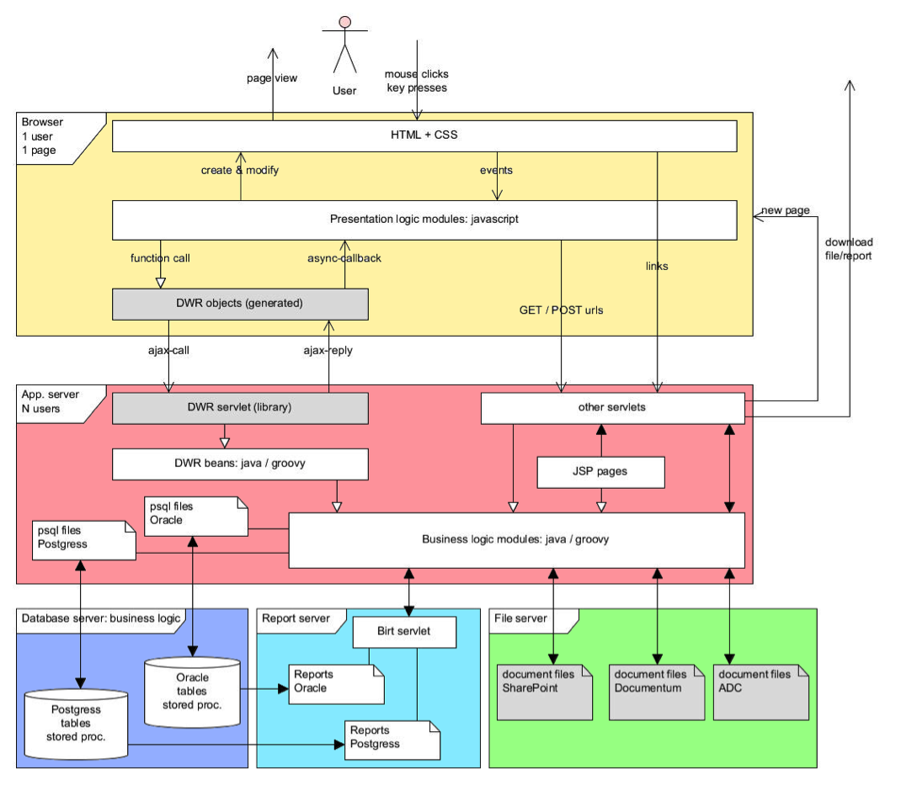
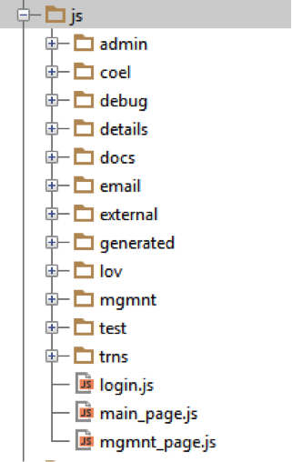
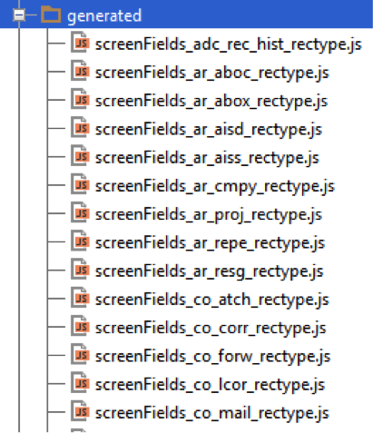
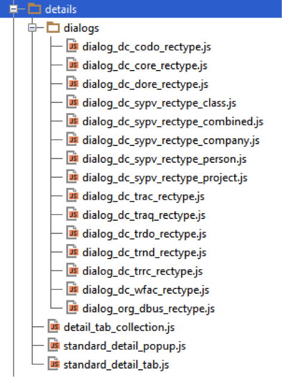
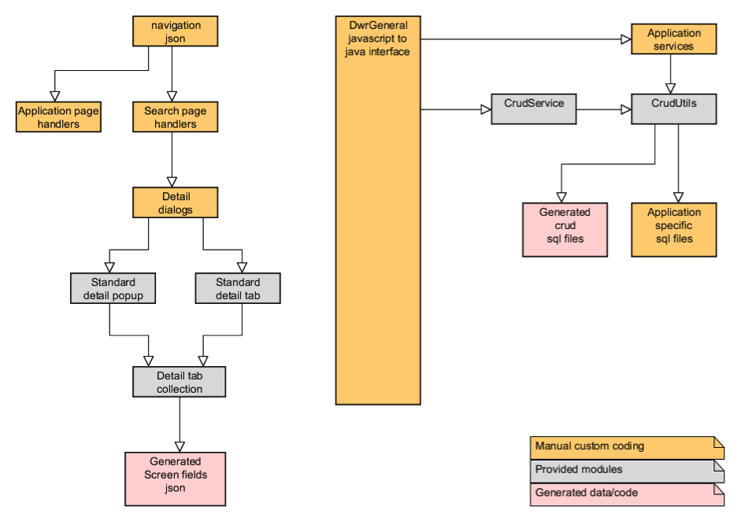
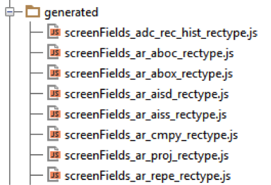
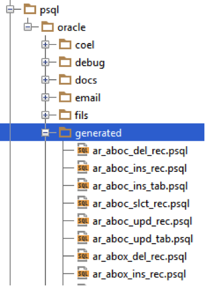
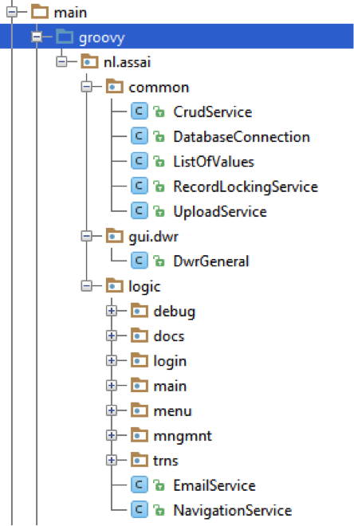

# Assai-9 POC global design
# 1. Introduction
This document presents a global design for the Proof of Concept for the AssaiAdmin web interface. It gives an overview of the structure and the components used in the application.

The intended audience for the document are developers, familiar with web application terminology.
# 2. Overview
The picture below gives an overview of the system:

The main components involved are:

* The user’s browser
* The application server (for example running Tomcat)
* The database server (for example running an Oracle database)
* The report server (for example running Tomcat with the BIRT report viewer)
* The file server (for example running the ADC file system)

The user’s browser is running the presentation logic of the frontend.
The other servers are running the business logic of the backend. These servers may actually be just one physical server running for example Tomcat, BIRT, the ADC file system and an Oracle database.

The grey components in the picture are components that are provided and need no development. The document files are provided by the clients. The DWR library is provided by the open source framework Direct Web Remoting that facilitates Ajax communication between JavaScript and java: http://directwebremoting.org/dwr/index.html.
All other components need to be developed, or re-used from existing modules in AssaiWEB and Admin. 

The BIRT servlet is the standard open source BIRT report viewer with some specific add-ons like secure parameters (e.g. database credentials), and a management interface for managing custom reports.

# 3. Frontend
The frontend of the application is running in the user’s browser. After the login page there will probably be just one main page where all the presentation logic takes place.

This part of the application consists of an HTML page with some initial mark-up to provide the basic elements for the layout and position the navigation and main menu-bar widgets. Furthermore the page contains links to all the required CSS and JavaScript files.

Once everything has been loaded a little JavaScript will generate the HTML required to show the initial content of the page: layout, navigation, menu-bars, etc. Then it is up to the user and the JavaScript on the page is waiting for events to happen, such as button clicks, menu selections, etc.

The JavaScript modules loaded by the page react to the events by invoking server calls through the DWR layer. The call back functions that are invoked upon completion will probably change the HTML content to show additional tabs and tables, enable/disable menus and buttons, and so on.

Once in a while a click on a link in the generated HTML will result in a GET request to one of the servlets to download a file from the file server or to download a report. The browser will prompt the user to save or open the downloaded content.

And once in a while the user will upload a file which will result in a PUT request to one of the servlets that will store the uploaded file on the file server.

## 3.1	Libraries

The frontend of the application will use open source libraries based on jQuery: http://jquery.com/
Besides the jQuery core library other libraries used for widgets are for example jQuery UI and jQuery DataTables. An advantage of using the jQuery stack (besides being popular) is that they all implement the same theming mechanism and provide a consistent way of coding.

The application’s general modules for the presentation logic are also implemented as jQuery plugins. These plugins are generally used like this:

    $( element-selector ).plugin-name( plugin-settings );

The $ is a common shortcut for jQuery. If no plugin settings are supplied then the plugin will apply sensible default settings.

## 3.2	Common modules
3.2	Common modules
Currently available common modules:

1.	jquery.alfaaccordion.js
2.	jquery.alfatree.js
3.	jquery.alfamenu.js
4.	jquery.alfaiconsbar.js
5.	jquery.tableWrapper.js
6.	jquery.alfautils.js
7.	jquery.alfadlgutils.js
8.	jquery.alfadialog.js
9.	jquery.alfadlg.lov.js
10.	jquery.alfadlg.blocks.js
11.	jquery.alfadlg.drilldown.js
12.	jquery.alfaContextHandler.js

Modules 1,2,3,4,5 are wrappers for standard jQuery UI plugins. 

The standard jQuery UI plugins operate on a HTML structure, for a menu for example:

    <ul id="menu">
      <li class="ui-state-disabled"><a href="#">Aberdeen</a></li>
      <li><a href="#">Ada</a></li>
      <li><a href="#">Addyston</a></li>
      <li>
        <a href="#">Delphi</a>
        <ul>
          <li class="ui-state-disabled"><a href="#">Ada</a></li>
          <li><a href="#">Saarland</a></li>
          <li><a href="#">Salzburg</a></li>
        </ul>
      </li>
    </ul>

    $( '#menu' ).menu();

This is fine for simple web sites, but in the application these HTML structures cannot be hardcoded. It must be possible to build the content of a menu dynamically (including the call-back functions to be called).

The wrapper plugins take a JSON structure as input, generate the HTML structure accordingly and then apply the standard UI plugin to that HTML structure. For a menu for example:

    myMenu = [
        {name:'main 1', id:'id_main1', items:[
            {name:'item 1', id:'id_item1', fn:'myObj.func1'},
            {name:'item 2', id:'id_item2', fn:'myObj.func2' , disabled: true}
        ]}
    ];

    $( '#menu' ).alfaMenu({
          "items": myMenu
    });

These simple wrapper plugins are not further described in this paragraph.

### 3.2.1	tableWrapper

This plugin consists of one object in the jQuery function namespace:

    $.fn.customPaging

This object provides a wrapper to customize the jQuery Data Tables plugin. The customization includes: server-side paging, multi-select of rows, inline editing of cells, zooming in/out on the table, etc.

### 3.2.2	alfautils
This is a static plugin that consists of just one object in the jQuery namespace:

    $.alfa.alfaUtils

This object provides general utility functions, not directly related to dialogs, for example:

* getLabel: get the label for a specified key (for localized messages and prompts)
* createObjectFromRow: create an object from an array of values and a corresponding array of column names
* getFunctionFromString: get the function object corresponding to a specified string (e.g. “MyObj.function1”)

### 3.2.3	alfadlgutils
This is a static plugin that consists of just one object in the jQuery namespace:

    $.alfa.dlgUtils
    
This object provides utility functions related to generating HTML structures for dialogs, for example:

* ddField: adds the HTML structure to represent the specified field (text  input, text area, date, dropdown list, etc.)
* getValuesForFieldsItem: gets the user-entered values from the HTML page for the fields specified in a JSON structure.

### 3.2.4	alfadialog
This is the jQuery plugin that creates the different dialog types used by the application (e.g. blocks and lov).  The dialogtype property in the dialog settings determines the type of dialog that is created:

    $( '

' ).alfaDialog( {
        dialogtype: "lov",
        title: "Status values",
        service: {"dwr": "DwrGeneral.lov_status", "parameters": {}},
        callback: "MyFunctions.handelSelection"
    } );

    $( '

' ).alfaDialog( {
        dialogtype: "blocks",
        title: "Document details"
    }, items );

The alfaDialog object just provides default values for the settings and lets the dialogs be created like a jQuery plugin.
The actual implementation of these dialogs is provided by the other modules: alfadlg.lov and alfadlg.blocks. From the jQuery plugin the actual dialog object can be obtained by a call like this:

    var dlg = $( '#dlg_doc_details' ).alfaDialog( 'getDialogObject' );

### 3.2.5	alfadlg.lov
This module provides the DlgLov object that shows a dialog to display a list of values and select one or more of these values. The service property in the settings specifies the DWR function to call to obtain the list of values from the server. The callback property in the settings specifies the JavaScript function to call upon selection. In the settings of the DlgLov object a lot of options can be configured (e.g. using an icon, using auto-complete, using a hot-key, using a cache, etc.).
### 3.2.6	alfadlg.blocks
This module provides the DlgBlocks object that shows a dialog build from a JSON structure with blocks for different type of dialog items (fields, buttons, trees, tables, etc.).
Each block has two properties: type and data. The block type determines the content of the data property.

|          |   |
|----------|---|
|**type**  | **data**                                                                                        |
|separator | ``{}                                                                                         `` |
|buttons   | ``{label1: {action: ‘function’, disabled: true\|false}, label2: {…}}                         `` |
|fields	   | ``{label1: {value: ‘value’, optional: true|false, type: ‘string|date|lov|large-string’}}     `` |
|table	   | ``{count: 1, columns: [col1, col2], rows: [[value1, value2]], onselect: ‘function’}          `` |
|tree	   | ``{items: [{name: ‘name1’, id: ‘id1’, fn: ‘function1’, items: []} ]}                         `` |
|tab	   | ``{title: ‘title’,  items: [ any-of-the-blocks]}                                             `` |
|container | ``{}                                                                                         `` |

With this mechanism the content of a dialog can be described in a JSON structure and the corresponding HTML structure will be built dynamically. 
In the settings of the dialog the is_popup property specifies if the dialog should be shown as a popup window (with minimize and close icons) or should be shown as plain HTML within the enclosing element (e.g. a tab element).

### 3.2.7	alfadlg.drilldown
This module provides drilldown functionality for cells in a table when clicked upon. At the moment these drilldown actions are supported:

*	runreport (not used in AdminPOC): open a popup window with the content of a report run with the current row values as parameters.
*	download_file_by_path: download the file with the path specified in the cell content.

Additional drilldown action will be supported in future versions, e.g. to popup a window to show a large text or to popup a window with a detail screen for the foreign key value in the cell content.

With these drilldown actions; download (and other functionality) can be added to table rows or screen fields by specifying them in the SQL query that fills the data table. For example:

    SELECT '{"drill_action": "download_file_by_path", "parameter": "' ||
           (SELECT replace(PATH, '\', '/') || '/' || name || '.' || extension
            FROM adc_files fils, adc_entities entt
            WHERE     fils.pk_seq_nr = dcdore00.latest_dore_seq_nr(docs.docs_seq_nr)
                      AND fils.entt_seq_nr = entt.entt_seq_nr
                      AND entt.entity_code = 'DORE'
                      AND fils.for_publication = 'Y') || '"}'
      AS  publication_file
    ,     docs.docs_seq_nr
    ,     docs.full_nr                  documentnr
    ,     docs.description

In the table the publication file will be shown as an icon based on the extension and the file will be downloaded when the icon is clicked upon.
### 3.2.8	alfaContextHandler
Most screens and tabs contain buttons or menus or icon bars or a table with a context menu. And often a screen contains a combination of these. Most of the time these buttons and menu entries need be enabled or disabled depending on the context of the screen, for example when one or more rows in the table get selected or deselected.
The alfaContextHandler is a module that assists in keeping track of the screen context. It provides functions for loading a menu configuration from the server, enabling/disabling buttons and menu items, attaching function keys to button/menu actions, tracking the selected rows in a table, etc.

## 3.3	Application Modules
The client modules that take care of the application functions are located in the webapp/js directory:

The subdirectories deal with specific application level modules like composition elements, LOVs, documents, transmittals, etc.

A special case is the generated directory:

These scrienFields_<record type>.js files are generated from the database and contain JavaScript descriptions for the fields of database record types. These files are used to build the details screens for data entry for those records.

Another special case is the details subdirectory:

This directory contains the details tabs and the details popup dialogs for the different record types. These tabs and popups adhere to a certain interface and are available through the detail tab collection. In this way a detail screen can easily incorporate different tabs for master-detail views.

## 3.3.1	Application modules overview
An overview of the application level modules on the client and the server is shown in next diagram. The modules on the left are JavaScript modules on the client and the modules on the right are java/groovy modules on the server. The DwrGeneral module is the interface between the client and the server, it is implemented in groovy on the server and can be invoked remotely from JavaScript on the client. The modules with grey background are provided modules for general use, the modules with pink background are generated from the database metadata and the modules with orange background are to be written manually because they contain the business logic.

# 4. Backend
## 4.1	Database dependencies
Currently the only database supported is Oracle, but in the future the application also needs to support databases like Postgress or Microsoft SQL server.

To ease the migration to other databases the code on the application server should have as less database dependencies as possible. Therefore the SQL statements will not be embedded in the code but externalised into .psql files (just like in AssaiWEB). This is done not only for select, insert, update and delete statements but also for stored procedure calls.

## 4.2	Database generated data
The application has to deal with a large number of database tables. In the database stored procedures are generated to handle the operations on the records of these tables. In the application the handling of these records is always similar. That would require a lot of repetitive source code with only varying names for tables, fields and procedures.
To deal with this repetitive code the application uses data generated from the database. On the client side these generated JavaScript files are used:

On the server side these generated psql files are used:

These files are generated by a database script and then copied into the project and updated into the mercurial repository (so the generation process is not part of the build script).

## 4.3	Application server
### 4.3.1	Common modules
Currently available main modules:

* CrudUtils
* ExternalProcedureService
* SqlFileService

These modules are to support the functions defined in DWR beans and other services.

#### 4.3.1.1	CrudUtils
The main functions provided by this class are:

* getBasicDataSource: a static function that creates a data source for the specified database URL and credentials.
* runSqlFile: runs the specified .psql file with the provided name-values map and returns the result (count + columns + rows).

#### 4.3.1.2	ExternalProcedureServices
The main functions provided by this class are:

* runProcedureWithInoutParams: runs the stored procrdure in the specified .psql file with the provided input values list and returns  the output parameters in the data section of the result.

#### 4.3.1.3	SqlFileService
This service is used to parse .psql files. These files contain SQL statements with special tokens formatted like {@name}.
The service removes any comments from the SQL statement and creates a prepared statement with the tokens replaced by ? characters, and a corresponding array of values.

Two types of tokens are treated differently:

* {@order_by}: this token is just replaced by the corresponding value
* {@use_name}: this token is used at the start of a line to enable a line or comment it out (the default value is --)

This can for example be used to create a Query By Example statement dynamically:

    select
        parameter_code
      , description
      , datatype
      , validated_by
      , value
      , application_level_ind
    from adc_system_parameters
    where 1 = 1
    {@use_parameter_code} and parameter_code like '%' || {@parameter_code} || '%'
    {@use_description }   and description like '%' || {@description} || '%'
    {@use_validated_by}   and validated_by'%' || {@validated_by} || '%'
    order by {@order_by}

If a parameter (like description) has a value then it will be taken into account in the where clause, otherwise it will be commented out.

### 4.3.2	Application modules
The server modules that take care of the application logic are located in the src/main/groovy directory:

The logic subdirectories deal with specific application level modules like documents, transmittals, etc.
The common subdirectory contains services to support all the application modules. The CrudService for example provides a generic interface for create, read, update and delete operations on all (generated) database record types.

A special case is the gui/dwr subdirectory, this contains the DWR beans that define the interface between the client and the server part of the application. The DWR beans support the JavaScript on the client with remote access to the server side services. These DWR beans are just thin layers which call the other services to implement the actual application logic.

## 4.4	Database server

TODO

## 4.5	Report server
The report server is a modified version of the standard BIRT report viewer application. Nonstandard additions:

* Web service to get the list (tree) of available reports.
* Web service to get the parameters of a specified report.
* Filter to decrypt encrypted parameters (e.g. database credentials) and to check the MAC to verify that the parameters have not been tampered with.
* A management interface for uploading / removing custom reports.
* A modified database connector that passes ‘AssaiBirt’ as the program name property so the database sessions can be recognized. 
* A servlet that runs a specified report and stores the result in a file on disk.

The standard BIRT report viewer application provides a servlet that supports URLs to:

* Run a report and show the result in a web page.
* Run a report and return the result in a specific format (e.g. PDF or CSV).

The BIRT reports are stored in XML files. These files are created and modified with a special version of the open source Eclipse IDE.

Because the reports include SQL statements that may be different for different databases, it may be necessary to have different report files per database.

## 4.6	File server
The following file systems are currently supported:

* ADC file system
* Documentum
* SharePoint
* FileNet
* Livelink

The application server modules use objects to hide the specifics of each file system and access all in a way that is as uniform as possible.

# 5. Testing
The application is a single page web application with almost all communication between the frontend and the backend going through the DWR layer. That makes it easier to test the frontend and the backend independently.## 5.1	Frontend

## 5.1	Frontend
The frontend modules can be tested by using simple JavaScript mocks for the DWR objects. For example:

    // DwrGeneral mock functions
    DwrGeneral = {};

    DwrGeneral.adc_system_parameters_delete = function (id, callback)
    {
        var out = {columns: [], rows: [], count: 1, data: {}};
        setTimeout(function() {callback(out);}, 100);
    };

Frontend modules can thus be tested without any server interaction. Examples can be found in the project’s test directory: test/js/visual

## 5.2	Backend
The business logic of the backend is mainly activated through the DWR beans (as opposed to HTTP GET requests and form POSTs through the servlets). As these are just plain function calls they can be tested with simple unit tests without the need of an application server container (like Tomcat). For example:

    def "test adc_system_parameters delete"()
    {
        setup:
        def result = dwrgeneral.adc_system_parameters_search( [parameter_code: "CODE_1001"] )
        def id = result.rows[0][0]

        when:
        result = dwrgeneral.adc_system_parameters_delete(id)

        then:
        result.count == 1
    }

This unit test uses the open source framework Spock: https://code.google.com/p/spock/
Examples can be found in the projects test directory: test/java and test/groovy.
All unit tests are run automatically upon each maven build command. If any of the unit tests fails then the build will fail until the issue is fixed.

## 5.3	Code Analysis
Besides testing also code analysis tools are used to detect defects at an early stage. The maven build file uses these plugins at build time:

* CheckStyle: analyses java source code
* PMD: analyses java source code
* CodeNarc: analyses groovy source code
* JSLint: analyses javascript source code

If any of these plugins detects an issue then the build will break until the issue is fixed.

When the maven site is built then it will contain the reports of these plugins as well as the Cobertura report about the code coverage details from the unit tests. This plugin has been configured to handle both java and groovy code.

