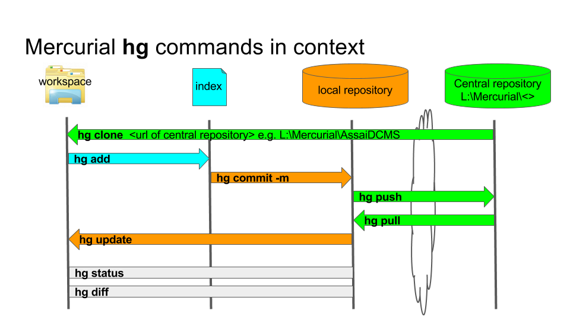
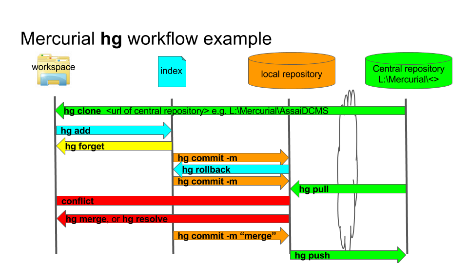
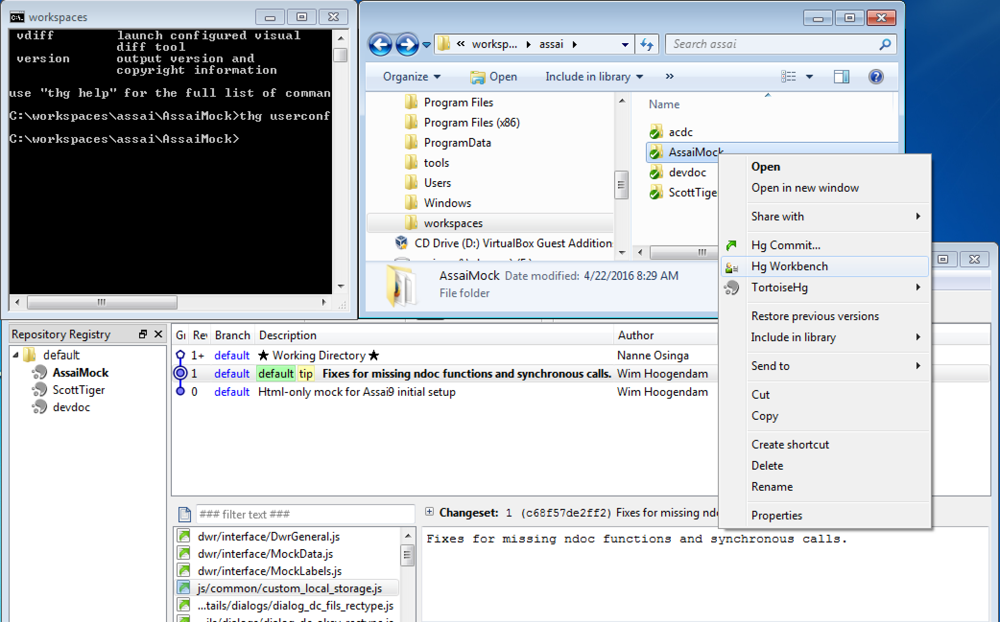

# Mercurial & TurtoiseHg

## What is version control

Version control systems are a category of software tools that help a software team manage changes to source code over time.
Version control software keeps track of every modification to the code in a special kind of database. If a mistake is made, developers can turn back the clock and compare earlier versions of the code to help fix the mistake while minimizing disruption to all team members.

[https://www.atlassian.com/git/tutorials/what-is-version-control](https://www.atlassian.com/git/tutorials/what-is-version-control)

## Benefist of version control

1. A complete long-term change history of every file.
2. Traceability.
3. Branching and merging.

## _Distributed_ Version Control System (DVCS)

In the past five years or so a new breed of tools has appeared: so-called “distributed” version control systems (DVCS for short). The two most popular of these are Git and Mercurial.

These systems do not necessarily rely on a central server to store all the versions of a project’s files. Instead, every developer **“clones”** a copy of a repository and has the full history of the project on their own hard drive. This copy (or “clone”) has all of the metadata of the original.
The act of getting new changes from a repository is usually called **“pulling”**, and the act of moving your own changes to a repository is called **“pushing”**. In both cases, you move changesets (changes to files groups as coherent wholes), not single-file diffs.

One common misconception about distributed version control systems is that there cannot be a central project repository. This is simply not true. In our case the **Store11\Develop\Mercurial** ( **L:\\Mercurial** ) is the central repository

Two most well known are GIT and Mercurial
GIT is made by Linus Torvalds (Linux guy)

* Primary focused on linux => Windows is second class citizen

Mercurial is written in python and used by most python projects

* Mercurial’s simple approach leads to documentation which is sleek and concise. It’s easy to find what you’re looking for — using hg help, so you can spend less time looking at docs and get back to coding. It favors clarity over “cleverness”, which makes for an easier-to-use tool.

## Why Mercurial

*    More GUI options
*    Easier to learn
*    Better cross-OS support
*    More secure commit history

## Mercurial hg commands

Why hg ? Hg is de chemical name of mercury in the periodic table

* hg ##clone## central repository
* hg ##commit -m## selected diffs in checked files
* hg ##undo (rollback)## last immediate commit
* hg ##revert## checked files to last revisioned state
* hg ##add## checked files
* hg ##move## checked files
* hg ##remove## checked files
* hg ##forget## checked files
* hg ##pull## all changes from the central repository to your local repository
* hg ##push## all changes from your local repository to the central repository

You can read more on Mercurial [here](http://hgbook.red-bean.com/read/a-tour-of-mercurial-the-basics.html).

## Mercurial commands in context

## Mercurial workflow example

## Installation

Installation of Mercurial is described in the [first tutorial](/#install-mercurial)

# TurtoiseHg

TurtoiseHg is a graphical user interface on top Mercurial. There are two ways to startup TurtoiseHg from the commandline by typing **thg**   ``C:\workspaces\assai\AssaiMock>thg`` or right-click in the Windows explorer, see the image below.

All the commands and explanation on TurtoiseHg you can find [here](http://tortoisehg.readthedocs.org/en/latest/)