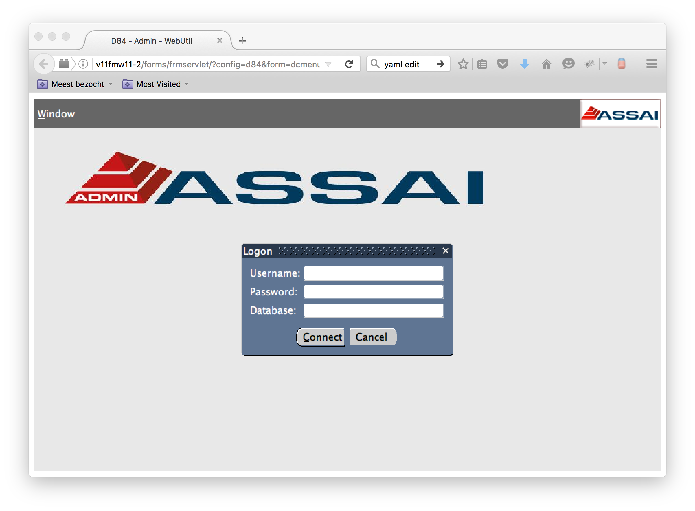
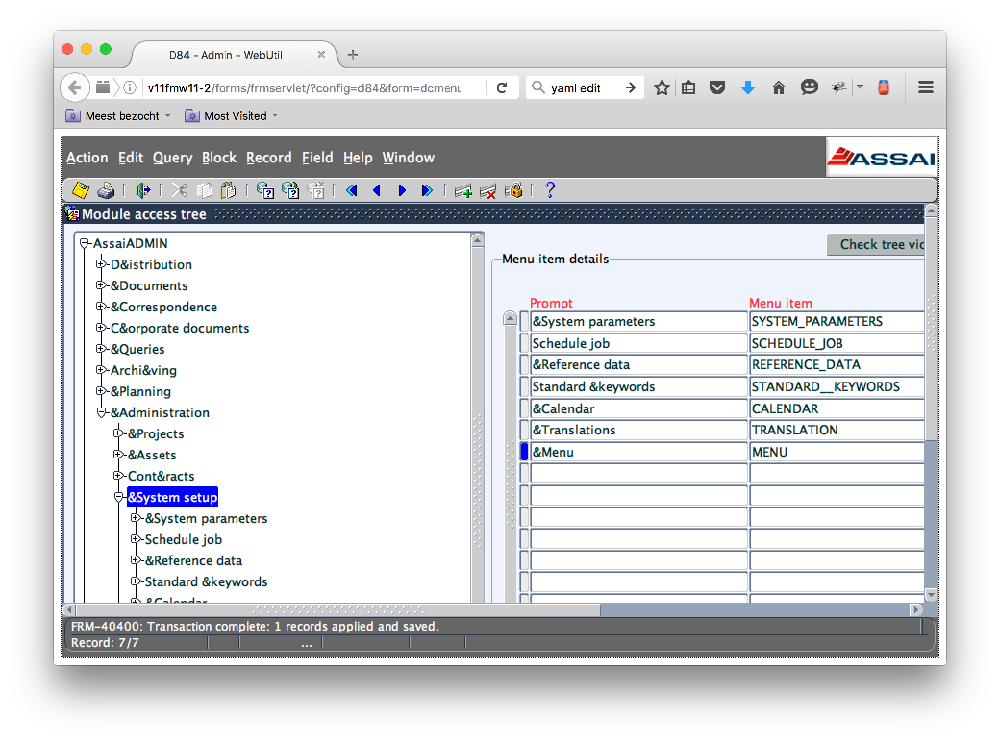
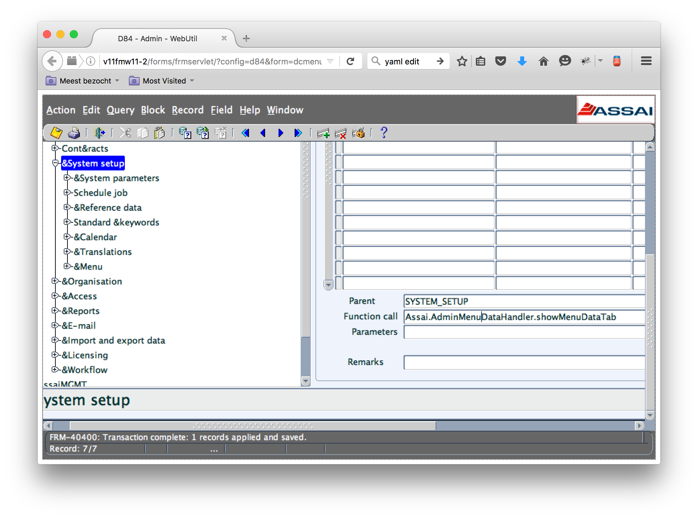
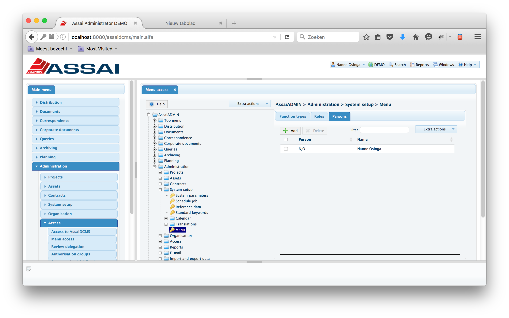
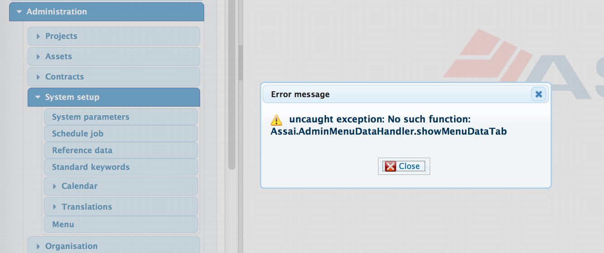
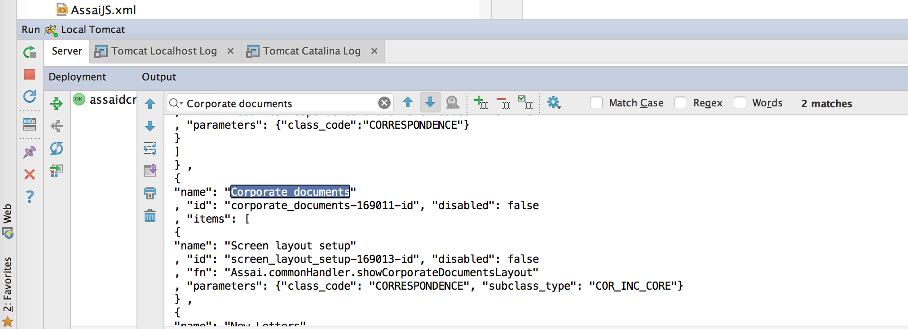
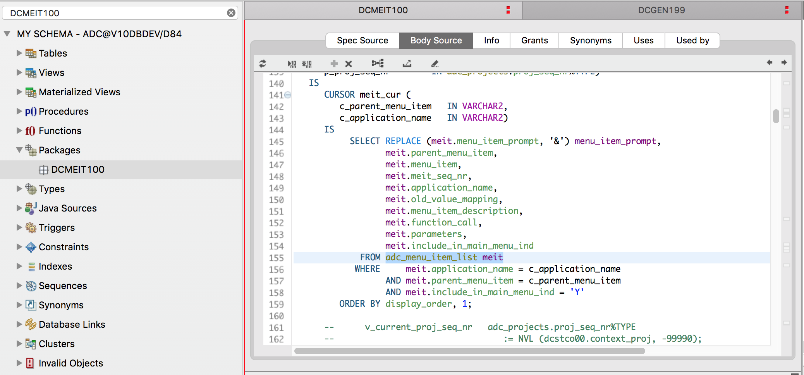

# Assai DCMS create menu and screen

First we create a menu, since we still have to add menu items with and Oracle form we are going to create a screen in A9 to add and modify menu items

# Create menu

## Add menu item to menu item table

Open the following Oracle Forms screen

[http://v11fmw11-2/forms/frmservlet/?config=d84&form=dcmenu_maintenance](http://v11fmw11-2/forms/frmservlet/?config=d84&form=dcmenu_maintenance)

log in with

    Username : njo
    Password : njo
    Database : D84

Under

    AssaiAdmin
    ==> &Administration
        ==> &System setup

Add the following menu item details

     Prompt         : &Menu
     Menu item      : MENU
     Display order  : 40
     Show in menu ? : yes

         Parent        : SYSTEM_SETUP
         Function call : Assai.commonHandler.showMenuItemAdmin

We are going to create the Assai.commonHandler.showMenuItemAdmin function later in this tutorial

## Add

Open the following A9 screen and login

log in with

    Username : njo
    Password : njo
    Database : D84

[localhost:8080/assaidcms/login.alfa](localhost:8080/assaidcms/login.alfa)

Under

   Main menu
   ==> Administration
       ==> Access
           ==> Menu acces

   And now go in the right pane to

   AssaiADMIN
   ==> Administration
       ==> System setup
           ==> Menu

   And add person NJO

Logoff and logon

   Main menu
   ==> Administration
       ==> System setup
           ==> Menu

If you click on it you get the following error:

Adding the menu item is finished now

# Create screen

## Generate screen definitions for menu table

First we have to find the menu table. This can be found in the logging in your IDE when you run assaidcms local

* Go to [localhost:8080/assaidcms/login.alfa](localhost:8080/assaidcms/login.alfa)
and logoff
* Clear the logging in your IDE
* logon to [localhost:8080/assaidcms/login.alfa](localhost:8080/assaidcms/login.alfa)
* Search for `Corporate Documents` in IDE tomcat logging, the second hit is in the menu json structure see image above
* Scroll up and find out that `External call Function (/login/get_accordion.psql)` is called
* In the next line you see `call DCMEIT100.gen_json_menu_clob`

        DEBUG [2016-05-25 09:11:59] [nl.alfa.util.ExternalProcedureService.performFunctionCall(ExternalProcedureService.groovy:77)] :
        External call Function (/login/get_accordion.psql):
        {{@RET_CLOB jsonStructure} = call DCMEIT100.gen_json_menu_clob(
        	{@IN_NUMERIC p_pers_seq_nr},
        	{@IN_VARCHAR p_application_name},
                {@IN_NUMERIC p_proj_seq_nr},
        	{@OUT_VARCHAR p_error_message}
        )}
        Values:
        [p_pers_seq_nr:4602, p_proj_seq_nr:434, p_application_name:AA]
        Result data:
        [jsonStructure:[
        {
        "name": "Distribution"
        , "id": "d_istribution-138976-id", "disabled": false
        , "items": [

* Check now in the database in function DCMEIT100.gen_json_menu_clob, for example with Toad

          Username : adc
          Password : adc
          Database : D84

* Now we are using `adc_menu_item_list meit` as input for generating the screen fields for the menu screen

* start sqlplus with adc/adc@D84. And look for the screen definitions generator package. This package is called `DCGEN199`

          $sqlplus adc/adc@D84

          SQL*Plus: Release 11.2.0.4.0 Production on Wed May 25 08:53:49 2016

          Copyright (c) 1982, 2013, Oracle.  All rights reserved.

          Connected to:
          Oracle Database 11g Release 11.2.0.4.0 - 64bit Production

          SQL> desc dcgen199
          PROCEDURE GEN199
           Argument Name			Type			In/Out Default?
           ------------------------------ ----------------------- ------ --------
           P_TABLE_NAME			VARCHAR2		IN
           P_SHORT_NAME			VARCHAR2		IN
          PROCEDURE GEN199_PKB
           Argument Name			Type			In/Out Default?
           ------------------------------ ----------------------- ------ --------
           P_TABLE_NAME			VARCHAR2		IN
           P_SHORT_NAME			VARCHAR2		IN
          PROCEDURE GEN199_PKS
           Argument Name			Type			In/Out Default?
           ------------------------------ ----------------------- ------ --------
           P_TABLE_NAME			VARCHAR2		IN
           P_SHORT_NAME			VARCHAR2		IN
          PROCEDURE GEN_JAVASCRIPT_FILES
           Argument Name			Type			In/Out Default?
           ------------------------------ ----------------------- ------ --------
           P_TABLE_NAME			VARCHAR2		IN
           P_SHORT_NAME			VARCHAR2		IN
          PROCEDURE GEN_JAVASCRIPT_FILES
           Argument Name			Type			In/Out Default?
           ------------------------------ ----------------------- ------ --------
           P_RECTYPE_NAME 		VARCHAR2		IN
          PROCEDURE GEN_OBJECT_TYPES
           Argument Name			Type			In/Out Default?
           ------------------------------ ----------------------- ------ --------
           P_TABLE_NAME			VARCHAR2		IN
           P_SHORT_NAME			VARCHAR2		IN
          PROCEDURE GEN_PLSQL_FILES
           Argument Name			Type			In/Out Default?
           ------------------------------ ----------------------- ------ --------
           P_TABLE_NAME			VARCHAR2		IN
           P_SHORT_NAME			VARCHAR2		IN
          FUNCTION IS_COLUMN_UPPER_CASE RETURNS BOOLEAN
           Argument Name			Type			In/Out Default?
           ------------------------------ ----------------------- ------ --------
           P_TABLE_NAME			VARCHAR2		IN
           P_COLUMN_NAME			VARCHAR2		IN
          PROCEDURE WR_STR
           Argument Name			Type			In/Out Default?
           ------------------------------ ----------------------- ------ --------
           P_STRING

* We go for

          PROCEDURE GEN_JAVASCRIPT_FILES
           Argument Name			Type			In/Out Default?
           ------------------------------ ----------------------- ------ --------
           P_TABLE_NAME			VARCHAR2		IN
           P_SHORT_NAME			VARCHAR2		IN

* Execute the procedure as follows

          SQL> set serverout on
          SQL> begin dcgen199.GEN_JAVASCRIPT_FILES('ADC_MENU_ITEM_LIST','MEIT'); end;
            2  /

          PL/SQL procedure successfully completed.

          SQL> set serverout on
          SQL> /
          SET serveroutput on size 1000000 format wrapped
          set feedback  off
          set trimspool on
          SPOOL screenFields_dc_meit_rectype.js
          begin
          DBMS_OUTPUT.put_line ('Assai.screenFields.dc_meit_rectype = {' );
          DBMS_OUTPUT.put_line ('  "_generation_date"  :"25-05-2016",' );
          ...
          SQL> l
            1* begin dcgen199.GEN_JAVASCRIPT_FILES('ADC_MENU_ITEM_LIST','MEIT'); end;
          SQL> spool gen_sd.sql
          SQL> /
          SQL> spool off
          SQL> @gen_sd.sql

* The following rectype is displayed in your sqlplus output

          Assai.screenFields.dc_meit_rectype = {
            "_generation_date"  :"25-05-2016",
            "_table_name"       :"adc_menu_item_list",
            "_pk_column"	      :"meit_seq_nr",
            "_timestamp_column" :"maintenance_date",
            "_entity_code     " :"MEIT",
            "meit_seq_nr": {
               "type"	      : "number"
            ,  "optional"       : false
            ,  "size"	      : 9
            ,  "upper_case"     : false
            ,  "pk"	      : true
            ,  "update_allowed" : false
            }
            ,
            "parent_menu_item": {
               "type"	      : "string"
            ,  "optional"       : false
            ,  "size"	      : 100
            ,  "upper_case"     : false
            ,  "uk"	      : true
            ,  "update_allowed" : true
            }
            ,
            "menu_item": {
               "type"	      : "string"
            ,  "optional"       : false
            ,  "size"	      : 100
            ,  "upper_case"     : true
            ,  "uk"	      : true
            ,  "update_allowed" : true
            }
            ,
            "menu_item_prompt": {
               "type"	      : "large_string"
            ,  "optional"       : true
            ,  "size"	      : 128
            ,  "upper_case"     : false
            ,  "update_allowed" : true
            }
            ,
            "application_name": {
               "type"	      : "string"
            ,  "optional"       : false
            ,  "size"	      : 10
            ,  "upper_case"     : true
            ,  "uk"	      : true
            ,  "update_allowed" : true
            }
            ,
            "old_value_mapping": {
               "type"	      : "large_string"
            ,  "optional"       : true
            ,  "size"	      : 2000
            ,  "upper_case"     : false
            ,  "update_allowed" : true
            }
            ,
            "menu_item_description": {
               "type"	      : "large_string"
            ,  "optional"       : true
            ,  "size"	      : 2000
            ,  "upper_case"     : false
            ,  "update_allowed" : true
            }
            ,
            "function_call": {
               "type"	      : "large_string"
            ,  "optional"       : true
            ,  "size"	      : 200
            ,  "upper_case"     : false
            ,  "update_allowed" : true
            }
            ,
            "parameters": {
               "type"	      : "large_string"
            ,  "optional"       : true
            ,  "size"	      : 200
            ,  "upper_case"     : false
            ,  "update_allowed" : true
            }
            ,
            "include_in_main_menu_ind": {
               "type"	      : "string"
            ,  "optional"       : false
            ,  "size"	      : 1
            ,  "upper_case"     : true
            ,  "values"	      : ["Y", "N"]
            ,  "update_allowed" : true
            }
            ,
            "display_order": {
               "type"	      : "number"
            ,  "optional"       : true
            ,  "size"	      : 9
            ,  "upper_case"     : false
            ,  "update_allowed" : true
            }
            ,
            "created_by": {
               "type"	      : "string"
            ,  "optional"       : false
            ,  "size"	      : 30
            ,  "upper_case"     : true
            ,  "update_allowed" : true
            }
            ,
            "creation_date": {
               "type"	      : "date"
            ,  "optional"       : false
            ,  "upper_case"     : false
            ,  "update_allowed" : true
            }
            ,
            "maintained_by": {
               "type"	      : "string"
            ,  "optional"       : false
            ,  "size"	      : 30
            ,  "upper_case"     : true
            ,  "update_allowed" : true
            }
            ,
            "maintenance_date": {
               "type"	      : "date"
            ,  "optional"       : false
            ,  "upper_case"     : false
            ,  "update_allowed" : true
            }
          };

* The above content we save in a file `assaidcms\src\main\webapp\js\generated\screenFields_dc_meit_rectype.js`

## Generate the other JavaScript files.

In some IDE's you can generate the JavaScript files directly. If that is not possible generate the JavaScript files from the command line. See for detailed instructions in the ScottTiger Tutorial how to run from the command line

In the IntelliJ IDE perform the follwing steps

* select the file `assaidcms\tools\generators\GenerateApplicationFiles.groovy`
* right click
* select `> Run'GenerateApplicationF...'`
* click

When you generate the whole application it will take around a minute

## Copy the generated JavaScript files.

