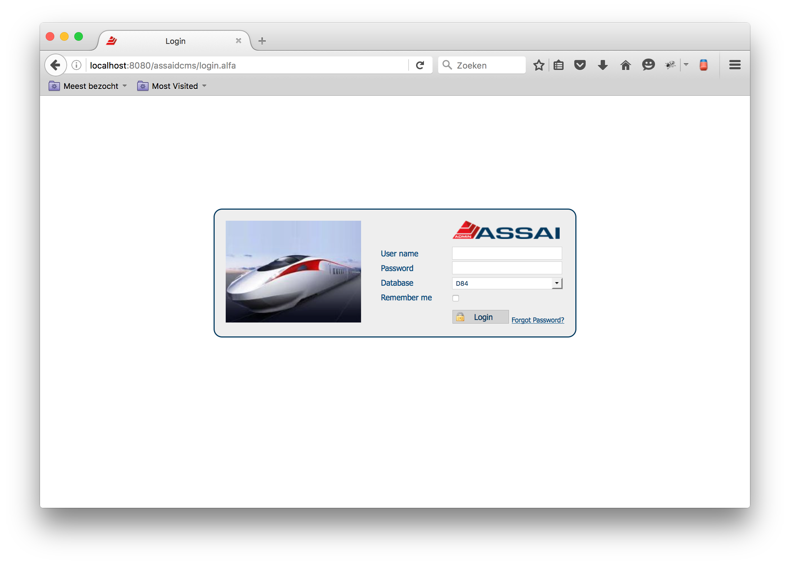
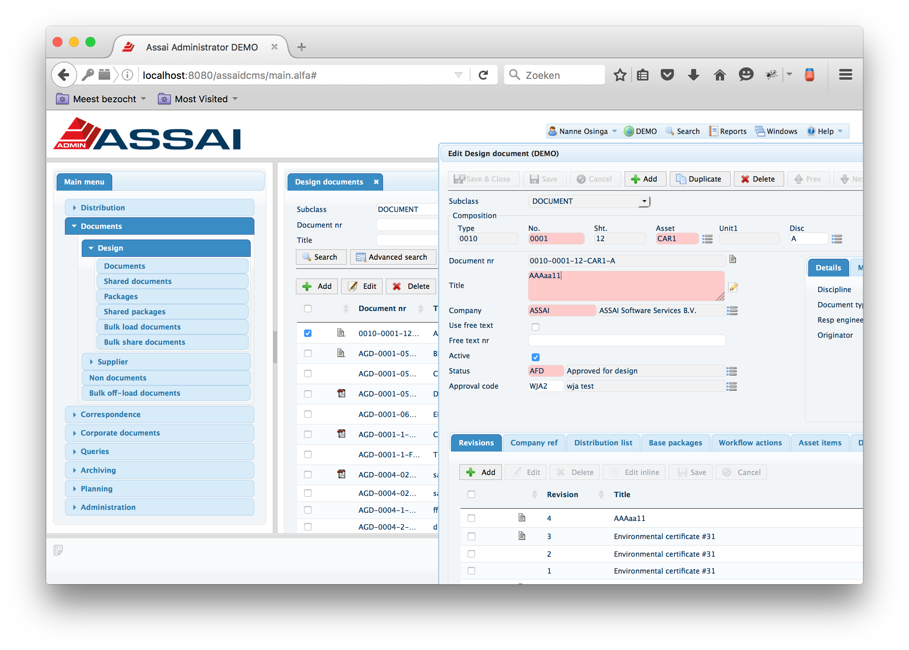

# Assai DCMS getting started

## Get the Assai Software from the central Mercurial repository

It is assumed that it is the first time you download the assai DCMS 9 v software from Mercurial repository on your local machine. It is also assumed that you have a drive L: which is mapped to store11.assai.nl\Develop

If the above two pre-requisites apply to you, you can execute the following command. Once again, if you want to know more about the usage of mercurial please refer to the Mercurial section in the Reference guide of this help

     >mkdir -P C:\workspaces\assai
     > cd C:\workspaces\assai
     C:\workspaces\assai>hg clone L:\Mercurial\AssaiDCMS assaidcms

Now we got the latest sources of AssaiDCMS. Make sure that your java and maven is installed properly and that your are pointing to the assai nexus repository. More information about the [assai nexus repository](../../#build-acdc-and-build-scotttiger) can be found [here](../../#build-acdc-and-build-scotttiger). A copy of the maven settings.xml file can be found under assai\assaidcms\settings.xml

## Build the AssaiDCMS application

Build the application with maven

     > mvn clean install

It is possible that the build fails on ACDC, you will get the following error

     [ERROR] Failed to execute goal on project assaidcms: Could not resolve dependencies for project nl.assai.alfa:assaidcms:war:1.0-SNAPSHOT: Could not find artifact nl.alfa.acdc:ACDC:jar:1.0-SNAPSHOT in nexus (http://10.1.0.53:8081/nexus/content/groups/public) -> [Help 1]

In that specific case get the latest source of ACDC en build ACDC

     > cd C:\workspaces\assai
     > hg clone L:\Mercurial\AlfaCommonDialogComponents acdc

     > cd acdc
     > hg pull

     > mvn clean install

After building acdc you can build assaidcms again

     > cd C:\workspaces\assai
     > cd assaidcms
     > hg pull

     > mvn clean install

If the build is succesfull you get a message like

    [INFO] ------------------------------------------------------------------------
    [INFO] BUILD SUCCESS
    [INFO] ------------------------------------------------------------------------
    [INFO] Total time: 04:36 min
    [INFO] Finished at: 2016-05-24T11:36:28+02:00
    [INFO] Final Memory: 64M/372M
    [INFO] ------------------------------------------------------------------------

## Verify the AssaiDCMS application in tomcat

Now you can deploy assaidcms on tomcat by copying the war to the tomcat webapp. It is convenient to stop tomcat, copy and rename the war to the tomcat webapp dir and add a assaidcms conf file to the tomcat conf dir. An example of the assaidcms conf file can be found under assai\assaidcms\misc\assaidcms-1.0-SNAPSHOT.xml

      > copy C:\workspaces\assai\assaidcms\misc\assaidcms-1.0-SNAPSHOT.xml "C:\tools\java\Apache Tomcat 8.0.27\conf"\assaidcms.xml
      >copy C:\workspaces\assai\assaidcms\target\assaidcms-1.0-SNAPSHOT.war "C:\tools\java\Apache Tomcat 8.0.27\\webapps"\assaidcms.war

      start tomcat

The contents of the assai\assaidcms\misc\assaidcms-1.0-SNAPSHOT.xml file are displayed below

    <?xml version="1.0" encoding="UTF-8"?><AssaiDCMS>
      <authorisation>
        <user>
          <name>AWAdmin</name>
          <password>1e6947ac7fb3a9529a9726eb692c8cc5</password>
          <security>
            <full_control>true</full_control>
            <logfiles>
              <enable_logging permission="2"/>
              <assaiweb permission="2"/>
              <apache permission="2"/>
              <catalina permission="2"/>
              <localhost permission="2"/>
              <iis permission="2"/>
            </logfiles>
            <database permission="2"/>
            <access application="TEMPLATE"/>
            <access application="PROCESSES"/>
          </security>
        </user>
      </authorisation>
      <logging>
        <enabled>DEBUG</enabled>
      </logging>
      <logoff_at_close>false</logoff_at_close>
      <applet_allowed>true</applet_allowed>
      <parameter>
        <name>DEFAULT_DB_USR</name>
        <value>encrypted:9f56e7365eb56082c4463a74394146a7</value>
      </parameter>
      <parameter>
        <name>DEFAULT_DB_PWD</name>
        <value>encrypted:f77fe7f54f55a39f739cbfc8dcd838cf</value>
      </parameter>
      <db_settings>
        <protocol>TCP</protocol>
        <host>V10DBDEV</host>
        <port>1621</port>
        <sid>d84</sid>
        <dbname>d84</dbname>
        <service_name>d84.ASSAI.NL</service_name>
        <selected>true</selected>
        <description/>
      </db_settings>
      <db_settings>
        <protocol>TCP</protocol>
        <host>V10DBDEV</host>
        <port>1621</port>
        <sid>d85</sid>
        <dbname>d85</dbname>
        <service_name>d85.ASSAI.NL</service_name>
        <selected>false</selected>
        <description/>
      </db_settings>
      <db_settings>
        <protocol>TCP</protocol>
        <host>V10DBTST</host>
        <port>1521</port>
        <sid>T83</sid>
        <service_name>t83.assai.nl</service_name>
        <dbname>T83</dbname>
        <selected>false</selected>
        <description/>
      </db_settings>
      <db_settings>
        <protocol>TCP</protocol>
        <host>V10DBDEV</host>
        <port>1621</port>
        <sid>test</sid>
        <dbname>test</dbname>
        <selected>false</selected>
        <description/>
      </db_settings>
      <db_settings>
        <protocol>TCP</protocol>
        <host>HODB01.ASSAINET.HO</host>
        <port>1621</port>
        <sid>HO84</sid>
        <dbname>HO84</dbname>
        <service_name>HO84.ASSAINET.HO</service_name>
        <selected>false</selected>
        <description/>
      </db_settings>
    </AssaiDCMS>

Check the AssaiDCMS application on the following url in your browser http://localhost:8080/assaidcms/login.alfa

    username : njo
    password : njo

If all went well you should see the following picture

after loging in with njo/njo and clicking on Documents, Design and then on Documents.

