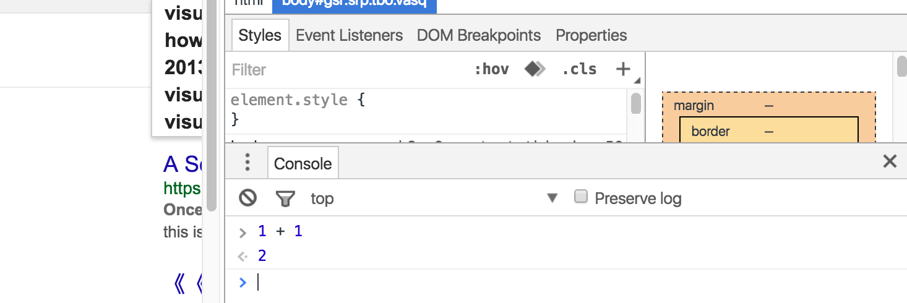

# Tutorial 3 : JavaScript primer

If you want to go to the [previous tutorial](../tutorial/master_detail) click [here](../tutorial/master_detail)
If you want to go to the [next tutorial](../tutorial/jquery) click [here](../tutorial/jquery)

# Introduction

Before we can go into depth with the Vaizr platform you need a good understanding of jQuery. The main building blocks of the Vaizr platform consist of jQuery plugins. You can find the [Vaizr jQuery Plugin documentation here](../../acdc/jsdoc/). In order to understand JQuery you need to have grasp of the fundamentals of JavaScript. Tutorial 3 is solely about JavaScript and Tutorial 4 is about jQuery. These two Tutorials are literally copied of the book of [Dane Cameron, HTML5 JavaScript & jQuery](http://www.cisdal.com/publishing.html), and in order to wet the appetite also the preface is copied. Tutorial 3 is a copy of Chapter 5 of the above mentioned book and Tutorial 4 is a copy of of Chapter 6. Of course when you have worked with jQuery and jQuery plugins before feel free to step over to Tutorial 5.

# Preface
## copy HTML5 JavaScript & jQuery Preface

JavaScript (and its frameworks such as jQuery) and HTML (along with its style sheet language CSS) have become a ubiquitous presence in software development. Due to their monopoly position in web browsers, and the fact web browsers have spread from PCs to phones, tablets and TVs; this pervasiveness will continue to grow and grow.

Despite their success, many software engineers are apprehensive about JavaScript and HTML. This apprehensiveness is not completely unfounded; both JavaScript and HTML were rushed in their early years, and driven by commercial rather than engineering interests. As a result, many dubious features crept into these languages. Due to backwards compatibility concerns, most of these features still remain.

In addition, many software engineers have used these languages without ever learning them. JavaScript and HTML have low barriers to entry, and this, along with their similarity to other languages, led many software engineers to conclude that there really was nothing much to learn.

If you have not used JavaScript and HTML for a number of years you may be surprised at what they now offer. Browser based web applications are now capable of matching or exceeding the sophistication and scale of traditional desktop applications. In order to create complex web applications however, it is essential to learn these languages.

This book takes the point of view that once you have a strong grasp of the fundamentals, the details will take care of themselves. It will not present you with long lists of APIs, or intricate details of every attribute, these can be found in reference manuals. It will focus on the details of each language that are fundamental to understanding how they work.

I hope this book helps you discover the elegance and beauty of JavaScript and HTML, and makes you think differently about what can be achieved with these languages.

October, 2013

# JavaScript Fundamentals
## copy HTML5 JavaScript & jQuery Chapter 5

This section will provide an in-depth overview of JavaScript, including its strengths and weaknesses. The intention of this chapter is to provide you a strong understanding of JavaScript fundamentals, and to focus on how the language _should_ be used, rather than how it _can_ be used.

JavaScript is a particularly flexible language, and does not enforce much discipline or structure on its users. In addition, JavaScript contains a number of features than can only truly be regarded as bugs. These remain in the language principally due to backwards compatibility concerns.

In order to write large-scale web applications it is necessary to harness the strengths of JavaScript, while at the same time avoiding the pitfalls that can easily confront software engineers and programmers who do not understand the language fundamentals, and do not structure their applications in a manner compatible with the growth of the code base.

As mentioned in the introduction, this chapter will not act as a tutorial on the syntax of JavaScript (such as loops and branching), although anyone familiar with languages utilizing similar syntax (C, C    , Java etc.), will quickly pick up those details from the examples below.

In order to follow the examples in this tutorial, simply open the Chrome or Firefox console, and enter the commands directly.

All major browsers now provide development tools offering direct access to a JavaScript interpreter. In order to access the Chrome interpreter, simply open Chrome, and type:

 • Command   Option   i on OSX
 • F12 or Ctrl   Shift   I on Windows

 Alternatively, you can right click anywhere on any web page and choose “Inspect Element”:

 Once the Developer Tools are open, click the “Console” tab. In order to prove that this is a genuine JavaScript interpreter, simply type 1 + 1 at the command prompt:

 You should see something like this :
 

## Types
Any understanding of JavaScript begins with an understanding of its data types, and how these types are used.

JavaScript has the following data types:

* String
* Number
* Boolean
* Null
* Undefined
* Object

Each of these will be outlined in the sections below.

### Strings
Strings are series of characters enclosed in either single or double quotes:

    > "hello world"
    "hello world"
    > 'hello world'
    "hello world"

The examples above are referred to as string literals. We can also assign a string to a variable:

    > s = "hello world"
    "hello world"

   |   |   |
   |---|---|
   |   |When using the console, variables will not be declared with the __var__ keyword. As you below, it is critical that this is used in most situations when writing actual JavaScript code.
   |   |   |

We can then inspect the type of this variable using the __typeof__ operator:

    > typeof s "string”

Although strings are their own data type, it is possible to invoke methods on them just as we will see it is possible to invoke methods on objects below.

    > s.charAt( 1)
    "e"
    > s.substr( 6)
    "world"
    > s.toUpperCase()
    "HELLO WORLD"

In addition, strings have properties that can be accessed, just as we will see on objects in the examples below:

    > s.length
    11

JavaScript strings are largely equivalent to strings in Java. One consequence of this is that strings are immutable.

   |   |   |
   |---|---|
   |   |An immutable object is an object that cannot be changed after it is first created. Even when these appear to change, as in the examples below, in reality a new object is being created.
   |   |   |

In order to see immutability in action, declare a new variable called __t__, and assign it the value of __s__:

    > t = s
    "Hello world"

We can now print out the value of __t__, and also confirm that __t__ and __s__ are equal:

    > t
    "Hello world"
    > s == t
    true

What should happen if we now modify the string held against the variable __s__? We can append to the string value using the __+=__ operator:

    > s += 'test'
    "Hello worldtest"

If you now print out the value of __s__ you will see that the string’s value appears to have changed:

    > s
    "Hello worldtest"

Despite this, if you print out the value of __t__ it has retained its old value:

    > t
    "Hello world"

When we appended “test” to the string held against the variable __s__, the underlying string was not modified; instead a new string was created and assigned to the variable __s__. Since __t__ still refers to the original string, it is not impacted by the modification.

###Numbers

The number type is used to represent both integer and floating-point values; in fact all numbers are 64 bit floating-point numbers in JavaScript:

    > n = 6.827
    6.827
    > typeof n
    "number"
    > n2 = 6
    6
    > typeof n2
    "number"

Due to the fact that all numbers are floating-point, operations between two integers can return floating-point results (unlike in Java).

    > 1/ 3
    0.3333333333333333

In addition to real numbers, JavaScript also supports a number of special values. “Not a number” is used in cases where an arithmetic operation produces a result that is not a number. Confusingly, this type is still a number.

    > a = 9/undefined
    NaN
    > typeof a
    "number"

It would have potentially been more useful for JavaScript to generate an error in this scenario.

Negative and positive infinity are also supported, and are most often generated when dividing by 0:

    > b = 6/0
    Infinity
    > b == Number.POSITIVE_INFINITY
    true
    > c = -6/0
    -Infinity
    > c == Number.NEGATIVE_INFINITY
    true

Again, most programming languages would generate errors in these scenarios if confronted with the integer value of 0, but since all numbers are floating point in JavaScript, it follows the IEEE convention for floating point numbers and returns infinity.

JavaScript also natively supports a Math library modelled almost identically on the Java equivalent. Most common maths functions are available in this library.

    > Math.pow(3, 2)
    9
    > Math.round(3.22)
    3

### Booleans

JavaScript supports a boolean type that contains the literal values true and false:

    > t = true
    true
    > typeof t
    "boolean"
    > f = false
    false

Equality operators in JavaScript (>, <, ==, !=, >=, <=) also return booleans as their result:

    > f != t
    true

### Null
Null is a data type that has a single value: __null__.

    > n = null
    null

Confusingly, __null__ is considered to be of type object:

    > typeof n "object"

This is another bug in the JavaScript language that has been maintained for backwards compatibility. Despite this, __null__ is genuinely a unique data type in JavaScript.

It is possible to set a variable to __null__ after it has been assigned a value, therefore removing the reference to its current value (and changing its data type):

    > q = 2
    2
    > typeof q "number"
    > q = null
    null
    > typeof q
    "object"

### Undefined

The undefined data type is returned when you access a property on an object that does not exist, or use a variable before it is declared, or before it is assigned a value.

    > typeof g "undefined"

### Objects

Other than the types outlined above, all data types in JavaScript are objects: this includes arrays, functions, dates and user defined objects. Objects will be discussed at length in the sections below.

## Truthy an Falsey Values

Now that you have an understanding of the JavaScript data types, the next thing to understand is that some values for these types evaluate to __true__, and some evaluate to __false__. For instance, the following are all considered __false__ in JavaScript:

* false
* 0 (zero)
* "" (empty string)
* null
* undefined
* NaN (technically __NaN__ is not true or false - and can only be detected with the function __isNaN__)

In order to see this in action, simply ask if they are equal to __false__ in the console:

    > 0 == false
    true

All other values represent __true__ values.

As a consequence of this, it is possible to utilize a shortcut when evaluating the value of variables in conditional statements. Instead of writing the following:

    > if (a == undefined || a == null) {
        a = 1;
      }

It is possible to simply write:

    > if (! a) { a = 10 }

Likewise, if you only want to use a variable if it has a value you can write the following:

    > if (s) {
        console.log( s)
      }

This shortcut is enormously useful, and extensively used in JavaScript code. The final thing that should be understood is which values are equal to one another; the following may come as a surprise:

    > null == undefined true
    > 5 == "5"
    true
    > "true" == true
    false
    > "1" == true
    true
    > "2" == true
    false

There are numerous inconsistencies in the examples above, and again, these are often bugs rather than features. __Null__ should not be considered equal to __undefined__, despite the fact they are both falsey values they represent very different data-types and meanings. Fortunately, JavaScript contains an alternative pair of equality operators:

    ===
    !==

These compare variables based on both their value and their data type, and therefore provide more expected results:

    > null === undefined
    false >
    5 === "5"
    false
    > "true" === true
    false
    > "1" === true
    false

It is best practice to always use these equality operators unless you consciously want to compare two values you know have different data types.

   |   |   |
   |---|---|
   |   |If you want to know whether any value is true or false in a Boolean sense, you can print it out by prepending !! to it. A single ! will negate a Boolean value, while !! provides a double negative, and therefore prints out the Boolean value of any value:|
   |   |   |

    >!!""
    false
    >!!"hello"
    true

## Dynamic Typing

Finally, it is worth reiterating that JavaScript is a dynamically typed language.

Languages such as Java and C++ are statically typed languages. In statically typed languages, all variables are assigned a type at compile time, and this type cannot be changed.

   |   |   |
   |---|---|
   |   |The terms strong and weak typing are sometimes used to refer to statically typed and dynamically typed languages respectively.|
   |   |   |

In a statically typed language, the compiler can perform type checking: if a variable is defined to store an integer, the compiler can check that it is not assigned a string. This catches many causes of bugs before they can become an issue at run-time.

As we have seen, JavaScript variables derive their types based on the values they are assigned at run-time, and variables can change their type if they are assigned a new value. As a result it is not possible to perform static type checking in JavaScript, e.g. to ensure a string is not provided where a number is expected.
Consider the following function that adds two numbers together:

    function add(v1, v2) {
        return v1+v2;
    }

If you invoke this function with two numbers, the result is as expected:

    > add( 1,1)
    2

If you accidentally pass a string as one of the parameters however, the result is very different:

    > add( 1,"1")
    "11"

Instead of adding the numbers, JavaScript has performed string concatenation between the number and the string. It is unlikely that this is the result expected. This is one reason why the __typeof__ operator is so important in JavaScript, it allows the function above to be rewritten as follows:

    function add( v1, v2) {
        if (typeof v1 === "number"
          && typeof v2 === "number") {
            return v1+v2;
        } else {
            throw "both arguments must be numbers";
        }
    }

This at least ensures data type issues will be identified at run-time, even if it does not highlight these issues to the programmer who wrote the code allowing the function to be called incorrectly.

   |   |   |
   |---|---|
   |   |Using the “+” operator on different data types produces a variety of random results in JavaScript:|
   |   |{} + [] = 0|
   |   |[] + {} = Object|
   |   |Even using the “+” operator on the same data types can produce meaningless results:|
   |   |[] + [] = empty string|
   |   |{} + {} = NaN|
   |   |It is hard to make sense of any of these results.|
   |   |In addition, the “-“ operator should only be used on numbers:|
   |   |“a” + 1 = “a1” |
   |   |“a” – 1 = NaN |

There are many arguments for and against dynamically typed languages. This book will not address these arguments, but it is safe to conclude that dynamic typing has advantages, but those come at the risks of run-time bugs.

# Objects

JavaScript also supports objects; in fact, most values in JavaScript applications will be objects. JavaScript also supports syntax for defining classes that objects can be instantiated from. This may lead you to think JavaScript is a conventional object orientated language – this would be a mistake.

In classical object orientated languages such as Java and C#, classes must be defined before objects can be instantiated from them. It is never possible to have an object that is not a type of a specific class.

Classes are static templates that contain definitions of the properties and methods that objects will contain. During program execution, instances of these classes are created: these are called objects. All objects instantiated from the same class have the same properties and methods, although the values assigned to properties will differ from instance to instance.

When designing applications with a classical object orientated language you may find cases where you would like some objects to contain additional properties or methods, even though they are similar in other respects those created by an existing class. For instance you may have started with a class called “Vehicle” which contained the following properties:

1. Registration number
2. Initial year of registration
3. Make of vehicle
4. Model of vehicle

Objects can be instantiated from this class, and will contain four properties to which values can be assigned.

   |   |   |
   |---|---|
   |   |This book will use the term “property” to refer to the state of an object. Other languages may call these fields or attributes.|
   |   |   |

You may subsequently decide that you would like to capture more information about trucks, for instance:

1. Number of axles
2. Towing capacity

You cannot simply add these new properties to objects that have been created from the Vehicle class; you must first create a new class (called Truck), and extend the Vehicle class. Only when the class structure is in place can you begin creating instances of Trucks.

A further feature of classes is that they must be defined when the application is compiled; they cannot be defined on the fly at run-time. It is not possible to decide midway through program execution that you would like to start capturing an additional property on some objects.

JavaScript has a far more flexible attitude to classes and objects, in fact classes are not essential to JavaScript programming at all.

The simplest way you can create a new object in JavaScript is as follows:

    > obj = {}

The __typeof__ operator confirms that the obj variable is indeed an object:

    > typeof obj
    "object"

If you are familiar with classical object orientated languages you may wonder what _type_ __obj__ is? This object is not of any type; it is just an object.

It may sound difficult to write code without knowing the type. For instance, if a function is passed an object without knowing its type, how does it know what to do with it?

JavaScript uses an approach colloquially known as “duck typing”. There is an old saying, “if it walks like a duck, and swims like a duck, and quacks like a duck, it probably is a duck”. Likewise, in JavaScript we might say “If it has a registration number property, and has a year of registration property, it probably is a vehicle”.

An empty object with no properties or methods is not very useful. With JavaScript however, it is possible to dynamically add properties and methods:

    > obj.firstName = 'John';
    > obj.lastName = 'Smith';
    > obj.age = 32;
    > obj.increaseAge = function() {
        this.age    ;
      }

   |   |   |
   |---|---|
   |   |In order to type commands that span multiple lines, hold down the Shift key while pressing enter. |
   |   |   |

   |   |   |
   |---|---|
   |   |Functions inside objects are referred to as methods. They are exactly the same as functions, except in the way they treat an important variable called this. You may have also noticed the use of this in the method above: this will be explained in full below.|
   |   |   |

If you now look at the object in the JavaScript console you will see that it has a set of properties with values assigned:

    > obj
    Object {firstName: "John", lastName: "Smith", age: 32, increaseAge: function}

Note: is Chrome you only see

    > obj
    Object {firstName: "John", lastName: "Smith", age: 32}

The reason this is possible is because objects in JavaScript are really just associative arrays (also known as hash maps in other languages). Associative arrays are supported natively in most programming languages, and comprise a collection of name/ value pairs.

In order to access a property on a JavaScript object, simply use the following notation:

     > obj.firstName
     "John"

JavaScript supports an alternative syntax for accessing and setting properties that is even more evocative of associative arrays in other languages.

    > obj[' firstName'] "John"

   |   |   |
   |---|---|
   |   |These two approaches are not exactly equivalent. The second approach will work when property names are not valid variables names. The dot notation on the other hand will not work if:|
   |   |* The property starts with a number.|
   |   |* The property contains a space or other special character except the underscore or $ sign.|
   |   |* The property name is one of the language keywords.|
   |   |If you are writing code that needs to handle any property name, including ones you had no say in defining, the square brackets notation should be preferred.|
   |   |   |

In addition to properties, the example above provides an example of a method being added to an object. The method __increaseAge__ increments the age property by 1: it can be invoked as follows:

    > obj.increaseAge()
    > obj.age
    33

I alluded to the use of the __this__ variable inside the method:

    obj.increaseAge = function() {
       this.age++ ;
    }

This is the only thing that separates a function from a method: in a method the special variable __this__ refers to the object itself, and therefore:

    this.age

is a way of accessing the __age__ property on the object. As we will see in future sections, this takes on several different meanings depending on context. Understanding the meaning of __this__ in these different contexts is one of the keys to understanding JavaScript.

Although it is possible to construct objects without any reliance on classes, it is probably obvious that we are also missing out on the benefits that classes bring.

If you want to create a new object to refer to a different person, you need to add these properties and methods all over again. This is not a major problem for the properties of an object, since you would need to provide values for those properties anyway, but it is a major inconvenience for methods. For instance, you would need to write the following:

    > obj2 = {}
    > obj2.firstName = 'Albert'
    > obj2.lastName = 'Jones'
    > obj2.age = 28
    > obj2.increaseAge = function() {
          this.age++ ;
      }

   |   |   |
   |---|---|
   |   |An alternative approach is to include the properties and methods inside the {} separating properties/ methods with commas, and properties/ methods from their values with colons:|
   |   |   |

    obj2 = { firstName: 'Albert',
             lastName: 'Jones',
             age: 28,
             increaseAge: function() {
                 this.age++ ;
             }
           }

This is going to become a major inconvenience, especially if you have a large number of methods on your object.

There is a solution to this problem that does not rely on reverting to classes: you could simply clone an existing object, and change its properties as required. The object being cloned can be referred to as a prototype for other objects.

We will see in later chapters that jQuery contains a helper for cloning objects, but for now we will write our own clone implementation. This function will perform a deep clone on an object: if a property on an object contains a value that is an object, that object will also be cloned.

    function clone(obj) {
      if (obj == null || typeof obj != 'object') {
         return obj;
      }
      var newObj = {}
      for (var key in obj) {
         newObj[key] = clone( obj[key]);
      }
      return newObj;
    }

This function uses the __for(var key in obj)__ loop to iterate through all the properties on an object. This is a special kind of JavaScript loop specifically provided to iterate through properties in an object. If the value of the property is an object, it is recursively passed to the __clone__ function. If it is a simple type (such as a number or string) it is returned immediately so it can be set directly on the new instance of the object. You will remember from earlier sections that strings and numbers are immutable; therefore they do not need to be cloned.

This implementation should reinforce to you how simple JavaScript objects are.

   |   |   |
   |---|---|
   |   |There are potential problems with this implementation that have been ignored for simplicity. This implementation should not be used in real applications: use versions provided in the jQuery or Underscore libraries.|
   |   |   |

You can now use this function to construct a new object for storing information about people:

    > obj3 = clone(obj2)
    > obj3.firstName = 'Jim'
    "Jim"
    > obj3.firstName = 'Duffey'
    "Duffey"
    > obj3.age = 42
    > obj3.increaseAge()
    43

As you can see we have retained the method already defined on its prototype.

This section is not intended to imply classes have no value in JavaScript, instead it is intended to demonstrate what objects truly are in JavaScript, and to suggest that there are viable ways of writing JavaScript that does not utilize classes.

There are potential pitfalls in this implementation. For instance, if you forget to set a property on the newly cloned object, it will retain the value from the object it was cloned from: this may or may not be correct, and could become a source of bugs.

Although we will examine more advanced approaches to object creation below, the approach to objects examined in this section has a lot to recommend it.

## JavaScript Object Notation

The previous section demonstrated how simple JavaScript objects are. At heart, JavaScript objects are simple associative arrays. Each property in the object can have a value that is a simple type (such as a number or a string), a function, an array, or another type of object.

When writing web-based applications it is often necessary to send data from the client to the server, or the server to the client. In order to transfer data across a network it must be encoded in a data format agreed by both the sender and the receiver.
There are many data formats that can be used to send and receive data; of these XML is probably the most common. An example XML document for representing people might look as follows:

    <person>
      <firstName>John</firstName>
      <lastName>Smith</lastName>
      <age>32</age>
      <address>
        <city>Los Angeles</city>
        <postCode>90245</postCode>
      </address>
    </person>

XML is a widely used data format, particularly in enterprise applications. It has many benefits, including a wide array of libraries that support it and widespread acceptance in IT departments. XML is a particularly verbose data format however, in the example above far more than 75% of the text is made up of tags rather than content.

Before gaining an understanding of JSON, first consider what a JavaScript object may look like that contained this same data:

    > person = {};
    person.firstName = 'John';
    person.lastName = 'Smith';
    person.age = 32;
    person.address = {};
    person.address.city = 'Los Angeles';
    person.address.postCode = 90245;

The example above consists of two objects. The first object is a person; this then contains a second object that captures the address information.

It would not be difficult to create an object from the XML structure. There is however a data format that is far more closely aligned with JavaScript called the JavaScript Object Notation (JSON) that makes this process trivial.

You can transform this object into a JSON encoded string as follows:

    > JSON.stringify(person)
    "{"firstName":"John","lastName":"Smith","age":32,"address":{"city":"Los Angeles","postCode":90245}}"

The output of this function call is a string, and could be assigned to a variable:

    > s = JSON.stringify(person)

A string can then be transformed back into an object as follows:

    > person2 = JSON.parse(s)

The process of converting between a string and an object is called serializing and de-serializing: the string is a serialized form of the object.

   |   |   |
   |---|---|
   |   |This process is only applicable for properties: methods are not retained when an object is serialized.|
   |   |   |

JSON is a remarkably simple data format. The entire data format is contained in a couple of paragraphs at the following web site:

http://www.json.org/

There are 3 types of value in JSON:

1. __Objects__, denoted with the now familiar curly brackets
2. __Arrays__, which are denoted by [] brackets, and contain comma separated values just like JavaScript arrays.
3. __Literal values__ (strings, numbers, Booleans)

An object or an array can in turn contain any of these 3 types. For instance, an array may contain an object, an object may contain an array, an object may contain another object, etc.

JavaScript makes it possible to convert from a _stringified_ version to an _object_ representation purely because the language does not rely on classes. The stringified version of the object does not contain information on what type it is: it is simply a set of properties formatted according to the JSON specification. Likewise though, JavaScript does not need to know what type of object needs to be created when de-serializing: it can simply add the appropriate properties to an otherwise empty object.

JSON has become a widely used data format even for applications that do not use JavaScript. For instance, Java contains libraries for converting to and from JSON. The only difference in languages such as Java is that you must tell the library what type of class the textual string represents.

   |   |   |
   |---|---|
   |   |Java can in fact de-serialize a string into an object without knowing the type, but it needs to use hash maps rather than programmer defined types.|
   |   |   |

One reason for the widespread adoption of JSON (beyond its simplicity) is the fact it is far less verbose than XML – the example above is roughly half the size of the XML version. Although the size is far smaller, it is still easy for a human to read and understand a JSON encoded message (which was a traditional strength XML had over other data formats, particularly binary data formats).

As we go through the book we will explore several cases where this ability to convert simply and easily from an object to a textual string is enormously useful.

## Prototypes

We will return now to our discussion of objects in JavaScript.

The __clone__ function that we wrote above was our first attempt at code reuse. It allowed us to reuse or extend an object that we had already written. One problem discussed with the __clone__ function was that it took all the properties from the object it was cloning, including properties that were specific to the cloned instance, such as __firstName__ and __lastName__.

JavaScript provides a more elegant mechanism for extending objects called prototypes. In fact, JavaScript itself is considered a prototype-based language.

If you declare an empty object, you may think that it contains no properties at all:

    > obj = {}

You can however execute the following method on the object:

    > obj.toString()
    "[object Object]"

Where did the __toString__ method come from?

All JavaScript objects have a prototype object (this can be __null__ in rare instances, but this scenario can largely be ignored). A prototype object is an object in its own right, and can encapsulate properties and methods. If we access a property or method on an object, JavaScript will first try to access that property or method on the object itself. If the object has no property or method with that name it will look for it on the prototype object.

In fact, there can be a whole chain of objects due to the fact that the object that is our prototype may itself have a prototype. If no objects in the prototype chain have a property matching the name specified then JavaScript returns a special type called __undefined__.

The prototype of our empty object was provided by __Object.prototype__. This is the only object that does not have a prototype of its own, and therefore is the end of the chain.

In order to see the prototype chain in action, we can define our own __toString__ implementation on the empty object.

    > obj.toString = function() {
                        return "I am an object"
                     };

If we now execute __toString__ on this object, the newly defined version will be used:

    > obj.toString()
    "I am an object"

In this case you have not modified the implementation of __toString__ on the prototype; it has been overridden on this specific instance. In order to prove this, you can create a new empty object, and execute the __toString__ method on it:

    > obj2 = {}
    > obj2.toString()
    "[object Object]"

The properties on a prototype are immutable, just like strings are immutable. Although all objects with the same prototype share the properties on the prototype, they cannot change the prototype; they simply override these properties on themselves.

The specific prototype assigned to objects created with the object literal notation is the __Object.prototype__. Different objects can however have different prototypes. For instance, if we create an array using the array literal notation, the variable is still an object:

    > a = [1,2,3,4,5];
    > typeof a
    "object"

Because this is an object, it will contain the Object prototype somewhere in its hierarchy, and therefore we can invoke the __toString__ method. You will notice that the __toString__ implementation has been specially tailored for arrays:

    > a.toString()
    "1,2,3,4,5"

The array instance also has access to a whole set of other properties that were not available to our object created with the object literal notation:

    > a.reverse()
    [5, 4, 3, 2, 1]
    > a.pop()
    1
    > a.push(6)
    5

These methods are derived from the prototype object for arrays called __Array.prototype__ (which in turn has Object.prototype as its prototype).

Due to the fact that all arrays are based on the same prototype, if we add methods to this prototype, they immediately become available to all arrays. Remember, prototypes are just objects themselves; therefore they can be modified just like any other object.

For instance, arrays do not have a “contains” method. It might be useful to implement a method that accepts a single parameter, and then returns true if the array contains that value. This can be written as follows:

    > Array.prototype.contains = function (val) {
          for (var i = 0; i < this.length; i++) {
              if (this[i] === val) {
                  return true;
              }
          }
          return false;
      }

We can now execute the following:

    > [1,2,3,4,5].contains(3)
    true
    > a.contains(6)
    false

Adding functionality to prototypes is a very effective code reuse pattern. As soon as the functionality is added to that prototype, it is immediately available to all objects that contain that prototype in their prototype chain: even if they were created before the functionality was added to the prototype.

   |   |   |
   |---|---|
   |   |If you are wondering how objects can be given a specific prototype, this will be explained in more detail below.|
   |   |   |

Prototypes provide a mechanism to tidy up the code reuse pattern that we used earlier. The new implementation of __clone__ (which we will rename to __extends__) still accepts an object, but now returns a new empty object with that object set as its prototype.

We will first write the object that will act as the prototype. This is going to contain two methods, the increase age method we saw earlier, and a new method that returns the full name of the person as the concatenation of the first and last name. In addition, this implementation is going to combine object creation, and the addition of methods to the object, into a single step:

    > person = {
        getFullName: function() {
        return this.firstName+" "+this.lastName;
        },
        increaseAge: function() {
          this.age++;
        }
      }

Notice that this object is referring to properties that are undefined. It does not include lastName, firstName or age properties, therefore calling these methods will not produce very useful results:

    > person.getFullName()
    "undefined undefined"

We will now write an __extends__ function that accepts this object as a parameter, and returns a new object with this object set as its prototype:

    >function extend(obj) {
        function E(){};
        E.prototype = obj;
        return new E();
    }

This code may look unfamiliar or mysterious. That is because this function is taking advantage of a special type of function we have not seen before called a constructor function.

The first line of this function declares a function called __E__:

    function E(){};

By convention constructor functions always start with a capital letter. This is because there is nothing different between a regular function, a method, and a constructor function except (you guessed it) the meaning of the special __this__ variable, and the fact that a constructor function implicitly returns a new object.

On the next line, we set the prototype for the __E__ constructor function:

    E.prototype = obj;

This means that anytime we use the __E__ constructor function to create a new object, it will implicitly set the passed in object to be its prototype, and therefore it will have access to all the functionality defined in that prototype.

Constructor functions are the closest JavaScript has to classes. They must be called with the __new__ keyword, and as a result will construct an object that is implicitly returned when the constructor finishes. Before finishing our look at the __extends__ function, it is worth learning a little more about constructor functions.

Within a constructor function you can use the special this variable to set properties on the implicitly created object. For instance, if we had written the following constructor function:

    > function Person(firstName, lastName) {
         this.firstName = firstName;
         this.lastName = lastName;
    }

you could then construct a person as follows:

    > p = new Person('John', 'Smith');

The constructor implicitly returns the newly created object even though it has no return statement. This __p__ variable will therefore contain a reference to an object with the appropriate name properties set.

If you omit the __new__ keyword when calling a constructor function, it will act like any other function. This is why constructor functions start with a capital letter by default: to remind you to add the __new__ keyword.

Omitting the __new__ keyword is actually far worse than it may look. Inside the constructor function you have access to a __this__ variable that refers to the newly constructed object. If you omit the __new__ keyword __this__ will refer to what it does in normal functions: the __window__ object.

   |   |   |
   |---|---|
   |   |The __window__ object is a global object within the browser that contains information about the document. When JavaScript is used outside the browser an alternative global object is provided in place of __window__.|
   |   |   |

This is a huge source of bugs because the code appears to work, but all instances of the class will overwrite the same variables in the global namespace.

    > p = Person('John', 'Smith');

The value of __p__ is now __undefined__, since the function does not have a return value, but the __window__ object has had two new properties added to it:

    > window.firstName
    John
    > window.lastName
    Smith

This is one of the reasons I recommend against constructor functions except in controlled environments such as the extends function.

   |   |   |
   |---|---|
   |   |Programmers who have experience with other object orientated languages are always initially drawn to constructor functions. They provide a certain familiarity, and appear to provide a class based typing system. Programmers are then invariably annoyed when these classes do not provide the same features they are used to with classes in other languages.|
   |   |   |

Finally, we can look at the final line of the __extends__ function:

    return new E();

This is simply returning a new object created by the __E__ constructor. Since we only need to write the __extends__ function once however, we will not forget the __new__ keyword.

You can now use the __extends__ function to create some objects:

    > p1 = extend(person)
    > p1.firstName = 'John'
    > p1.lastName = 'Smith'
    > p1.age = 34

   |   |   |
   |---|---|
   |   |As the examples above illustrate, semi colons are actually optional in JavaScript. It is highly recommended that all statements are terminated with semi-colons however, since JavaScript will automatically add them when they are missing, and in some cases they will not be added where they are expected. This is another common source of hard to find bugs, for instance, the following function returns __undefined__:|
   |   |   |

    function a() {|
        return
            {a:1};
    }

Once the instance is populated with the appropriate properties, you can use the methods defined on the prototype:

    > p1.getFullName()
    "John Smith"

Notice that the references to __this__ inside the prototype now refer to the object itself and the full name of the person is returned.

JavaScript is a type of object orientated language called a “prototype-based language”. Prototype languages use existing objects as the basis for new objects, which are then modified to meet their specific needs. The fact that JavaScript also supports syntax for creating Class-like structures sometimes obscures this fact.

Prototype-based languages look unfamiliar to most people who have used other classical object orientated languages such as C++ or Java. The approach is very powerful however, and the examples in this book will favour prototypes to classes as the basic approach to code reuse.

Prototype-based object orientated languages are relatively rare, which is why they are so unfamiliar. Other than languages based on JavaScript, it is unlikely most software engineers will ever encounter another prototype-based language. In order to succeed with JavaScript it is important to be aware of its fundamental nature however, and embrace it rather than fight it.

# Functional Programming

Understanding JavaScript begins with the realisation that it is a prototype-based object orientated language. The next phase in understanding JavaScript comes from realising that it is also a functional-orientated programming language.

   |   |   |
   |---|---|
   |   |There is no standard definition for what makes a programming language a “functional programming language”.|
   |   |This section will highlight the aspects of JavaScript that make it a functional programming language without addressing arguments against considering it a functional language.|
   |   |   |

JavaScript has first class functions. This means variables can contain references to functions, and functions can be passed as arguments to other functions.

The following is an example of assigning a function to a variable:

    > f = function() {
             console.log('Hello World');
          }

The variable f now contains a reference to a function. If we execute:

    > typeof f

The result will be

    “function”

Strictly speaking this is incorrect: functions are objects, and have methods just like other objects. As we saw earlier, functions are not considered a distinct data type.

   |   |   |
   |---|---|
   |   |Following this precedence, you may expect that the typeof an array would be array: it is not, it will return object.
Once you have a reference to a function, you can execute it by appending () to its name:

    > f()
    Hello World

First class functions are a powerful concept. As another example, consider this as a stand-alone function assigned to a variable:

    > f2 = function(i) {
              return i % 2 == 0;
           }

This function accepts a number, and returns true if the number is even, and false if it is odd:

    > f2(9)
    false
    > f2(10)
    true

Now, create an array of all the numbers between 1 and 10, and assign that to variable a:

    > a = [1,2,3,4,5,6,7,8,9,10]

As mentioned earlier, JavaScript arrays are objects, and therefore they contain methods. One of the methods supported by arrays is filter. This method accepts a function as a parameter; the filter method will then pass each member of the array in turn to the function provided, and at the end return a new array containing each value that evaluated to true in that function. This means we can create a new array with all the even numbers as follows:

    > a.filter(f2)
    [2, 4, 6, 8, 10]

   |   |   |
   |---|---|
   |   |The filter, map and reduce methods referred to in these examples were only added to JavaScript in ECMAScript version 5. As such they are not natively supported in older browsers, including IE8. They can however easily be added as polyfills.|
   |   |   |

Of course, we did not need to declare the function first, we could have written the same functionality as follows:

    > a.filter(function(i) {return i % 2 == 0})
    [2, 4, 6, 8, 10]

The function passed to the __filter__ method in this case is an anonymous function (i.e. a function without a name). This function only exists for the duration of the filter call, and cannot be reused.

Let’s now imagine a more complex example. Suppose we want to take an array, multiply each element by itself, and then return the result if it is even.

JavaScript arrays also have a method called __map__. Like __filter__, __map__ passes each member of the array to a function, and then returns a new array with the result of these function calls.

   |   |   |
   |---|---|
   |   |It is important to note that these methods are not altering the original array; they are creating a new array with the appropriate entries. This is an important paradigm, since it means the method call will not impact any other code that has a reference to the original array.|
   |   |   |

In order to multiply each member by itself, we could execute:

    > a.map(function(i) {return i*i})
    [1, 4, 9, 16, 25, 36, 49, 64, 81, 100]

In order to return the even numbers amongst these, we could therefore perform the __filter__ method on the array returned by the __map__ call:

    > a.map(function(i) {return i*i}).filter(function(i) {return i % 2 == 0})
    [4, 16, 36, 64, 100]

Finally, let’s imagine that we want to sum the values in the final array. __Arrays.prototype__ supports a __reduce__ method for this. This method is slightly more complex than __map__ and __filter__, since the method must keep track of the current count. This method will pass the following to our function for each member in the array:

1. The current result.
2. The value of the current member of the array.
3. The index that member has in the array (starting at 0).
4. The array itself.

   |   |   |
   |---|---|
   |   |The methods filter, map and reduce are not unique to JavaScript. These are important operators for dealing with data sets in many languages, and were popularised by Google’s map/reduce algorithm for indexing web pages.|
   |   |[http://static.googleusercontent.com/external_content/untrusted_dlcp/research.google.com/en//archive/mapreduce-osdi04.pdf](http://static.googleusercontent.com/external_content/untrusted_dlcp/research.google.com/en//archive/mapreduce-osdi04.pdf)|
   |   |   |

In order to see this working, execute the following:

    > [1,2,3,4,5].reduce(function(total, currentValue, index, array) {
            console.log('Current value is ' + currentValue);
            console.log('Total is ' + total);
            return total += currentValue;
    });

This will print the following:

     Current value is 2
     Total is 1
     Current value is 3
     Total is 3
     Current value is 4
     Total is 6
     Current value is 5
     Total is 10
     15

The total value is initially set to the value of the first element in the array. Each member is then passed to the function, and we add this to the total. At the end, the total is 15, which is returned from the __reduce__ method.

We can now write our final version of the code with __map__, __filter__ and __reduce__ chained together, each using the result of its predecessor as its input:

    > a.map(function(i) {return i*i})
        .filter(function(i) {return i % 2 == 0})
        .reduce(function(total, currentValue, index, array) {
              return total += currentValue;
         })

    220

Functions that accept other functions allow software engineers to write extremely concise code. In many strongly typed Object Orientated languages, such as Java, functions are not first class language constructs. In order to write a function (or method), you first must construct a class to contain it, and then an object from that class. Although Java allows anonymous classes, the syntax for performing the examples above would be nowhere near as concise.

## Function Arguments

JavaScript does not check that the arguments passed to a function match the signature of the function. For instance:

* You can pass more arguments to a function than it expects; in this case the extra arguments will be ignored.
* You can pass fewer arguments to a function than it expects; in this case the arguments are assigned the value of undefined.

   |   |   |
   |---|---|
   |   |A side effect of this is that it is not possible to overload functions or methods in JavaScript. In many languages it is possible to define multiple versions of the same function, but with different parameter lists (or signatures). The compiler then determines the correct version to invoke based on the parameters provided.|
   |   |   |In order to achieve this in JavaScript the functions must be given different names, otherwise JavaScript cannot determine the correct version to invoke.|
   |   |   |

There are legitimate reasons to pass fewer arguments to a function than it expects. You may be happy for these arguments to be __undefined__.

There are also legitimate reasons to pass more arguments to a function than its signature specifies. For instance, consider a function that accepts an arbitrary number of arguments, and adds them all together.

Any time a function is invoked a variable called __arguments__ is available inside the function. This is an array containing all the variables passed to the function. This means we can defined an __add__ function as a function that accepts no parameters, but instead uses the arguments array:

    > function add() {
         var result = 0;
         for (var i = 0; i < arguments.length; i++) {
             result += arguments[i];
         }
         return result;
      }

This function uses a standard for-loop to iterate through all the arguments, and simply adds them to a result variable that is returned at the end.
This can then be invoked as follows:

    > add(6,2,9,20)
    37

Naturally, it is especially important to add comments to functions that accept variable numbers of parameters; otherwise it can be difficult to work out how to invoke them.

## Closures

Closures are another of the most important features of JavaScript. When we continue the development of the sample web application we will make extensive use of closures.

Closures can be a difficult concept to explain, so it is useful to learn about them through examples.

Consider the following code:

    > function f() {
         var i = 0;
         return ++i;
    }

   |   |   |
   |---|---|
   |   |This example uses ++i rather than i++. This means that the value is incremented (has 1 added to it with the ++ operator) before it is returned. If this had used i++, the value would be returned and then incremented by 1 – which is not the same thing.|
   |   |   |

This code defines a function f. Inside this function a private variable is declared and initialised to 0. This variable is then incremented by 1 and returned.

If we perform repeated calls to this function, it is not surprising that it will always return 1:

    > f()
    1
    > f()
    1
    > f()
    1

Each time this function is executed it declares a new variable, which is scoped to the function. The keyword var is used to indicate that the variable is function scoped rather than global scoped. The newly created variable has 1 added to it, and the value is returned. When the function ends the variable is destroyed.

If we try to access the variable i outside the function an error will be generated:

    > i
    ReferenceError: i is not defined

The error is not because the variable is being accessed outside the function; it is because it does not exist anymore. Function variables are placed on a stack when the function begins execution, and when the function completes they are popped off the stack and destroyed.

Programming languages use this approach for good reason. This ensures the space allocated to variables inside functions is automatically reclaimed when the function completes. This ensures against out of memory errors.

On the face of it this all seems to make sense. There are however good reasons why we may wish to access function scoped variables even after functions complete. We do not however want to make these variables global variables (as we could do by omitting the var keyword on the variable declaration). This can be achieved via closures.

Consider the following code:

    > function f2() {
          var i = 0;
          return function() {
              return ++i;
          };
      }

This function does the following:

1. Declares a function scoped variable called i initialised to the value 0.
2. Returns a function that will increment this variable when invoked.

We can therefore call this function and assign the result (which is a function) to a variable:

    > incrementer = f2()

Based on our explanation of the function scoped variables above, you would expect that the variable declared inside f2 would be destroyed when the function call f2 completed. Therefore, when we invoke the function that was returned from f2, there would be no i variable for it to access (since it has been destroyed). This is not the case:

    > incrementer()
    1
    > incrementer()
    2
    > incrementer()
    3

When the anonymous function was defined inside function f2 it “closed” over its environment as it existed at that point of time, and kept a copy of that environment. Since the variable i was accessible when the function was declared, it is still available when the function is invoked. JavaScript has realised that the anonymous function refers to the variable i, and that this function has not been destroyed, and therefore it has not destroyed the i variable it depends on.

If we construct another function using the same mechanism:

    > incrementer2 = f2()

This will also have access to a variable called i as it existed when the function was created, but it will be a new version of that variable:

    > incrementer2()
    1
    > incrementer2()
    2
    > incrementer2()
    3

This may look like a simple quirk of the language, but it is an incredibly powerful feature.

JavaScript by default is not very good at hiding data. It is not possible to declare properties as private inside an object. For instance, consider the following object that provides the same basic “incrementer” functionality:

    > obj1 = {i: 0,
              increment: function() {
                             return ++this.i;
                         }
             }

This appears to work correctly:

    > obj1.increment()
    1
    > obj1.increment()
    2
    > obj1.increment()
    3

There is a potential problem here though. Anyone with a reference to this object can change the current value of i:

    > obj1.i = 20

Once this is done, the next call to increment will cause the number to jump to 21:

    > obj1.increment()
    21

This may be a big problem; it may be an even bigger problem if the following occurs:

    > obj1.i = "hello world"

Now the next call will return the following:

    > obj1.increment()
    NaN

The closure-based implementation solves this problem. There is no way to modify the value of i, or impact the value returned by the function. If a call to the function returns 5, the next call to the function is guaranteed to return 6.

Data hiding (or encapsulation) is an enormously important concept when writing large applications. It allows us to write code modules with well-defined public interfaces (or APIs), while hiding (or encapsulating) the internal logic and state from the caller. This reduces bugs, since code cannot accidentally corrupt the state of the module.

The approach used to implement the closure-based __incrementer__ is a representation of a design pattern. A design pattern is a commonly used, reusable approach to solving a common problem. This approach is referred to as the __module__ design pattern.

The module design pattern is also commonly implemented by returning an object rather than a function. This allows the object to use private variables for its private properties and functions, while still exposing a series of public properties and methods. The functionality above can be rewritten as follows:

    > function createIncrementer() {
           var i = 0;
           return {
              increment: function() {
                             return ++i;
                         }
           };
      }

We can now create an __incremeter__ object:

    > obj2 = createIncrementer();

Once created, we now call the increment method, and consistently receive a value incremented by 1:

    > obj2.increment()
    1
    > obj2.increment()
    2
    > obj2.increment()
    3

We can attempt to change the internal state of the object by calling the following:

    > obj2.i = 10

but all this will do is create a new property on the object:

    > obj2.i
    10

This is not the same property that is being used as the incrementing state of the object:

    > obj2.increment()
    4
    > obj2.increment()
    5
    > obj2.increment()
    6

## Scope and "this"

In order to fully understand a language, you must understand its approach to scoping variables. Understanding scope tells us when various variables are available within the program, and which variable is used if there are multiple variables available with the same name.
Let’s start with a simple example:

    > function getNumber() {
          num = 10;
          return num;
      }

This is a function that always returns the same number: 10.

    > getNumber()
    10
    > getNumber()
    10

When this function finishes execution, it may seem that the variable num would no longer be available based on our discussion of function scoped variables earlier in this chapter. This is not the case:

    > num
    10

This is because we forgot to use var when declaring the variable. If we had done the following, the variable would not have existed after the function completed:

    > function getNumber() {
          var num = 10;
          return num;
      }

Due to the fact var was omitted; the num variable was added as a property to the object represented by a special variable called this. Within a function, this refers to a special object called window. You can see this by typing this in the console:

    > this
    Window {top: Window, window: Window, location: Location, external: Object, chrome: Object…}

   |   |   |
   |---|---|
   |   |Strictly speaking this is not true: it is only true of functions executed in a browser environment. JavaScript written in server side applications will use a different object than window for the global scope.|
   |   |   |

In fact, this function could have been written as follows:

    > function getNumber() {
          this.num = 10;
          return this.num;
      }

The window object is a global object that contains information about the browser environment, but is also the object that properties are added to by default within functions. The window object is available to any code in the web page (including external libraries), and therefore it is referred to as global scope.

Adding properties to the window object is dangerous in any moderately sized application. Since the global properties can be read and written by any piece of code, there is a significant possibility that other code will accidentally overwrite your variables.

   |   |   |
   |---|---|
   |   |If you do need to create global variables (and the sample application will create a couple), it is often a good idea to create a single object in the window to hold all the variables for your application:|
   |   |   |

    > window.THEAPP = {};
    > window.THEAPP.myproperty = 'myvalue ';

As mentioned earlier, the __this__ variable takes on a different meaning inside an object’s method:

    > obj = { num: 10,
              add: function(num2) {
                      this.num += num2;
                      return this.num;
                   }
            }

This is a very simple object that contains a __num__ property initialized to 10. It also exposes an __add__ method that adds the parameter passed in to this property and returns the result:

    > obj.add(10)
    20
    > obj.add(10)
    30

You will notice that this inside an object method refers not to the global window object, but to the object itself.

Let’s take this one step further:

    > obj = { num: 10,
              add: function(num2) {
                       helper = function(num2) {
                                    this.num += num2;
                                    return this.num;
                                 }
                       return helper(num2);
                    }
            }

In this example we are declaring a function inside the object’s method. Although this is a contrived example, the approach used here is common (especially for event listeners).
Intuitively it looks like this code should work: the helper function is using __this.num__ to access the __num__ property on the object. Unfortunately this code does not work as expected:

    > obj.add(20)
    NaN

The problem can be seen if we add some logging to the code:

    > obj = { nums: 10,
              add: function(num2) {
                       console.log('Outer this ' + this)
                       helper = function(num2) {
                                    console.log('Inner this ' + this)
                                    this.num += num2;
                                    return this.num;
                                }
                       return helper(num2);
                    }
            }

If you execute this now, you will see the following output:

    > obj.add(20)
    Outer this [object Object]
    Inner this [object Window]
    NaN

Surprisingly the __this__ inside the inner function has reverted from being the object to being the __window__. This is considered by most as a bug in the language, but it is a bug that will not be rectified since it would break legacy code.
The common way to avoid this issue is as follows:

    > obj = { num: 10,
              add: function(num2) {
                       var that = this;
                       helper = function(num2) {
                                    that.num += num2;
                                    return that.num;
                                }
                       return helper(num2);
                   }
            }

Before entering the inner function we declare a variable called __that__, and set it to refer to the __this__ object (the object itself). Inside the inner function we then access the __that__ variable rather than the __this__ variable.

So far we have seen two different definitions of the __this__ variable. In both these cases __this__ was implicitly defined by the programming environment. It is also possible to explicitly specify the object that should be used to represent __this__. In order to see this in action we will define a new object that adds two properties together:

    > adder = {
        num1: 10,
        num2: 20,
        add: function() {
                 return this.num1+this.num2;
             }
      }

If we call the __add__ method, the two properties will be added together and returned:

    > adder.add()
    30

As mentioned earlier, functions and methods are actually objects in JavaScript, and therefore they support their own methods. These are defined on __Function.prototype__, (so naturally you can also add your own methods to functions). One of the methods __Function.prototype__ supports is apply, which allows an alternative environment to be provided for the this variable:

    > adder.add.apply({num1:30,num2:40})
    70

The parameter passed to __apply__ is an object containing the appropriate properties required by the function. This approach can be used to replace the value of __this__ in standalone functions and object methods.

Another method provided to __Function.prototype__ is __bind__. Rather than executing the function using the object passed in as the environment, __bind__ returns a new function that permanently binds the object passed in as the __this__ variable for the function:

    > add2 = adder.add.bind({num1:30,num2:40})

It is now possible to execute the function as follows:

    > add2()
    70

We can use this method to solve the problem we encountered with inner functions in this example:

    > obj = { num: 10,
              add: function(num2) {
                       console.log('Outer this ' + this)
                       helper = function(num2) {
                                    console.log('Inner this ' + this)
                                    this.num += num2;
                                    return this.num;
                                }
                       return helper(num2);
                   }
            }

This can be rewritten as follows: by adding the following __.bind(this)__

    > obj = { num: 10,
              add: function(num2) {
                       console.log('Outer this ' + this)
                       helper = function(num2) {
                                    console.log('Inner this ' + this)
                                    this.num += num2;
                                    return this.num;
                                }.bind(this)
                       return helper(num2);
                   }
            }

Executing this now provides the correct result:

    > obj.add(20)
    Outer this [object Object]
    Inner this [object Object]
    30

Earlier in this book I mentioned a fourth way __this__ could be defined: inside constructor functions. Within a constructor function __this__ refers to the implicitly created object, provided the function was invoked with the __new__ modifier. Without the __new__ modifier, __this__ becomes the global object again.

It is worth mentioning one more limitation of JavaScript before completing this section. JavaScript does not support block level scope. This can be seen in the following example:

    > function test() {
          var a = [1,2,3,4];
          for (var i = 0; i < a.length; i++) {
              var a = i;
              console.log(a);
          }
          console.log(a);
      }

The inner block here uses the same variable name __a__ as is used in the outer block. In most programing languages the two variables named __a__ would be different, because they are defined in different blocks of code. JavaScript does not support block level scoping: it only supports function level scoping, therefore the line:

    var a = i;

overwrites the variable defined here:

    var a = [1,2,3,4];

In addition to being limited to functional scoping, JavaScript employs another technique for all the variables defined within a function called “hoisting”. Before we explain “hoisting”, try to work out why only one of these two functions produces an error when executed:

    > function testLocal() {
          console.log(j);
          var j = 10;
      }

    > function testGlobal() {
          console.log(j);
          j = 10;
      }

Intuitively it looks like both of these functions will fail because they are attempting to access a variable before it is declared. In fact, when JavaScript functions are executed they first look for all function scoped variables that will be declared anywhere in the function. These are then “hoisted” to the top of the function.

These function variables remain undefined until explicitly assigned a value, but they do exist as undefined variables. Globally defined variables are not hoisted, and therefore the two functions produce different results:

    > testLocal()
    undefined
    > testGlobal()
    ReferenceError: j is not defined

For this reason it is always best practice to declare function scoped variables at the top of the function, since this is what the language will automatically do anyway.

# Exception Handling

We will discuss approaches to implementing application wide exception handling later in this book. For now, it is worth emphasising that JavaScript does support “Java-style” exception handling, but without the benefits provided by static typing.

Any code can throw an exception without declaring that it will throw that exception. Any data type can be thrown as an exception, although it is common practice to throw an object with a code and a message. This function throws an exception if it is passed an even number:

    > function dontLikeEven(num) {
          if (num % 2 == 0) {
              throw {code: 'even_number',
                     message: 'This function cannot be called with even numbers'
              };
          }
      }

      > dontLikeEven(22)
      * Uncaught Object {code: "even_number", message: "This function cannot be called with even numbers"}

It is also possible to catch an exception, and provide logic to handle the failure scenario:

    > function passNumber(num) {
          try {
              dontLikeEven(num);
          } catch(e) {
              console.log(e.code+':'+e.message);
              console.log('Retying with ' + (num+1));
              dontLikeEven(num+1);
          }
      }

In order to catch exceptions, a try block must be declared in the code. Only errors that occur in this block will be caught. A catch block must be provided at the end of the try block, and this will be passed any exception that occurs in the block.
The function above produces the following output if it is invoked with an even number:

    > passNumber(2)
    even_number:This function cannot be called with even numbers
    Retying with 3

Unlike Java, only a single __catch__ block can be provided, and this block must then determine the cause of the exception. If required the __catch__ block can throw another exception.

Try/catch blocks should be provided to catch application logic exceptions, not to hide coding bugs. We will explore this topic further later in the book.

# Threading

Unlike most languages, JavaScript does not offer programmers an approach for utilizing multiple threads.

Within the browser environment, all JavaScript code executes on a single thread, and this is also the thread that the browser utilizes to update the window. This means that if you make changes to the DOM, and then continue to utilize the thread to perform any computation, your DOM changes will not be applied until you finish this processing.

Browsers do allow documents in different tabs to utilize different threads: this is possible because the tabs do not interact with one another.

The browser manages the single thread with an event queue. Each time an event occurs, be it a browser initiated event such as resizing the window, a user initiated even such as clicking a button, or a JavaScript initiated event such as a timer executing a function, the event is added to a queue. The browser then processes these events sequentially and does not begin processing a new event until all the events ahead of it have finished processing.

This threading model can cause issues, since it does not prioritize the processing of events based on their source. In real-world applications it is often more important to respond to user based events quickly, even if that means temporarily interrupting a computational process currently executing.

HTML5 has addressed this issue to a degree with an API called Web Workers. These will be introduced later in the book, but they are not a general purpose solution to threading issues, since they contain numerous limitations.

JavaScript does provide a mechanism to alleviate some of the issues inherent in the single thread model with the __setTimeout__ function defined in the language. The __setTimeout__ function allows code to execute at a delayed interval.

In order to see __setTimeout__ in action, we will first define a function that we wish to execute at a delayed interval:

    > writer = function() {
                   for (var i = 0; i < 10; i++) {
                       console.log('Row '+i);
                   }
               }

Next we will ask the browser thread to execute this with a delay of 5000 milliseconds:

    > setTimeout(writer, 5000)

If you execute this you should see the execution begin after approximately 5 seconds. JavaScript executes this by encapsulated the function call in an event and adding that event to the event queue after 5 seconds. It will only execute when it gets to the front of the event queue.

Before performing a long running calculation, it is sometimes useful to yield control back to the browser to ensure any other events that are waiting can be processed (particularly user driven events) first, and therefore stops the application from appearing to “lock-up”.

Your processing can be encapsulated in a call to __setTimeout__ with a very small delay (10 milliseconds for instance). This will guarantee that you go to the back of the event queue (and any pending events will occur), but still will not result in any unnecessary delay if there are no other events waiting to run.

The __setTimeout__ function can also be used to yield control back to the browser during a long running task. If you were to perform a computation that took 10 seconds, by default you would not be interrupted during this period, so all other events would queue up behind you. Instead, if there is a way of breaking the computation up, you can choose a point where you wish to yield, and ask the next portion of the algorithm to run by calling setTimeout with a delay of 10 milliseconds.

If this was done every 100 milliseconds, it is unlikely the user would notice that there was a long running computational process executing on the same thread.

The main challenge in achieving this is pausing and resuming the computation. It will typically be necessary to store the current state of the algorithm, and pass this to the function that will continue the processing.

__setTimeout__ has a companion function called __setInterval__. Unlike __setTimeout__ which causes a function to be executed once, __setInterval__ causes a function to be executed indefinitely with a given delay between executions. The following is a simple example:

    > setInterval(function() {
                      console.log('hello world');
                  }, 1000)

This will cause “hello world” to be printed to the console every second indefinitely. __setInterval__ is very useful for implementing background jobs that need to perform operations periodically.

As with __setTimeout__, __setInterval__ generates events that are placed on the event queue. Therefore they can only run once they get to the front of the event queue.

Although __setTimeout__ and __setInterval__ are rudimentary compared to the threading libraries common in most programming languages, it is important to have a strong grasp of what they do, and when you should use them. They do allow many of the issues associated with the single thread model (particularly unresponsive GUIs, and slow reactions to user events) to be alleviated.

# Conclusion

JavaScript is best described as a multi-paradigm language: it supports the following programming paradigms:

* Functional programming
* Imperative programming
* Classical object orientated programming
* Prototype-based programming

Due to its multi-paradigm nature, JavaScript is enormously flexible. The danger with JavaScript’s multi-paradigm nature is that it allows programmers to see in it what they want, without taking into account which of these paradigms are JavaScript’s true strengths.

This chapter has presented the case that JavaScript should be best thought of as a prototype-based, functional programming language.

JavaScript’s approach to functions is a particular strength. First class functions are a powerful concept, and allow for concise, reusable code.

JavaScript’s approach to prototyping is perhaps its least understood feature, and while unusual as a design choice in the language, is another key strength of the language.

Finally, JavaScript has more than its fair share of quirks and design bugs. The key to circumventing these is to understand they exist. These quirks can be easily worked around by those who understand them, but can cause annoying bugs for those who don’t.

If you want to go to the [next tutorial](../tutorial/jquery) click [here](../tutorial/jquery)

