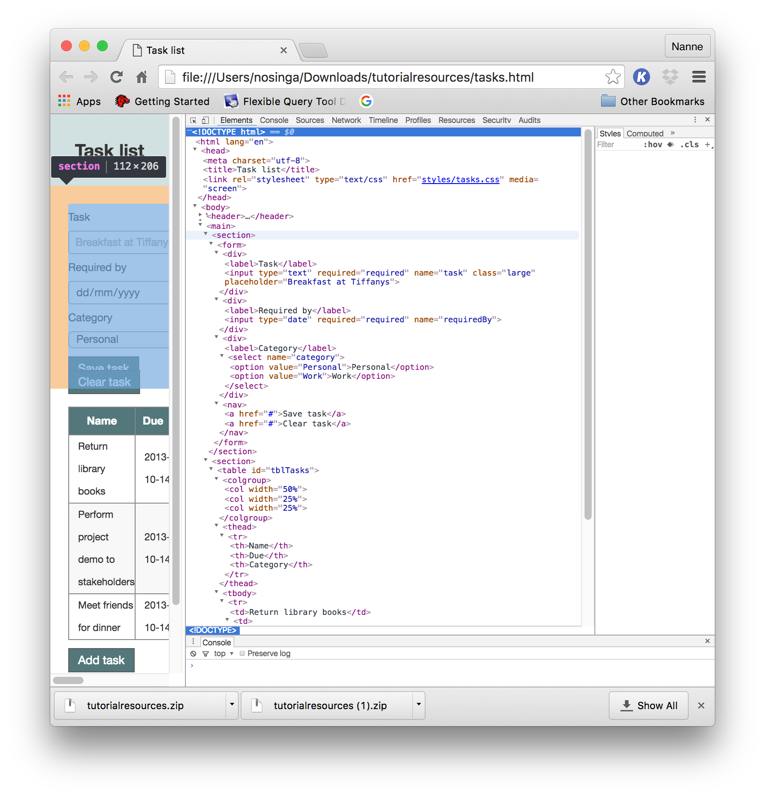
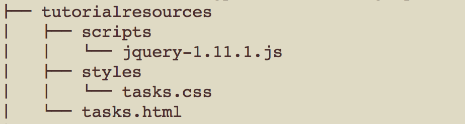
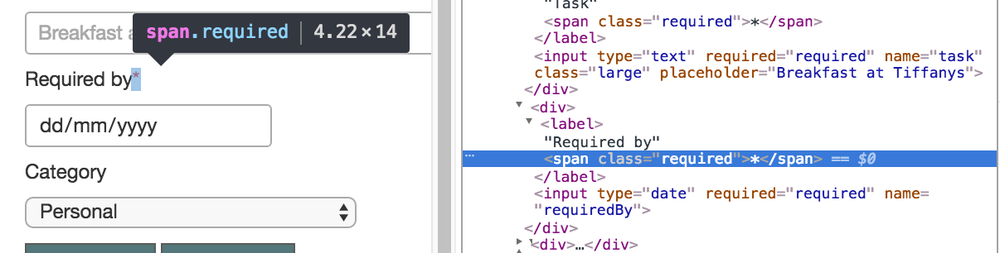

# Tutorial 4 : jQuery primer

If you want to go to the [previous tutorial](../tutorial/javascript) click [here](../tutorial/javascript)

If you want to go to the [next tutorial](../tutorial/add_and_edit) click [here](../tutorial/add_and_edit)

You can [download the tutorial resources here](../../downloads/tutorialresources.zip)

# Introduction

Understanding jQuery begins with an understanding of JavaScript. Sometimes jQuery is treated as an independent language that can be used instead of JavaScript. Although jQuery contains many features associated with programming languages, it is best thought of as a library that enhances JavaScript in specific situations. For this reason, JavaScript has been introduced before jQuery.

Before understanding jQuery however, it is worth taking a brief look at the Document Object Model (DOM), since jQuery is primarily a library for dealing with the DOM in a browser independent manner.

# Document Object Model

HTML (including XML and XHTML) documents are modelled in memory using a tree structure called the Document Object Model.

Each document has a single parent node, and this node can have children. These nodes in turn can be parents of other children. Each node in the tree (except the head node) has one, and only one parent. All nodes in the tree can have zero or more children.

DOM trees contain several kinds of nodes, the most common of which are element nodes (which represent tags) and text nodes (which represent the content inside tags).

In order to see the inherent tree structure of a document, open the tasks.html document which you can [download here](../../downloads/tutorialresources.zip), and view it in the “Elements” tab of Chrome's developer tools. Any parent that has children has an arrow beside it that can be expanded. The overall parent of the whole document is the html tag at the start of the document. This has two children: __head__ and __body__, and each of these have children. Even in this relatively simple document, there are some elements that are eight generations removed from the __html__ element:

The Document Object Model is a technology and language independent API for interacting with HTML documents. The API allows developers to access nodes in the document, traverse the document, and manipulate elements in the document.

Each element in the DOM tree is represented by an object. These objects support an API that allows them to be manipulated. As you will see when we start using jQuery; sometimes we will still encounter native DOM objects, but usually they will be wrapped inside jQuery specific versions of the objects, and expose additional functionality.

All web browsers that support JavaScript support a JavaScript implementation of the DOM API. The specific version of the API they support will depend on the browser however, and this, along with inconsistencies in their implementations, can lead to issues for JavaScript programmers.

In order to see the DOM API in action, open the Chrome console and type the following:

    > document

This will return the DOM representation of the HTML document, which is the exact same representation we saw from the Elements tab of the developer tools above. This may differ from the literal document: for instance if the HTML document was not well formed (e.g. it was missing closing tags), the browser will attempt to construct a well-formed representation of the document (according to the rules specified in the HTML5 specification).

The DOM API  allows us to access elements based on their characteristics; for instance, we can access the __table__ elements with:

    > document.getElementsByTagName('table')

In addition to querying, traversing and manipulating the document, the DOM API also allows event listeners to be added to the nodes in the document. These can be used to detect users clicking buttons, or text being typed into input fields, along with many other types of event.

jQuery does not allow you to do anything with the DOM that could not be done using the native JavaScript API, in fact, jQuery is implemented using the native DOM API, and is therefore essentially an abstraction or wrapper of the DOM API.

Since jQuery does not do anything that cannot be done with the native DOM API you may wonder what is the use of learning jQuery. For one thing, jQuery provides a genuine cross browser implementation of the DOM API, and alleviates the quirks that are found in many browser implementations.

Rather than providing a full set of reasons for using jQuery, I encourage you to work through the examples below. They highlight the elegance and conciseness of the jQuery API, and once you begin using jQuery it is very hard to go back to the native DOM API.

# Starting with jQuery

In order to use jQuery you must include the jQuery library in the HTML page. This can be achieved by serving your own copy of the jQuery library, or by utilizing a hosted version from a content delivery network (CDN), most notably Google.

   |   |   |
   |---|---|
   |   |As a general rule, for production deployment you should favour CDN hosted options. These tend to provide superior performance for users than hosting your own copy. For development I generally prefer to download my own copy, since this removed the need for a network connection to run the application.|
   |   |   |

If you wish to use the Google hosted version of jQuery, simply include it in the head of the HTML file:

In order to serve your own copy, download the latest version of jQuery from here:
http://jquery.com/download/
The examples in this book are using 2.0.3, but any recent version will be compatible.

__Since Vaizr is using version 1.11.1 this file is added to the totorial resources__

jQuery consists of a single JavaScript file that can be downloaded in either minimised or non-minimalized form. The non-minimalized form is useful for debugging, but either version will be appropriate. Here we will use the file which comes with the tutorial resources. Unzipped your directory structure should now look like this:

Now add the following to the head section of the tasks.html HTML file:

In order to verify you have performed these steps correctly, open the page, and open the JavaScript console. Type the following in the console:

    > jQuery
    function ( selector, context ) {
		// The jQuery object is actually just the init constructor 'enhanced'
		// Need init if jQuery is called (just allow error to be thrown if not included)
		return new…

If this gives a result similar as displayed above and does not generate an error, jQuery is ready to go.

# Selection

The first thing we are going to do with jQuery is select elements from the document.

Selecting elements obviously has no intrinsic value in its own right; we are eventually going to do something with these elements. A jQuery selection will return zero or more elements from the document. More specifically, the selection will return zero or more jQuery wrapped DOM elements from the document. This distinction will be important in later sections.

In order to perform a selection, simply include the selection criteria inside the following construct:

    $('<selection criteria>')

The $ is an alias for the function called jQuery, so we could also use the following construct:

    jQuery('<selection criteria>')

The __$__ alias tends to produce better readability, so we will use that convention in the sections below. The only time to avoid this alias is if you are using any other libraries that use the $ global variable: jQuery does support a no-conflicts mode in this case, and allows you to create a new alias.

The selection criteria utilized by jQuery is in fact essentially the same selection criteria utilized by CSS. This is enormously helpful, since it means you only need to learn the selection language once in order to use CSS and jQuery.

There are five core ways to select elements:

* Element type.
* Element attribute.
* Element class.
* Element ID.
* Pseudo classes.

All five approaches will be briefly outlined below.
The first way to select an element is by its type. For instance, if we want to select all the table elements in the document, we can use the following syntax:

    > $('table')

This, and all other commands in this chapter, can be run directly in the console after first loading the tasks.html page. This command will return an array of one element, and that element will be the table holding the tasks.
If we want to select all the td elements in a document, we can use the following:

    > $('td')

This will return an array of 9 elements.

    > $('td').length

The second core way we can select elements is based on one of their attributes. If we wish to select all the elements with a placeholder attribute, the following selection can be used:

    > $('[placeholder]')

Notice the use of [] brackets around the attribute name. This will find all elements with a placeholder attribute, regardless of its value.

Additionally, we may wish to specify that the element has an attribute with a specific value, in which case the following syntax can be used:

    > $('[datetime="2013-10-14"]')

In this case we are mixing single and double quotes, since we wish to express the value as a string inside the string that is the selection criteria.

Selecting elements based on attributes becomes even more useful due to the fact it is possible to add your own custom attributes to HTML elements. Adding custom attributes to elements allows you to associate data with an element, and then use this data in any way we need.

For instance, we may want to denote that a cell in a table represents the name of a task; therefore we could add the following attribute to the element:

    <td data-name-field="true">

In order to quickly find all name field nodes, we could then execute the following selection:

    > $('[data-name-field]')

Alternatively, we may wish to associate a priority with tasks, so each tr element could include the following:

    <tr data-priority="high">

or

    <tr data-priority="medium">

We can then select all the high priority rows in the table with the following selection:

    > $('[data-priority="high"]')

We will see below that the prefix added to this attribute (“data-“) is more than a convention, and allows for other possibilities. Binding data directly to elements turns out to be an enormously powerful concept. It provides a way to add context to elements in a manner that can be easily understood and processed by code, and therefore allows the same element to have user facing and a computer facing meaning.

   |   |   |
   |---|---|
   |   |Data attributes should be specified in lower case characters only, and words should be separated with a hyphen.|
   |   |This is a good general rule with HTML, since all attributes are converted to lower case in the DOM anyway.|
   |   |As we will see below, these attributes can be returned from elements as an object via the __data()__ method on DOM elements. This will convert the attribute names as follows:|
   |   |`data-this-is-long=”true”`|
   |   |is converted to the following property on the data object:|
   |   |`thisIsLong=true`|
   |   |   |

The next way we can select elements in a document is by class. Elements can be given one or more classes with the class attribute. All HTML elements support the class attribute (the restrictions from HTML4 applying to some elements have been removed). Inside tasks.html you will see the following examples:

    <input type="text" required="required" name="task" class="large">

    <tr class="even">

A class is just an arbitrary name: it is a way of grouping together otherwise unrelated elements to denote they share some characteristic. The characteristic they usually have in common is that they should have the same styles applied via CSS, and therefore the class attribute is usually associated purely with CSS.

In reality classes can be used to group elements for any reason. When using jQuery it is common to assign classes to elements purely to allow jQuery selections to efficiently find related elements.

For instance, in tasks.html every second row in the table is given the class of even. All even rows can be selected using the following selection criteria:

    > $('.even')

(Note the “.” at the start of the selection criteria)

   |   |   |
   |---|---|
   |   |It is possible to apply specific styles to every second row purely through CSS:|
   |   |`tr:nth-child(even) {`|
   |   |`    background-color: #f8f8f8;`|
   |   |`}`|
   |   |   |

Using classes for reasons other than CSS matching does not go against the spirit of the HTML5 specification. The specification states that classes are one way that elements can be extended, thereby effectively creating a new type of element.

The fourth basic way to select elements is based on their ID. Any element can be given an ID using the id attribute.
ID names are arbitrary, just as class names are, but ID names must be unique within a document.

   |   |   |
   |---|---|
   |   |HTML5 has relaxed the rules on the values that can be used for IDs. The only rules now are that they must be unique in a document, and cannot be an empty string or contain spaces. The rules for class names are identical.|
   |   |   |

An element can be given an ID as follows:

    <table id='tblTasks'>

Once an element has been given an ID it can be selected with the following criteria:

    > $('#tblTasks')

(Note the “#” sign at the start of the selection criteria.)

The last way of selecting elements is via jQuery filters. If you are familiar with CSS, these may look the same as CSS pseudo-classes, and they essentially serve the same purpose.

Suppose we want to find the first row in a __table__. We could add a class to the row, but if the table was re-ordered we would need to make sure this was updated. We could also select all rows from the table into an array and choose the first element, but this is inefficient. With filters we can use the following selection criteria:

    > $('tr:first')

(Filters are always prepended with a colon; this is therefore combining two selectors, one to select __tr__ elements, and then another limiting the selection to __tr__ elements that are in the first position amongst their siblings.)

Filters can also accept parameters; therefore we can find any arbitrary row in the table using the following filter:

    > $('tr:eq(1)')

This will find the second row in the table (counting starts at 0).
Alternatively we may wish to find any row except the first row, so we could use the following filter:

    > $('tr:gt(0)')

This is selecting all rows with a position greater than 0.
Other useful filters are as follows:

* __:even__ finds all even numbered elements in a selection.
* __:odd__ finds all odd numbered elements in a selection.
* __:not(selection)__ finds all elements that do not match the selection.
* __:checked__ finds radio buttons or check boxes that are checked.
* __:selected__ finds options in select boxes that are selected.
* __:contains(text)__ finds elements that contain a given piece of text.
* __:empty__ finds all elements that have no children.
* __:focus__ finds the element that currently has focus.
* __:last__ finds the last element in a set.

In addition, filters can simplify the process of selecting input elements. Since most input fields use the element type of __input__, it is necessary to also query on the attribute __type__. jQuery contains the following filters for finding specific types of input field:

* :hidden
* :text
* :checkbox
* :password
* :radio
* :checkbox
* :file
* :button

for instance, this selects all __text__ input fields:

    > $(':text')

One of the nice features about jQuery filters is that you can actually write your own. For instance, jQuery does not provide a filter for finding all the date input types. We can therefore add a custom filter to our code-base as follows:

    > jQuery.expr[':'].date = function(elem) {
        return jQuery(elem).is( "input" ) && $( elem ).attr( "type" ) === "date";
      }

(Don’t worry if this code looks unfamiliar, it will look familiar by the end of the chapter.)
When executed, this will be passed all elements in the document (or the specified sub-tree of the document), and returns true or false depending on whether the specified element meets the selection criteria. The result to the caller is all the elements that evaluated to true.

   |   |   |
   |---|---|
   |   |This function takes advantage of the jQuery __is__ function. The __is__ function is slightly unusual in that it returns __true__ or __false__ rather than a set of elements.|
   |   |   |

Once this has been added to the code-base, the following pseudo class can be used:

    > $(':date')

Now that we have investigated the five main selection mechanisms, the next step is to understand how these mechanisms can be combined. We have already been briefly introduced to this concept with pseudo-classes.

The simplest way of combining filters is in cases where elements need to meet two or more selection criteria. For instance, if the __:text__ filter did not exist, it could be written through the combination of two selection criteria. In the first instance, we would need to make sure the element was of type __input__:

    > $('input')

Additionally, the element must have an attribute called type set to the value text:

    > $('[type="text"]')

In order to join these two criteria, a single selection criterion can be written as follows:

    > $('input[type="text"]')

Notice that there is no space between one criteria and the next – if a space was placed here this would mean something different, as we will see below.

We can use the same approach to match on both element type and class:

    > $('input.large')

This will return all elements of __type__ “input” that have a __class__ of “large”.

It should never be necessary to combine selectors based on ID with other types of selector, since IDs are unique within a document.

In addition to combining selectors for criterion relating to a single element, it is often necessary to select all elements that match selection criteria within a particular sub-tree of the document.

Consider a case where we have multiple tables in the same document, but we want to return the first row in a specific table (for instance, the table with the ID __tblTasks__). In order to achieve this we first need to find the table called __tblTasks__, and then find the first row within its sub-tree.

jQuery supports several ways of doing this. The most common approach is as follows:

    > $('#tblTasks tr:first')

The space denotes the fact that these are two different selections. jQuery performs this by selecting the elements that match the first selection:

    $('#tblTasks')

and then executing the second selection against the sub-trees of these elements:

    $('tr:first')

In fact, jQuery supports an alternative mechanism for doing this more explicitly:

    > $('#tblTasks').find('tr:first')

Yet another approach to performing this same selection is to use the optional second parameter to the jQuery selector:

    > $('tr:first', '#tblTasks')

The second parameter is used to specify the root of the sub-tree that the selection should occur within. This can be a useful approach when you know you are dealing with a sub-tree of the document, since you can assign the context to a variable, and then use that in all selections:

    > documentContext = $('#tblTasks');

    > $('tr:first()', documentContext);

It is possible to specify more than two levels of selection within a single selection criterion. For instance, we may want to find all the __td__ elements in the last row of all the __tables__ in the second __section__ of the document. This can be performed as follows:

    > $('section:eq(1) table tr:last td')

Sometimes we may want to be more precise about the relationship between elements. For instance, we may want to select elements that are direct children (rather than just decedents) of another element. This can be accomplished through the use of the “>” sign, for instance:

    > $('select[name="category"] > option')

This will find all the __option__ elements within a particular __select__ element, but only because they are direct children of the select box. For instance, this will not return any results:

    > $('form > option')

# Traversal

Selecting a set of elements from the DOM is an important step, but is only the first step in the process. Once a set of elements has been identified a common second step is to traverse from these elements to another set of elements.

A traversal function always starts with the results of a selection, and then performs a traversal operation on these elements to return a new set of elements.

A common traversal requirement is to traverse from an element, or set of elements, to their siblings. For instance, in tasks.html input fields and their labels are siblings because they share the same parent.

Sibling-based queries can be performed through the __siblings function__. If we want to find all siblings for the select box with the name of __category__, we can perform the following query:

    > $('select[name="category"]').siblings()

If we want to limit the siblings to elements of type __label__ we can add a selector to the __siblings__ function:

    > $('select[name="category"]').siblings('label')

Two other similar functions are __next__ and __prev__. These return the next and previous sibling element of the selected element. For instance, the following returns the next sibling of all labels in the document:

    > $('label').next()

while this returns the previous siblings of all the input fields in the document:

    > $('input').prev()

Again, these functions also accept selection criteria if necessary.

Another common traversal requirement is to find specific parents of a given element or set of elements. For instance, we may wish to find the __parent__ of all input fields. This can be achieved with the parent function:

    > $('input').parent()

We may also wish to limit this to input fields that have __div__ elements as their parents:

    > $('input').parent('div')

A slight variant on this function is the __parents__ function. Instead of returning immediate parents, this returns all ancestors that meet the selection criteria. For instance, the following returns the __section__ element that is the ancestor of each input field:

    > $('input').parents('section')

Yet another variant on the same theme is the __closest__ function. This allows us to find the closest ancestor that matches a given selection criteria, starting with a specific set of nodes in the initial selection. This first examines the selected node against the criteria, then works its way up the DOM tree until it finds a match. For instance, if we want to find the closest __div__ to each __label__, we could use the following selection:

    > $('label').closest('div')

Another example of a traversal function is returning the __last__ element. As we have seen, a pseudo-class on the selection itself also supports this. For instance, this returns the last row in the tasks table:

    > $('#tblTasks tr').last()

As with all traversal functions, the __last__ function also supports a parameter representing selection criteria allowing you to find the last element that meets specific criteria.

The traversal functions we have examined up until this point all return a new set of elements that typically do not include any of the elements from the original selection. In some cases it is useful to retain the original selection while including additional elements found during the traversal. For instance, suppose we had returned a set of input fields, and now wish to also include all the labels in the result set. This can be achieved with the following:

    > $('input').add('label')

A similar mechanism for achieving this is to augment any of the traversal functions above with a request to also add the original elements. For instance, the following call will return all labels and their closest div elements:

    > $('label').closest('div').andSelf()

This particular line of code is a good time to introduce another important topic: chaining. Due to the fact that most jQuery function calls return an array of elements, and most jQuery function calls can be invoked on an array of elements, it is very easy to chain a set of function calls together, each acting on the elements returned by the call that preceded it. This process can continue almost indefinitely, for instance:

    > $('input').parents('div').last().siblings().children()

If we trace this through, it is doing the following:

1. Find all __input__ elements.
2. Find any __div__ elements that are __parents__ of these elements.
3. Limit the result set to the __last__ div element.
4. Find its __siblings__.
5. Find their __children__.

Chaining allows for very concise code, but it also runs the risk of becoming dense and unreadable.

   |   |   |
   |---|---|
   |   |This is similar to UNIX pipelining. Pipelining allows multiple applications to be chained together with the result of one forming the input of the other. In UNIX, the key design decision that allows this is the fact that applications return text on standard output, and accept text on standard input. In jQuery the key design decision that allows this is that functions can be called on arrays of elements, and these functions return arrays of elements.|
   |   |   |

# Manipulation

The previous two sections on selection and traversal have shown you how a set of elements can be selected from the document. This section is going to introduce you to the ways you can manipulate documents once you have a set of elements to work with.

If you look at the tasks.html document you will see that the second row in the table has a class called __even__ assigned to it. The basic idea is that every second row in the table will be given the even class, and this will change the background colour of the row to make the table easier to read.

As mentioned previously, a real world application would be better off performing this functionality with CSS, but performing this with jQuery provides a nice introduction to DOM manipulation.

Before beginning this section, remove the __even__ class from the second row in the __table__. After this, refresh the tasks.html page in the browser and ensure all the rows have a white background.

In order to manipulate elements we must first select them. The selection criteria should be fairly standard by now. We first find all the even __rows__ in the body of the __table__ (this ensures we do not change the background of the header row):

    > $('tbody tr:even')

This will actually return two rows, since jQuery is counting from 0 the first row in the table and the third row in the table are returned. This still suits our needs, since our only real concern is that every second row is shaded.

We can then manipulate these rows as following:

    > $('tbody tr:even').addClass('even')

As soon as you execute this code you will see the DOM update, and the relevant rows of the table will be shaded with a new background color.

In addition to adding classes, we can also remove classes with __removeClass__ and toggle classes with __toggleClass__. Toggling is a particularly useful technique since it removes the class if the element already has it, or adds the class if the element does not already have the class. This will be used in examples later in this book.

Another requirement we may wish to implement is to add a red * next to the label for all mandatory fields. We know how to find all the mandatory fields; they are the ones with a required attribute (regardless of the value assigned to this attribute):

    > $('[required]')

and we can also find their labels as follows:

    > $('[required="required"]').prev('label')

The file tasks.css also contains a class called __required__ that is defined as follows:

    .required {
        color: red;
    }

In order to append the * to the __label__, we will include the * inside a __span__, and include that span within the __label__. This ensures it is separated from the label itself. We can dynamically append the __span__ to the __label__ as follows:

    > $('[required="required"]').prev('label').append( '*')

If you execute this you will notice a * appear at the end of two of the labels on screen.

This is not quite the finished result, we still need to add the appropriate class to the new __span__s; so refresh the screen to remove these changes.

You may have noticed that the result of the call above was the labels that had been modified (rather than the __span__s that were appended to them). We therefore need to select the child __span__s to these elements, and add the __required__ class to them:

    > $('[required="required"]').prev('label').append( '*').children( 'span').addClass('required')

Again, we have managed to achieve the entire operation in a single line through the use of chaining.

An important aspect to understand is that these changes have updated the Document Object Model in real time. In order to see this, highlight one of the red *, and choose “Inspect Element” from the right click menu (this is a shortcut to finding a specific element in the “Elements” tab of the developer tools). You will see the following:

Many of jQuery’s manipulation functions can be utilized to insert new content either before or after existing content. __Append__ is used to insert content inside a specific element, but other examples include:

* __after__: this adds content after each element, making the new content the next sibling of the original element. If we had used this in the example above, the __span__ would occur after the closing __label__ tag.

* __before__: this is similar to __after__, except the new element will appear before the original element. If we had used this in the example above, the __span__ would have appeared immediately before the label element.

* __prepend__: this creates a new child element at the start of the element (as opposed to __append__ which created the child at the end of the element). If we had used this in the example above, the * would have appeared to the left of the __label__ text, but the __span__ would still be a child of the __label__.

* __remove__: this completely removes an element from the document. You can use this to remove the newly added span elements.

* __replaceWith__: this   replaces an element or set of elements with a new element or set of elements.

In the examples above we have been adding content to existing elements. Instead of adding content to elements, it is also possible to create content and add it to elements. For instance, the following is a valid jQuery call:

    > $('*')

This returns the element specified by the HTML, although obviously that element is not part of the DOM at this point. It is then possible to call manipulation functions to add this element to the document:

    > $('*').appendTo('label')

This will append a * as a child element to each __label__ in the document. This approach can also used with the following functions:

* __insertBefore__: this function includes the new elements as siblings of the specified element or elements, but places them before them in the DOM.

* __insertAfter__: this function includes the new elements as siblings of the specified element or elements, but places them after them in the DOM.

* __prependTo__: this function includes the new elements as children of the specified element or elements, but places them at the start of the element, making them the first children.

The element inserted in this manner can be any HTML element or set of elements, including elements selected from the document.

In addition to adding new content to the DOM, some manipulation functions operate on characteristics of individual elements to either return information about them, or to manipulate this information. For instance, to find the value of the __select__ element in the document we can execute:

    > $('select').val()

The same function can be passed a value if we want to change the current value. If you execute the following the value of the select field will immediately change:

    > $('select').val('Work')

   |   |   |
   |---|---|
   |   |An important note regarding this call is that if any event listeners are registered to detect changes to this element, they will not be notified with this call.|
   |   |In order to notify any listeners of a change to the element, the following call could be used:|
   |   |` $('select').val('Work').change()`|
   |   |   |
   |   |Event listeners will be covered in detail later in this chapter.|
   |   |   |

Other similar functions are:

* __html__: this returns or manipulates the __html__ of an element.
* __text__: this returns the __text__ (or content) of an element. The text is the content between the elements tags.
* __attr__: this returns or manipulates the __value__ of an __attribute__ on an element.

These functions are also a little different from some of the others we have examined in that they only operate on a single element. For instance, if you execute the following:

    > $('div').html()

Only the HTML for the first element in the set of matched elements will be returned, rather than the HTML of all elements. Some jQuery functions are inherently limited in this way. In order to execute these functions on multiple elements, it is necessary to loop through those elements. This will be shown later in this chapter.

# Events

The next aspect of jQuery to understand is events. When writing web applications, the application will need to respond to events initiated by the user.

These events may be any of the following:

* Clicking a link or button.
* Double clicking a button or link.
* Changing the value in a text field.
* Pressing a particular key inside an input field.
* Selecting an option in a select list.
* Focusing on an input field.
* Hovering the mouse over an element.

In addition to these user-initiated events, the application may wish to respond to browser-initiated events such as:

* The document has finished loading.
* The web browser window is resized.
* An error occurring.

This section will first explain the ways event listeners can be registered, and will then look at some of these events in detail.

Before beginning, we will add the examples above permanently to the tasks.html page. In order to do this, add the following block immediately before the closing </html> tag:

    

This is a block of inline JavaScript. We will eventually provide more structure to the web application, and remove code such as this from the HTML page, but for now this is a simple way of including JavaScript code in the web page.

We will now begin by adding a simple event to the sample web application we have been working on. We will start by defining the task creation section of the screen (inside the first section element), to be hidden when we first come into the screen.

We will also provide it an id so we can easily refer to it:

    <section id="taskCreation" class="not">

The not class is defined in tasks.css, and provides a simple mechanism for hiding an element. It is defined as follows:
    .not {
        display:none;
    }

Next, we will modify the link with the text “Add Task” to have an id. This will allow us to select it more conveniently with jQuery:

    <a href="#" id="btnAddTask">Add task</a>

Finally, we will add the following code to the script section of tasks.html:

    $('#btnAddTask').click(function(evt) {
        evt.preventDefault();
        $('#taskCreation').removeClass('not');
    });

This code will be explained in detail below.

The entire page should now look like this (changes are encapsulated with two little comment blocks

    <!--starting new -->
       .. new block
    <!--endin new -->

The whole code block tasks2.html looks like

    <!DOCTYPE html>
    <html lang="en">
    <head>
    <meta charset="utf-8">
    <title>Task list</title>
    <link rel="stylesheet" type="text/css" href="styles/tasks.css"
        media="screen" />
    <!--starting new -->
    
    <!--ending new -->
    </head>
    <body>
        <header>
            Task list
        </header>
        <main>
    <!--starting new -->
            <section id="taskCreation" class="not">
    <!--ending new -->
                <form>
                    

                        <label>Task</label> <input type="text" required="required"
                            name="task" class="large" placeholder="Breakfast at Tiffanys" />
                    

                    

                        <label>Required by</label> <input type="date" required="required"
                            name="requiredBy" />
                    

                    

                        <label>Category</label> <select name="category">
                            <option value="Personal">Personal</option>
                            <option value="Work">Work</option>
                        </select>
                    

                    <nav>
                        <a href="#">Save task</a> <a href="#">Clear task</a>
                    </nav>
                </form>
            </section>
            <section>
                <table id="tblTasks">
                    <colgroup>
                        <col width="50%">
                        <col width="25%">
                        <col width="25%">
                    </colgroup>
                    <thead>
                        <tr>
                            <th>Name</th>
                            <th>Due</th>
                            <th>Category</th>
                        </tr>
                    </thead>
                    <tbody>
                        <tr>
                            <td>Return library books</td>
                            <td><time datetime="2013-10-14">2013-10-14</time></td>
                            <td>Personal</td>
                        </tr>
                        <tr>
                            <td>Perform project demo to stakeholders</td>
                            <td><time datetime="2013-10-14">2013-10-14</time></td>
                            <td>Work</td>
                        </tr>
                        <tr>
                            <td>Meet friends for dinner</td>
                            <td><time datetime="2013-10-14">2013-10-14</time></td>
                            <td>Personal</td>
                        </tr>
                    </tbody>
                </table>
                <nav>
    <!-- starting new -->
                    <a href="#" id="btnAddTask">Add task</a>
    <!-- ending new -->
                </nav>
            </section>
        </main>
        <footer>You have 3 tasks</footer>
    </body>
    <!-- starting new -->
    
    <!-- ending new -->
    </html>

If you reload the page, you should see that the task creation section (with all the input fields) is not displayed when the page initially loads. If you click the “Add task” button however, this section will immediately appear.

If you look at the event handler code you will see some familiar features. First, we select the element we wish to add an event listener to using standard jQuery selection criteria:

    > $('#btnAddTask')

Next we call the appropriate jQuery function on this element to add a click listener; this function is called __click__ and it accepts a JavaScript function as its parameter. In this example, the JavaScript function passed to the click function is created on the fly as an anonymous function. This could also have been written as follows:

    function btnAddClicked(evt) {
        $(evt.target).preventDefault();
        $('#taskCreation').removeClass('not');
    }

    $('#btnAddTask').click(btnAddClicked);

The technical term for the function we have passed to the click function is a callback. This is because the function is not executed immediately; it is executed when a specific event occurs (the user clicks the button). jQuery, like many other JavaScript libraries, makes extensive uses of callbacks, and we will see many other examples in the sections below.

You will also see that our function accepts a parameter called evt. When jQuery invokes the function we passed to it, it will provide an object as a parameter representing the event that has occurred.

The most useful feature that can be obtained from the event object is the element that caused the event. The same event listener may be added to many elements, therefore we will often need to find out which of these elements had the event invoked on it. This can be extracted from the event object as follows:

    evt.target

It may not be immediately obvious, but the object returned as the target is a plain DOM object rather than a jQuery wrapped DOM object. This may sound like a minor point, but it means that it is not possible to invoke jQuery functions on this element. For instance, if we attempt to call the __html__ function on this element, the following error will occur:

`tasks2.html:88 Uncaught TypeError: evt.target.html is not a function`

Whenever you are presented with a native DOM object, it is easy to convert it to jQuery wrapped object by selecting it:

    $(evt.target)

The result of this will expose all the standard jQuery functionality:

`Add task tasks2.html:88`

You will also notice the following line in the click handler:

    evt.preventDefault();

A single element can have multiple event listeners attached to it. Some of these will be added explicitly by the application, but the browser may add its own action implicitly. These implicit event listeners are called the default action of the element; for instance, a hyperlink has a default action that invokes its specified URL when it is clicked.

In this web application we do not want hyperlinks to exhibit this default behaviour, otherwise the page would be refreshed every time the user clicked a button. Therefore we call preventDefault on the event to signal that the element’s default action should be supressed.

   |   |   |
   |---|---|
   |   |Using hyperlinks instead of button elements is a personal preference. Many designers have historically preferred them, since they tend to be easier to style, and more flexible to use. There is however a strong argument in favour of using the button elements in these cases.|
   |   |   |

The final aspect of this event handler is the removal of the class that was causing this element to be hidden, which should be familiar code by now:

    $('#taskCreation').removeClass('not');

It is possible to add click listeners to any HTML element. For instance, we can add a feature to the __table__ so that when the user clicks a row it will highlight in bold. If they then click the row again it will return to normal.

The tasks.css file already contains a class that can set the text of an element to bold:

    .rowHighlight {
        font-weight:bold;
    }

As a first attempt at this code, we will try adding the following to the script block of tasks.html:

    $('tbody tr').click(function(evt) {
        $(evt.target).toggleClass('rowHighlight');
    });

This is adding a click listener to all rows in the __table__ body. When invoked, this will add the __rowHighlighted__ class to the element that was clicked.

If you debug this you will notice that the value of __evt.target__ is in fact the element that has been clicked on (the __td__ element) rather than the __tr__ element, therefore only a single cell highlights in bold.

   |   |   |
   |---|---|
   |   |The next chapter will address debugging JavaScript code. If you are unfamiliar with the Chrome debugger, and would like to see this for yourself, you may want to jump ahead to that chapter.|
   |   |   |

As a second attempt, we could try to find the __tr__ element that is the parent of the element that was clicked, and add the class to this element. This also will not work, since __td__ elements have been defined with normal font-styles in tasks.css, therefore they will not inherit font-style from their parents.

What we want to do is add this class to all the __td__ elements in the row that is selected. We could attempt this as follows:

    $('tbody tr').click(function(evt) {
        $(evt.target).siblings( ).toggleClass( 'rowHighlight');
    });

There are two problems remaining with this. The __siblings__ function returns a set of all the siblings, but leaves out the element that has been clicked, so all cells except the one clicked will highlight, we can solve this with the following:

    $('tbody tr').click(function(evt) {
        $(evt.target).siblings() .andSelf( ).toggleClass( 'rowHighlight');
    });

The next problem is the __td__ element that contains the __time__ element. If the __time__ element is clicked, the list of siblings will be empty, since the time element does not have any siblings. Before finding the siblings we therefore need to first find the closest __td__ element to the one clicked.

As mentioned earlier, the __closest__ function begins by examining the selected element, and only ascends the tree if that does not match the requirements. Therefore, the closest __td__ to a __td__ is itself, but the closest __td__ to a __time__ element is its parent.

The following code therefore meets our requirements:

    $('tbody tr').click(function(evt) {
        $(evt.target).closest( 'td').siblings( ).andSelf( ).toggleClass( 'rowHighlight');
    });

Finally, note that we are using the __toggleClass__ function. Rather than checking whether the elements have the class __rowHighlight__, and adding it if they don’t, and removing it if they do, we can let jQuery do the work for us.

In the examples above we are adding event listeners to elements in the document when the page is loaded. A complication with event listeners is that we might want to add them to elements that are not in the document yet. Due to the fact we can dynamically add elements to the DOM, we may want event listeners automatically added to these elements when they meet specified selection criteria.

If we consider the case of the event listener that highlights selected rows in the table, we may want this to work even if rows are dynamically added to the table after the page has loaded.

Fortunately jQuery has an elegant solution to this problem using the __on__ function. The first part of the solution involves specifying the portion of the document that will contain any new elements, in our case that may be:

    $('#tblTasks tbody')

We could alternatively say we want to add the event listener to any new elements anywhere in the document with:

    $(document)

Next we specify the type of event listener we want to attach, the type of element we want the event listener added against, and the callback we want executed.

In order to demonstrate this, we will add a click listener to be able to delete each row in the table.

Before beginning, we need to add navigation buttons to each row in the table body. Add the following to each row in the __tbody++ immediately before the </tr> (there are 3 of them):

    <td>
      <nav>
        <a href="#" class="editRow">Edit</a>
        <a href="#" class="completeRow">Complete</a>
        <a href="#" class="deleteRow" >Delete</a>
      </nav>
     </td>

In addition, add a new header cell inside the table header immediately before the </tr>:

    <th>Actions</th>

Finally, to make sure the columns are sized correctly, change the column groups for the table as follows:

    <colgroup>
      <col width="40%">
      <col width="15%">
      <col width="15%">
      <col width="30%">
    </colgroup>

In order to verify the changes, executing the following should return three elements:

    $('.deleteRow')

We can now add an event listener as follows:

    $('#tblTasks tbody').on('click', '.deleteRow',   function(evt) {
        evt.preventDefault();
        $(evt.target).parents('tr').remove();
     });

When an element with the class __deleteRow__ is clicked, this event listener will find the __tr__ element that is a parent of this element:

    $(evt.target).parents('tr')

It will then remove this element from the document using the __remove__ function.

Naturally this works for the three rows that were in the table when the page loaded. If you want to prove that this approach works for rows added directly to the DOM, you can add a new row to the table with the following code:

    $('#tblTasks tbody tr:first' ).clone().insertAfter('#tblTasks tbody tr:last')

This code will select the first row from the table, clone it, to create a new row, and then insert it after the last row in the table. You will be able to then delete this row from the table using its delete button, without having to add an event listener explicitly to the button.

   |   |   |
   |---|---|
   |   |Earlier versions of jQuery used a function called live to add dynamic event listeners. This function has been deprecated and should not be used.|
   |   |   |

So far we have concentrated on click events. There are many other events that can be listened for with jQuery. The following are the other common events, all of which work in the same basic way:

* __dblclick__: is invoked when an element is clicked twice in quick succession.
* __hover__: is invoked when the mouse hovers over the element.
* __mousedown__: is invoked when the mouse button is pressed, and before the button is release.
* __mouseup__: is invoked when the mouse button is released.
* __keypress__: is invoked each time the user types a key into an element, such as a text field.
* __keydown__: is invoked when the user presses a key, but before the output is reflected on screen. This allows you to veto the action with preventDefault.
* __blur__: is invoked when the focus leaves a form field. This is useful when you wish to validate content after the user has finished typing.
* __change__: is invoked when the value of a form field changes.
* __focus__: is invoked when the form field receives focus.

For a complete list of events, see the jQuery documentation.

Before finishing this section, we will make a minor change to ensure that our event handlers are not added before the DOM has been fully constructed. Ideally we want to start processing scripts after the DOM has been constructed, even if all resources (such as images) have not been loaded. Due to the way JavaScript works, it is possible that it will begin processing before the DOM has loaded, in which case elements will not be available when selected:

   |   |   |
   |---|---|
   |   |Technically in our case we do not need to worry about this, since our script is declared at the bottom of the page. It is however a good habit to use the approach suggested below, even in this case.|
   |   |   |

In order to detect that the DOM has fully loaded we can listen for the __ready__ event:

    $(document).ready()
        $('[required="required"]').prev('label').append( '*').children( 'span').addClass('required');
        $('tbody tr:even').addClass('even');
        $('#btnAddTask').click(function(evt) {
            evt.preventDefault();
            $('#taskCreation').removeClass('not');
        });

        $('tbody tr').click(function(evt) {
            $(evt.target).closest('td').siblings( ).andSelf( ).toggleClass( 'rowHighlight');
        });

        $('#tblTasks tbody').on('click', '.deleteRow', function(evt) {
            evt.preventDefault();
            $(evt.target).parents('tr').remove();
        });
    });

If you need to delay code execution until all resources have loaded, the __load__ event can be used instead:

    $(document).load()

# Writing jQuery Plugins

One of the reasons jQuery has become so popular is that it is trivial to write plugins that integrate with jQuery. This has led to a huge number of plugins freely available under the MIT license, and also allows you to write your own custom plugins.

A jQuery plugin usually works by performing an operation on an element, or set of elements returned from a jQuery selection. Just like standard jQuery functions, depending on how the plugin is written it may be capable of acting on a whole set of elements, or just a single element.

In this section we are going to write a plugin that can be executed on a __form__ element that has been selected using jQuery. This plugin will then return an object where the property names on the object are the form field names, and the values are the values of that field. Effectively this plugin is going to serialize the values on a form into an object. We will also allow this plugin to operate in the opposite direction: to de-serialize an object onto a __form__.

This plugin will take advantage of programming by convention. We will assume that the object names and the form field names should always match, even though there will be nothing in the code that insists on this.

Programming by convention does have disadvantages. For instance, if anyone changed the name of a field this will result in changes to the property on the objects serialized from that form, and that may in turn break other code that had expectations about what those properties would be. Programming by convention can significantly reduce the amount of code required to implement functionality however.

Plugins work in jQuery by passing the jQuery function to the plugin function, which will then extend the jQuery function by creating an object with a set of new functions in it.

It is not particularly important that you understand this process, but the boilerplate code for adding new functions to jQuery looks like this:

    (function($) {
        $.fn.extend({
            action: function() {}
        });
    })(jQuery);

In this case we are adding a single new jQuery function called __action__. This could then be invoked as follows:

    > $('div').action()

Inside the function we can use the __this__ variable to access the element or elements that the function has been executed on, for instance in the example above, all the div elements. This will either represent an array of jQuery elements, or a single jQuery element. In our example we are always going to assume that __this__ is a single element.

To begin, we will write a rudimentary version of the serialize function that simply writes the contents of the __form__ to the console log:

    (function($) {
      $.fn.extend({
        toObject: function() {
          console.log(this.serialize());
        }
      });
    })(jQuery);

This implementation adds a new function to jQuery called toObject, and is going to take advantage of a function already available in jQuery that serializes a form into a string.

Add this to the script section of the web page, refresh the web page, and click “Add task”. Enter values into all the fields, and then call:

    > $('form').toObject()

This should print out a text string with the contents of the form.

Now that we have a basic implementation, we can start writing the code needed to return an object with properties populated from the form.

Although jQuery does not have a function for serializing a form into an object, it does have a function for serializing a form to an array. This function returns an array where each form field is represented by an element in the array, and consists of a name and a value. In order to see this function in action, execute the following:

    > $('form').serializeArray()

We will use this as the basis of our implementation, and iterate over the array using a jQuery helper function called __each__:

    $.each($('form').serializeArray(), function(i, v) {

    });

   |   |   |
   |---|---|
   |   |jQuery has a number of utility functions available with “$.” prefixes. Unlike other jQuery functions, these are not used for selecting elements, and they cannot be invoked on a set of elements.|
   |   |   |

This particular function will iterate over an array and pass each index and value to the callback function we provide. To see this in action, try executing the following:

    > $.each([1,4,8,16,32], function(i, v) {
          console.log('index: '+i);
          console.log('value: '+v)
      });

This should print out:
index: 0
value: 1
index: 1
value: 4
index: 2
value: 8
index: 3
value: 16
index: 4
value: 32

Unlike the standard JavaScript __for__ and __while__ loops, the __$.each__ helper has the ability to iterate over both arrays and objects.

Now that the skeleton of __toObject__ is in place, we can complete the implementation as follows:

    (function($) {
      $.fn.extend({
        toObject: function() {
          var result = {}
          $.each(this.serializeArray(), function(i, v) {
              result[v.name] = v.value;
          });
          return result;
        }
      });
    })(jQuery);

If you now execute the following:

    > o = $('form').toObject()

The variable o will contain an object, with properties reflecting the names of the field in the form. It is therefore possible to execute the following:

    > o.task

You will notice that the implementation starts by creating an empty object. Properties are then added to the object for each form element. The implementation uses the [] bracket approach to add properties, rather than the “.” notation. This is important, because the name of fields may not conform to the standards required by JavaScript when using the “.” notation.

Now that we have a __toObject__ function, we can add a second function to de-serialize an object back onto a form. In order to add a second function, we simply create a new property in the object we are creating to extend jQuery. This function will be called __fromObject__ and accepts an object as a parameter:

    (function($) {
      $.fn.extend({
        toObject: function() {
          var result = {}
          $.each(this.serializeArray(), function(i, v) {
            result[v.name] = v.value;
          });
          return result;
        },
        fromObject: function(obj) {

        }
      });
    })(jQuery);

The first task of this function will be to extract all the form fields from the __form__ this function is called on (which again, will be represented by the __this__ variable. We can extract the input fields with the following:

    this.find('input')

The only problem is that this will not include select boxes, since they are not considered types of input fields. Fortunately, jQuery provides a selector that does return all input fields, including select fields:

    this.find(':input')

Once all the form fields are found, the implementation will iterate over all the fields and extract their name attribute. It will then look in the object for a property with that name, and if there is one, it we will set the value of the field from the value of the property:

    fromObject: function(obj) {
      $.each(this.find(':input'), function(i,v) {
        var name = $(v).attr('name');
        if (obj[name]) {
          $(v).val(obj[name]);
        } else {
          $(v).val('');
        }
      });
    }

You will notice that we add the __$()__ construct around the references to __v__. This is because the value returned is a native DOM object; therefore it is necessary to convert them to jQuery objects in order to use the __attr__ method.

With that implementation in place you should be able to change values in the form, and then call the following to repopulate it back to the original values stored in the o variable:

    > $('form').fromObject(o)

The final version of the jQuery plugin is as follows:

    (function($) {
      $.fn.extend({
        toObject: function() {
          var result = {}
          $.each(this.serializeArray(), function(i, v) {
            result[v.name] = v.value;
          });
          return result;
          },
        fromObject: function(obj) {
          $.each(this.find(':input'), function(i,v) {
            var name = $(v).attr('name');
            if (obj[name]) {
              $(v).val(obj[name]);
            } else {
              $(v).val('');
            }
          });
        }
      });
    })(jQuery);

# Using existing plugins

Before writing your own plugin, it is useful to check if any plugins are already available that meet your needs. There is a vast library of plugins available on the Internet. Some are well supported and widely used; others are unsupported, or used by a handful of people.

Most plugins are available under the MIT license, meaning you are free to modify them in any way you need.

In this section we are going to use a plugin for generating HTML from a template. The plugin we will use is jQuery Template, and is available here:

https://github.com/BorisMoore/jquery-tmpl

You can choose to download either jquery.tmpl.js or jquery.tmpl.min.js.

Alternatively, you can use the following CDN version:
http://ajax.aspnetcdn.com/ajax/jquery.templates/beta1/jquery.tmpl.js

   |   |   |
   |---|---|
   |   |When a library has .min in its name, it is exactly the same as the one without it, but has been compressed. It is common to compress JavaScript files to improve download speed, but some people (mistakenly) also see it as a way to add obfuscation to their code to stop it being copied.|
   |   |If you would like to investigate this subject further, or compress your own files, see this website:|
   |   |https://developers.google.com/speed/articles/compressing-javascript|
   |   |   |

This plugin was originally intended to form part of the core jQuery library, but these plans have not come to fruition. The library is now largely unsupported, but is still a useful templating library, and will be used here primarily to demonstrate the use of a jQuery plugin.

If you would like to use a supported templating library on a project, I recommend the Underscore library, which provides templating functionality that performs essentially the same role.

In order to use a downloaded version of jQuery Template, first copy it to the scripts folder of the project. Once in place, add the following to the head section of the page, but after the main jQuery import:

    <head>
    <meta charset="utf-8">
    <title>Task list</title>
    <link rel="stylesheet" type="text/css" href="styles/tasks.css" media="screen" />

    

    <!-- starting new -->
    
    <!-- ending new -->

    </head>

   |   |   |
   |---|---|
   |   |You may notice that it is no longer necessary to specify that the language of a script file is “text/javascript”. HTML5 assumes by default that scripts are JavaScript.|
   |   |   |

This is all that is required in order to start using the jQuery Template plugin. When the script loads it will automatically add new features to jQuery, just as our own custom plugin added new features to jQuery.

When new tasks are created via the form, we need to dynamically add them to the __table__; this means creating a new __tr__ element in the table, and adding the appropriate __td__ columns.

We could achieve this with jQuery directly by generating a string to represent the HTML and then appending it to the table. As we saw earlier in this chapter, it is possible to generate elements directly out of HTML and add them into the DOM.

Constructing HTML within code is error prone however, and it would be more convenient if we can write the basic structure of the row as HTML, and leave placeholders for the dynamic content.

   |   |   |
   |---|---|
   |   |Templating libraries are widely used in software development. Like jQuery template, they provide basic control structures such as loops and branching, and allow placeholders for parameters.|
   |   |   |

jQuery template allows us to define the following template in the HTML page:

    

This can be added at the very bottom of the page, before the </html> (not inside the other __script__ block). Note that this is essentially just a block of HTML, except it contains placeholders for values. The placeholders are inside the following constructs: __${}__.

Also note that this is not a standard JavaScript block, since it is defined as type __text/x-jQuery-tmpl__. The block also contains an ID, which is not typically needed in standard script blocks.

We now are going to implement a rudimentary version of the save functionality. Start by adding an ID to the save button:

    <a href="#" id="saveTask">Save task</a>

Next, add a __click__ event listener to the save task button. This is going to convert the form data into an object using the plugin we developed in the last section. It is then going to pass this object to the template we constructed above. Notice that in the template the placeholder names match the property names that will appear on our task object.

The template will generate a block of HTML, which we will then append to the table body. Add the following code to the __script__ section of tasks2.html alongside the other event handlers:

    $('#saveTask').click(function(evt) {
      evt.preventDefault();
      var task = $('form').toObject();
      $('#taskRow').tmpl(task).appendTo($('#tblTasks tbody'));
    });

As you can see, two lines of code are sufficient to convert the form to an object, and include the contents in the __table__, and this could be condensed to one line with relative ease.

As stated above, this is a rudimentary version of the save functionality. For instance, it does not contain any validation; therefore you can add invalid data to the table. This, and other minor issues, will be fixed once we start to turn this into a true web application in a couple of chapters time.

Now that the save is implemented we can remove the three rows that were added to the table by default each time the page was loaded, and add rows using the “Add task” and “Save task” functionality. In addition, the rows added should be able to be deleted using the “Delete task” option.

The tasks2.html page should now contain the following markup:

    <!DOCTYPE html>
    <html lang="en">
    <head>
    <meta charset="utf-8">
    <title>Task list</title>
    <link rel="stylesheet" type="text/css"     href="styles/tasks.css"
        media="screen" />
    
    
    </head>
    <body>
      <header>
        Task list
      </header>
      <main>
        <section id="taskCreation" class="not">
          <form>
            

              <label>Task</label>
              <input type="text" required="required"
                     name="task" class="large"
                     placeholder="Breakfast at Tiffanys" />
             

             

               <label>Required by</label>
               <input type="date" required="required"
                        name="requiredBy" />
              

              

                <label>Category</label>
                <select name="category">
                  <option     value="Personal">Personal</option>
                  <option     value="Work">Work</option>
                </select>
               

               <nav>
                  <a href="#" id="saveTask">Save task</a>
                  <a href="#">Clear task</a>
                </nav>
            </form>
        </section>
        <section>
            <table id="tblTasks">
                <colgroup>
                    <col width="40%">
                    <col width="15%">
                    <col width="15%">
                    <col width="30%">
                </colgroup>
                <thead>
                    <tr>
                        <th>Name</th>
                        <th>Due</th>
                        <th>Category</th>
                        <th>Actions</th>
                    </tr>
                </thead>
                <tbody>
                </tbody>
            </table>
            <nav>
                <a href="#" id="btnAddTask">Add task</a>
            </nav>
        </section>
        </main>
        <footer>You have 3 tasks</footer>
    </body>
    

    

    </html>

# Conclusion

This chapter has introduced all the important aspects of jQuery that deal with DOM manipulation. As has been demonstrated, jQuery provides an elegant and concise set of function calls for selecting, traversing and manipulating the DOM, along with adding event listeners.

Although jQuery does not do anything that could not be done natively with the DOM API (or other libraries such as Dojo for that matter), jQuery provides the following benefits:

* It takes care of any quirks that may exist in different versions of web browsers.
* It uses the same basic set of selectors as CSS, meaning anyone who understands CSS can quickly adapt to jQuery.
* It provides a concise and intuitive set of function calls that are easy to learn, and easy to use in conjunction with one another.
* It is easy to extend jQuery to solve new problems.
* jQuery is widely used, therefore there is a wealth of information and help available online.

There are several aspects of jQuery that have not been examined as yet. Foremost amongst these are the AJAX API which will be introduced later in this book. Several other jQuery topics will be introduced at the appropriate point in the book.