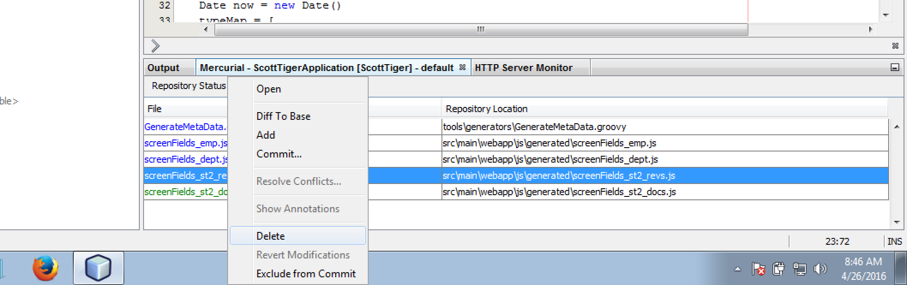
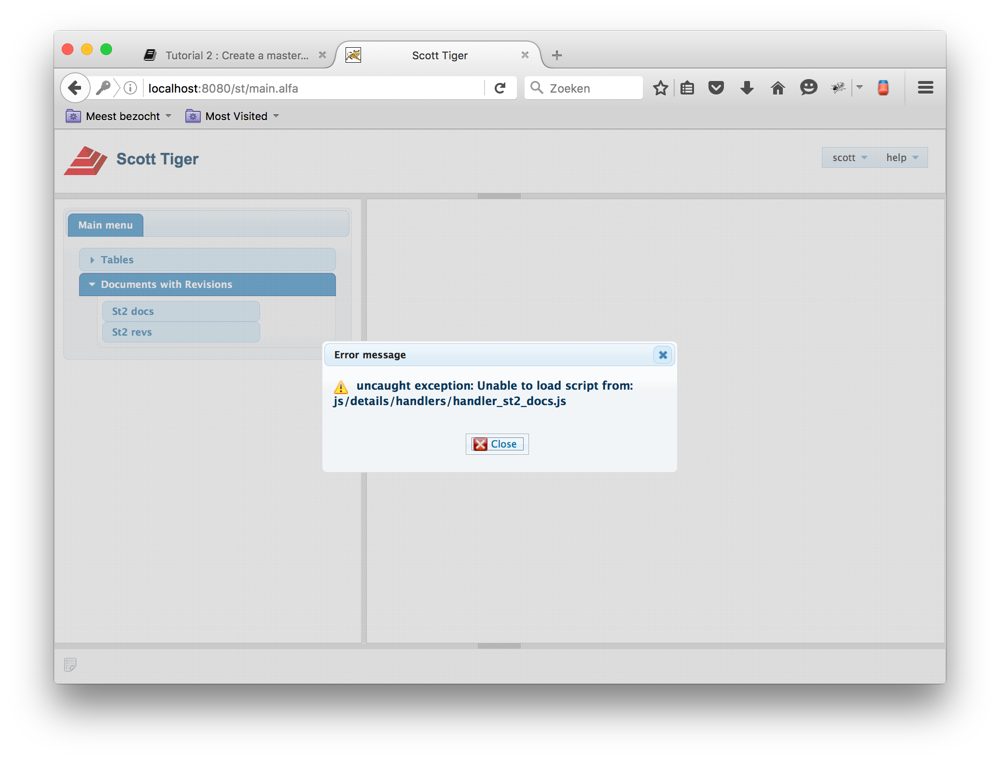
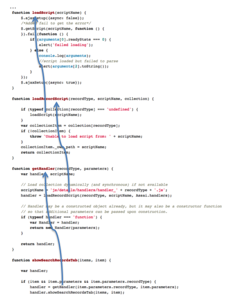
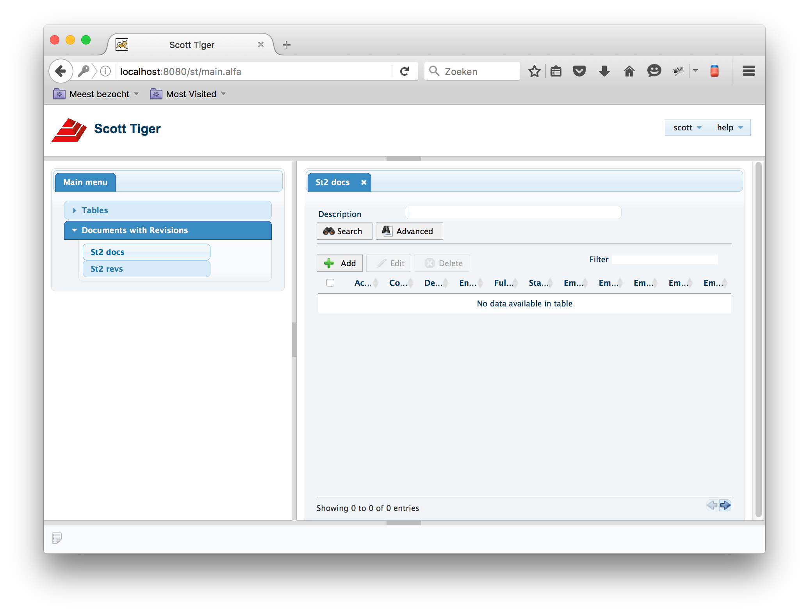

# Tutorial 2 : Generate as master detail

# Introduction

In this tutorial we first create two tables. One for documents and one for document revisions. After the creation of the two tables we are going to generate the screens.

You can start this tutorial by getting the clean code from the Mercurial repository

If already have a local clone yuo can ommit this step otherwise clone according to hereunder

    ...\workspaces\assai>hg clone L:\Mercurial\ScottTiger

After that revert back to get the proper state in your working environment by getting the proper tag

To show the tags

    ...\workspaces\assai>hg tags
    tip                               29:b59de41835d4
    start_tutorial_2                  14:aba87c45e7ee

Go update towards ``start_tutorial_2``

    ...\workspaces\assai>hg update -r start_tutorial_2

The following three statements are also valid

    ...\workspaces\assai>hg update -r 14
    ...\workspaces\assai>hg update -r aba87c45e7ee
    ...\workspaces\assai>hg update -r 14:aba87c45e7ee

Now your working environment is up-to-date to start with tutorial 2

# Removal and Installation of database objects

For this tutorial we have to connect to a database. Implicit we connected to same database in the first tutorial. The credentials for this database are given below

    Internal
    username : scott
    password : tiger
    host     : v10dbdev.assai.nl
    port     : 1621
    sid      : D84

    External
    username : scott
    password : tiger
    host     : orcl.vaizr.com
    port     : 1521
    sid      : orcl

Hereunder you find the scripts for dropping and creating a document and document revision table

    Drop sequence st2_docs_seq
    ;

    Drop sequence st2_revs_seq
    ;

    Drop table ST2_DOCS cascade constraints
    ;

    Drop table ST2_REVS cascade constraints
    ;

    CREATE TABLE ST2_DOCS
    (
       DOCS_PK              NUMBER,
       FULL_NUMBER          VARCHAR2 (10),
       DESCRIPTION          VARCHAR2 (100),
       ACTIVE               VARCHAR2 (1),
       START_DATE           DATE,
       END_DATE             DATE,
       EMPNO_RE             NUMBER (4),
       COMMUNICATION_TYPE   VARCHAR2 (10)
    );

    ALTER TABLE st2_docs
       ADD CONSTRAINT st2_docs_pk PRIMARY KEY (docs_pk) VALIDATE;
    ALTER TABLE st2_docs
       ADD CONSTRAINT st2_docs_uk UNIQUE (full_number) VALIDATE;
    ALTER TABLE st2_docs
       ADD CONSTRAINT st2_docs_emp_fk FOREIGN KEY (empno_re)
           REFERENCES emp (empno)
           VALIDATE;
    ALTER TABLE st2_docs
       ADD CONSTRAINT st2_docs_ck_commtype CHECK
              (communication_type IN ('email', 'manual', 'both'))
              VALIDATE;
    ALTER TABLE st2_docs
       ADD CONSTRAINT st2_docs_ck_active CHECK (active IN ('Y', 'N')) VALIDATE;

    CREATE TABLE ST2_REVS
    (
       REVS_PK       NUMBER,
       DOCS_PK       NUMBER,
       NAME          VARCHAR2 (10),
       DESCRIPTION   VARCHAR2 (100),
       ACTIVE        VARCHAR2 (1),
       START_DATE    DATE,
       END_DATE      DATE
    );

    ALTER TABLE st2_revs
       ADD CONSTRAINT st2_revs_pk PRIMARY KEY (revs_pk) VALIDATE;
    ALTER TABLE st2_revs
       ADD CONSTRAINT st2_revs_docs_fk FOREIGN KEY (docs_pk)
           REFERENCES st2_docs (docs_pk)
           VALIDATE;
    ALTER TABLE st2_revs
       ADD CONSTRAINT st2_revs_ck_active CHECK (active IN ('Y', 'N')) VALIDATE;

    create sequence st2_docs_seq
    ;

    create sequence st2_revs_seq
    ;

    create or replace trigger st2_docs_bfri
    before insert on st2_docs for each row
    begin
      if (:new.docs_pk is null or :new.docs_pk < 0) then
        select st2_docs_seq.nextval into :new.docs_pk from dual;
      end if;
    end;
    /

    create or replace trigger st2_revs_bfri
    before insert on st2_revs for each row
    begin
      if (:new.revs_pk is null or :new.revs_pk < 0) then
        select st2_revs_seq.nextval into :new.revs_pk from dual;
      end if;
    end;
    /

# Generate the Screen definitions

We first going to start with the generation of the screen definitions. This is dome by the following script. ``GenerateMetaData``. We first change the connection string to our preferred database schema.

So around line 19 in the script we change the following lines

    def sql = Sql.newInstance("jdbc:oracle:thin:@localhost:1521:xe", "scott", "tiger", "oracle.jdbc.OracleDriver")

Becomes

    //def sql = Sql.newInstance("jdbc:oracle:thin:@localhost:1521:xe", "scott", "tiger", "oracle.jdbc.OracleDriver")
    def sql = Sql.newInstance("jdbc:oracle:thin:@v10dbdev.assai.nl:1621:D84", "scott", "tiger", "oracle.jdbc.OracleDriver")

Before we can generate the screen definitions with groovy from the command line we have to install groovy. [Here](/reference/thirdpartyproducts/groovy) you can find how to [install groovy](/reference/thirdpartyproducts/groovy)

Next we start a command prompt in the following directory C:\workspaces\assai\ScottTiger\tools\generators> ``C:\workspaces\assai\ScottTiger\tools\generators>`` and check if is groovy is installed correctly by typing ``groovy --version``

    C:\workspaces\assai\ScottTiger\tools\generators>groovy --version
    Groovy Version: 2.4.6 JVM: 1.8.0_77 Vendor: Oracle Corporation OS: Windows 7

if you see the above line it is okay and we are going to type and get

    C:\workspaces\assai\ScottTiger\tools\generators>groovy GenerateMetaData.groovy
    Caught: java.lang.ClassNotFoundException: oracle.jdbc.OracleDriver
    java.lang.ClassNotFoundException: oracle.jdbc.OracleDriver
            at GenerateMetaData.run(GenerateMetaData.groovy:19)

This means that ``oracle.jdbc.OracleDriver`` is not on the classpath for now we solve it with the following addition to the above statement. `` -cp %HOMEPATH%/.m2/repository/com/oracle/ojdbc6/11.2.0/ojdbc6-11.2.0.jar``
One way to circumvent the necessary addition to the groovy classpath you can copy the library to the groovy external lib directory. You can do this bythe following two steps

    >mkdir %HOMEPATH\.groovy\lib
    >copy %HOMEPATH%\.m2\repository\com\oracle\ojdbc6\11.2.0\ojdbc6-11.2.0.jar %HOMEPATH%\.groovy\lib

Now you can run the statement with or without the ``-cp`` addition

    C:\workspaces\assai\ScottTiger\tools\generators>groovy GenerateMetaData.groovy

    C:\workspaces\assai\ScottTiger\tools\generators>groovy -cp %HOMEPATH%\.m2\repository\com\oracle\ojdbc6\11.2.0\ojdbc6-11.2.0.jar GenerateMetaData.groovy
    *** generating record type for: dept
    *** generating record type for: emp
    *** generating record type for: gwe_acc_emp
    *** generating record type for: gwe_docs
    *** generating record type for: gwe_dore
    *** generating record type for: michel
    *** generating record type for: michel_attributes
    *** generating record type for: michel_references
    *** generating record type for: mkl_access
    *** generating record type for: mkl_docs
    *** generating record type for: mkl_revs
    *** generating record type for: my_objects
    *** generating record type for: st2_docs
    *** generating record type for: st2_revs
    *** generating record type for: student
    *** generating record type for: st_docs
    *** generating record type for: test_comp

The above output can be minimized by changing the script a little in the following manner. Around line 23 we change
    ResultSet rs = metadata.getTables(sql.connection.catalog, "SCOTT", "%", "TABLE")
Into
    ResultSet rs = metadata.getTables(sql.connection.catalog, "SCOTT", "ST2%", "TABLE")

    C:\workspaces\assai\ScottTiger\tools\generators>groovy -cp %HOMEPATH%\.m2\repository\com\oracle\ojdbc6\11.2.0\ojdbc6-11.2.0.jar GenerateMetaData.groovy
    *** generating record type for: st2_docs
    *** generating record type for: st2_revs

If you have your IDE open, most probably NetBeans you can remove the green files in the output as shown in the figure below can be removed by selecting the green files and than right-clicking and choosing **delete**

Now the generated files can be used as input for the following step

    C:\workspaces\assai\ScottTiger\tools\generators>groovy GenerateMetaData.groovy

In order to run this statement probalbly tow additional steps have to be taken

1. copy __commons-lang3-3.3.2.jar__ into %HOMEPATH%\.groovy\lib
2. change on line 8 org.apache.commons.lang.StringUtils into org.apache.commons.lang__3__.StringUtils

After running C:\workspaces\assai\ScottTiger\tools\generators>groovy GenerateMetaData.groovy you should see the following output:

    *** processing screenFields_dept.js
        getForeignMetaData for emp
        add metadata to cache for emp
        getForeignMetaData for emp
    *** processing screenFields_dept.js.orig
        getForeignMetaData for emp
        getForeignMetaData for emp
    *** processing screenFields_emp.js
        getForeignMetaData for dept
        add metadata to cache for dept
        getForeignMetaData for dept
        getForeignMetaData for dept
        getForeignMetaData for dept
        getForeignMetaData for st2_docs
        add metadata to cache for st2_docs
        getForeignMetaData for st2_docs
    *** processing screenFields_emp.js.orig
        getForeignMetaData for dept
        getForeignMetaData for dept
        getForeignMetaData for dept
        getForeignMetaData for dept
        getForeignMetaData for st2_docs
        getForeignMetaData for st2_docs
    *** processing screenFields_st2_docs.js
        getForeignMetaData for emp
        getForeignMetaData for emp
        getForeignMetaData for emp
        getForeignMetaData for emp
        getForeignMetaData for st2_revs
        add metadata to cache for st2_revs
        getForeignMetaData for st2_revs
    *** processing screenFields_st2_revs.js
        getForeignMetaData for st2_docs
        getForeignMetaData for st2_docs
        getForeignMetaData for st2_docs
        getForeignMetaData for st2_docs

The above proces creates files which are stored under __generators__ in the __generated__ directory :

    .
    ├── dialogs
    │   ├── dialog_emp_dept.js
    │   ├── dialog_st2_docs_emp.js
    │   └── dialog_st2_revs_st2_docs.js
    ├── handlers
    │   ├── handler_dept.js
    │   ├── handler_emp.js
    │   ├── handler_st2_docs.js
    │   └── handler_st2_revs.js
    ├── lov
    │   ├── dept_lov.psql
    │   ├── emp_lov.psql
    │   └── st2_revs_lov.psql
    ├── lovCollection.js
    ├── navigation.json
    └── psql
        ├── mysql
        │   ├── generated
        │   │   ├── dept_delete.psql
        │   │   ├── dept_get.psql
        │   │   ├── dept_insert.psql
        │   │   ├── dept_update.psql
        │   │   ├── emp_delete.psql
        │   │   ├── emp_get.psql
        │   │   ├── emp_insert.psql
        │   │   ├── emp_update.psql
        │   │   ├── st2_docs_delete.psql
        │   │   ├── st2_docs_get.psql
        │   │   ├── st2_docs_insert.psql
        │   │   ├── st2_docs_update.psql
        │   │   ├── st2_revs_delete.psql
        │   │   ├── st2_revs_get.psql
        │   │   ├── st2_revs_insert.psql
        │   │   └── st2_revs_update.psql
        │   └── search
        │       ├── dept_search.psql
        │       ├── emp_dept_search.psql
        │       ├── emp_search.psql
        │       ├── st2_docs_emp_search.psql
        │       ├── st2_docs_search.psql
        │       ├── st2_revs_search.psql
        │       └── st2_revs_st2_docs_search.psql
        ├── oracle
        │   ├── generated
        │   │   ├── dept_delete.psql
        │   │   ├── dept_get.psql
        │   │   ├── dept_insert.psql
        │   │   ├── dept_update.psql
        │   │   ├── emp_delete.psql
        │   │   ├── emp_get.psql
        │   │   ├── emp_insert.psql
        │   │   ├── emp_update.psql
        │   │   ├── st2_docs_delete.psql
        │   │   ├── st2_docs_get.psql
        │   │   ├── st2_docs_insert.psql
        │   │   ├── st2_docs_update.psql
        │   │   ├── st2_revs_delete.psql
        │   │   ├── st2_revs_get.psql
        │   │   ├── st2_revs_insert.psql
        │   │   └── st2_revs_update.psql
        │   └── search
        │       ├── dept_search.psql
        │       ├── emp_dept_search.psql
        │       ├── emp_search.psql
        │       ├── st2_docs_emp_search.psql
        │       ├── st2_docs_search.psql
        │       ├── st2_revs_search.psql
        │       └── st2_revs_st2_docs_search.psql
        └── postgresql
            ├── generated
            │   ├── dept_delete.psql
            │   ├── dept_get.psql
            │   ├── dept_insert.psql
            │   ├── dept_update.psql
            │   ├── emp_delete.psql
            │   ├── emp_get.psql
            │   ├── emp_insert.psql
            │   ├── emp_update.psql
            │   ├── st2_docs_delete.psql
            │   ├── st2_docs_get.psql
            │   ├── st2_docs_insert.psql
            │   ├── st2_docs_update.psql
            │   ├── st2_revs_delete.psql
            │   ├── st2_revs_get.psql
            │   ├── st2_revs_insert.psql
            │   └── st2_revs_update.psql
            └── search
                ├── dept_search.psql
                ├── emp_dept_search.psql
                ├── emp_search.psql
                ├── st2_docs_emp_search.psql
                ├── st2_docs_search.psql
                ├── st2_revs_search.psql
                └── st2_revs_st2_docs_search.psql

Now we are going to copy the menu item entries in the menu file and copy the other generated files to the proper places. While doing that we skim read the code and get a basic understanding of what is going on.

## Modify menu in order to show the new screens in the menu

from generated\navigation.json we copy the following text fragment

        {
            "name": "st2_docs",
            "permission": "experimental",
            "id": "nav_experimental_st2_docs_id",
            "fn": "Assai.mainPageHandler.showSearchRecordsTab",
            "parameters": {
                "datasource": null,
                "recordType": "st2_docs"
            },
            "disabled": false
        },
        {
            "name": "st2_revs",
            "permission": "experimental",
            "id": "nav_experimental_st2_revs_id",
            "fn": "Assai.mainPageHandler.showSearchRecordsTab",
            "parameters": {
                "datasource": null,
                "recordType": "st2_revs"
            },
            "disabled": false
        }

into

__assai/ScottTiger/src/main/groovy/nl/assai/common/NavigationService.groovy__ just after
__the following text

            {
                "name": "employees",
                "id": "nav_employees_id",
                "fn": "Assai.commonHandler.openSearchEmployeesPage"
            }
        ]
    },

However in order to show the document tables in a sub directory __Document__ screens we add subsequently also the following text fragments into __assai/ScottTiger/src/main/groovy/nl/assai/common/NavigationService.groovy__

    ,
        {
            "name": "Documents with Revisions",
            "id": "nav_docrev_id",
            "items": [

and at the end

        ]
    }

So the whole multiline JSON main menu string becomes

    [
        {
            "name": "tables",
            "id": "nav_tables_id",
            "items": [
                {
                    "name": "departments",
                    "id": "nav_departments_id",
                    "fn": "Assai.commonHandler.openSearchDepartmentsPage"
                },
                {
                    "name": "employees",
                    "id": "nav_employees_id",
                    "fn": "Assai.commonHandler.openSearchEmployeesPage"
                }
            ]
        },
        {
            "name": "Documents with Revisions",
            "id": "nav_docrev_id",
            "items": [
            {
                "name": "st2_docs",
                "permission": "experimental",
                "id": "nav_experimental_st2_docs_id",
                "fn": "Assai.mainPageHandler.showSearchRecordsTab",
                "parameters": {
                    "datasource": null,
                    "recordType": "st2_docs"
                },
                "disabled": false
            },
            {
                "name": "st2_revs",
                "permission": "experimental",
                "id": "nav_experimental_st2_revs_id",
                "fn": "Assai.mainPageHandler.showSearchRecordsTab",
                "parameters": {
                    "datasource": null,
                    "recordType": "st2_revs"
                },
                "disabled": false
            }
            ]
        }
    ]

off course we can change names etc but we won't at this moment except `Documents with Revisions`. Running the application should give the following result. The screens do not work yet!

File by file will be moved from the generator/generated directory to the appropriate folders in order to see the new screens starting to work. As you can see in the above screenshot the file workspaces/assai/ScottTiger/tools/generators/generated/handlers/handler_st2_docs.js is not yeat available. Following the code we can draw the same conclusion.

# Put generated files in place

## copy handler_st2_docs.js ( & handler_st2_revs.js )

    copy ../ScottTiger/tools/generators/generated/handlers/handler_st2_docs.js
      to ../ScottTiger/src/main/webapp/js/details/handlers/handler_st2_docs.js

The function called in the menu is `Assai.mainPageHandler.showSearchRecordsTab` with the parameters

    "parameters": {
                        "datasource": null,
                        "recordType": "st2_docs"
                        }

The function __Assai.mainPageHandler.showSearchRecordsTab__ can be found back in    /ScottTiger/src/main/webapp/js/main_page.js

In the above script the final shown line is `handler.showSearchRecordsTab(items, item);`

This calls `showSearchRecordsTab` in /ScottTiger/src/main/webapp/js/details/handlers/handler_st2_docs.js

Apart from doing all kind of steps. The final step in the above function is

            // Auto search upon opening tab
            _searchRecordsForFieldValues({});
        }

In _searchRecordsForFieldValues the following line of code is executed

                    DwrGeneral.searchRecordsWithPaging(settings.datasourceName, settings.recType, search_fields, paging, function (json) {

This is a very special function ! If you start looking for DwrGeneral in the javascript source files you won't find the specification of the called functions. In this case `searchRecordsWithPaging`

Here a special trick is executed to get to the back-end. With other words in the Dwrgeneral a call is made to application server. This done with the help of DWR. Direct Web Remoting. DWR is a Java library that enables Java on the server and JavaScript in a browser to interact and call each other as simply as possible. [http://directwebremoting.org/dwr/index.html](http://directwebremoting.org/dwr/index.html)

In Vaizr most of the server code with which we interact is written in groovy. Groovy is an object-oriented programming language for the Java platform. It is a dynamic language with features similar to those of Python, Ruby, Perl, and Smalltalk.

Basically what happens is that you write a method in Groovy or java and that method is than made available in javascript as an Ajax call. On the serverside you have to annotate that method, an annotation is a form of syntactic metadata that can be added to the serverside source code. Classes, methods, variables, parameters and packages may be annotated. the DWR annotation syntax is `@RemoteMethod`

Searching in the groovy code brings us to the file `/ScottTiger/src/main/groovy/nl/assai/gui/dwr/DwrGeneral.groovy` and here we find

        @RemoteMethod
        String searchRecordsWithPaging(String dataSourceName, String recordType, Map nameValues,
            Map pagingSettings) {
            SessionBean sessionBean = getSessionBean()
            def result = new CrudService().searchRecordsWithPaging(sessionBean, dataSourceName,
                recordType, nameValues,
                pagingSettings)
            return result
        }

The `CrudService().searchRecordsWithPaging` can be found in `/ScottTiger/src/main/groovy/nl/assai/common/CrudService.groovy`

        String searchRecordsWithPaging(SessionBean sessionBean, String dataSourceName, String recordType,
            Map searchFields, Map pagingSettings) {

            def result = [:]
            result.count = 0
            result.columns = []
            result.rows = []
            result.data = [:]

            try {
                CrudUtils crudUtils = CrudUtilsFactory.getCrudUtils(sessionBean, dataSourceName)
                def rowCnt = pagingSettings.count

                def nameValues = [:]
                nameValues.db_date_format = sessionBean.getDbDateFormat()
                nameValues.order_by = pagingSettings.sortColumn
                nameValues.sortdirection = pagingSettings.sortDirection
                nameValues.startRow = pagingSettings.startRow
                nameValues.rowcnt = rowCnt

                searchFields.each { name, value ->
                    nameValues[name] = value
                }
                CrudUtils.addUseParameters(nameValues, true)

                String sqlFileName = "search/${recordType}_search.psql"
                CrudResultType crudResultType = crudUtils.runSqlFile(sqlFileName, nameValues)
                def sortColumn = pagingSettings.get("sortColumn").toString()

                if (pagingSettings.get("callType") == "paging") {
                    result.count = crudResultType.rows.size()
                    result.columns = crudResultType.columns
                    result.rows = crudResultType.rows
                } else if (pagingSettings.get("callType") == "initial") {
                    result.count = Integer.parseInt(rowCnt).value
                    result.columns = crudResultType.columns
                    result.rows = crudResultType.rows
                    result.sortMode = [sortColumn, pagingSettings.get("sortDirection")]
                }

                result.totalCount = crudUtils.getResultCount(sqlFileName, nameValues)

                LOGGER.debug("Searched multiple records for ${sqlFileName}")
            }
            catch (Exception e) {
                LOGGER.error("Error searching with paging ${recordType}", e)
                result.data.p_error_message = e.getMessage() ?: "Failed to search records"
            }

            return new JsonBuilder(result).toString()
        }

And in this method the call to back end is made in the following line `                CrudResultType crudResultType = crudUtils.runSqlFile(sqlFileName, nameValues)
`
This sqlFile should be located in `/ScottTiger/src/main/webapp/WEB-INF/psql/oracle/search` this sqlFile is generated and can be found in `/ScottTiger/tools/generators/generated/psql/oracle/search` we should copy the generated sqlFiles

## copy generated sqlFiles

    copy ../ScottTiger/tools/generators/generated/psql/oracle/search/st2*.psql
      to ../ScottTiger/src/main/webapp/WEB-INF/psql/oracle/search

    copy ../ScottTiger/tools/generators/generated/psql/oracle/generated/st2*.psql
      to ../ScottTiger/src/main/webapp/WEB-INF/psql/oracle/generated

    copy ../ScottTiger/tools/generators/generated/lov/st2*.psql
      to ../ScottTiger/src/main/webapp/WEB-INF/psql/oracle/lov

After copying the several back-end files we can check the content of the sqlFile, sthe sqlFile we were examining is `/Users/nosinga/workspaces/assai/ScottTiger/src/main/webapp/WEB-INF/psql/oracle/search/st2_docs_search.psql`

    select docs.docs_pk
    , docs.active
    , docs.communication_type
    , docs.description
    , docs.empno_re
    , docs.end_date
    , docs.full_number
    , docs.start_date
    , emp.comm as emp_comm
    , emp.deptno as emp_deptno
    , emp.ename as emp_ename
    , emp.hiredate as emp_hiredate
    , emp.job as emp_job
    , emp.mgr as emp_mgr
    , emp.sal as emp_sal
    from st2_docs docs
    left outer join emp emp on emp.empno = docs.empno_re
    where 1 = 1
    {@use_docs_pk} and docs.docs_pk = {@docs_pk}
    {@use_active} and lower(docs.active) like '%' || lower('{@active}') || '%'
    {@use_communication_type} and lower(docs.communication_type) like '%' || lower('{@communication_type}') || '%'
    {@use_description} and lower(docs.description) like '%' || lower('{@description}') || '%'
    {@use_empno_re} and docs.empno_re = {@empno_re}
    {@use_end_date} and trunc('day', docs.end_date) = to_date('{@end_date}', 'YYYY-MM-DD')
    {@use_full_number} and lower(docs.full_number) like '%' || lower('{@full_number}') || '%'
    {@use_start_date} and trunc('day', docs.start_date) = to_date('{@start_date}', 'YYYY-MM-DD')
    order by docs.docs_pk

Of course we can modify this file toward our needs but that's beyond the scope of this tutorial. Running the application and choosing the menu item `St2 docs` gives the below displayed result.

The application till sofar is totally generated. Now it is time to change to look and feel of the generated application. Since Vaizr is dependant on JavaScript en jQuery, actually the foundation library of Vaizr consists of a number of jQuery plugins. Before you can use these plugins effectively you need to have an understanding of JavaScript and jQuery. For those who haven't worked with JavaScript or jQuery (for some time) two tutorials regarding these subjects have been added. [Tutorial 3](../tutorial/javascript) is a JavaScript primer and [Tutorial 4](../tutorial/jquey) is a jQuery primer. In order to go to the next tutorial click [here](../tutorial/javascript)
